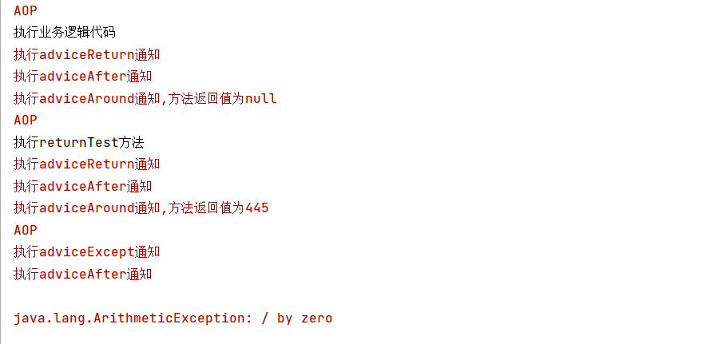
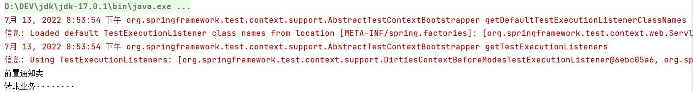

官方文档[Core Technologies (spring.io)](https://docs.spring.io/spring-framework/docs/current/reference/html/core.html#aop)

## AOP的术语

1. 连接点 `Joinpoint`

   连接点描述的是程序执行的某个特定位置。如一个类的初始化前、初始化后，或者类的某个方法调用前、调用后、方法抛出异常后等等。一个类或一段程序代码拥有一些具有边界性质的特定点，这些特定点就称为连接点。连接点用来定义在目标程序的哪里通过AOP加入新的逻辑。

   Spring仅支持方法的连接点，即仅能在方法调用前、方法调用后、方法抛出异常时以及方法调用前后这些程序执行点织入增强。
   
   
   
   **官方原文**
   
   A point during the execution of a program, such as the execution of a method or the handling of an exception. In Spring AOP, a join point always represents a method execution.


2. 切入点`Pointcut`
   切入点是一个连接点的过滤条件，AOP 通过切入点定位到特定的连接点。每个类都拥有多个连接点：例如 UserService类中的所有方法实际上都是连接点。换言之，连接点相当于数据库中的记录，切点相当于查询条件。切入点和连接点不是一对一的关系，一个切入点对应多个连接点，切入点通过 `org.springframework.aop.Pointcut `接口进行描述，它使用类和方法作为连接点的查询条件。
   
   
   
   **官方原文**
   
   A predicate that matches join points. Advice is associated with a pointcut expression and runs at any join point matched by the pointcut (for example, the execution of a method with a certain name). The concept of join points as matched by pointcut expressions is central to AOP, and Spring uses the AspectJ pointcut expression language by default.
   
   
   
3. 通知`Advice`

   切面在某个具体的连接点采取的行为或行动，称为通知。切面的核心逻辑代码都写在通知中，有人也称之为增强或者横切关注点。通知是切面功能的具体实现，通常是业务代码以外的需求，如日志、验证等。

   **常用的接口**

   - 前置通知：org.springframework.aop.MethodBeforeAdvice

   - 后置通知：org.springframework.aop.AfterReturningAdvice
   - 异常通知：org.springframework.aop.ThrowsAdvice 该接口没有要实现的方法，需要自定义一个afterThrowing()方法。
   - 环绕通知：org.aopalliance.intercept.MethodInterceptor


​		**官方原文**
​       A predicate that matches join points. Advice is associated with a pointcut expression and 		runs at any join point matched by the pointcut (for example, the execution of a method 		with a certain name). The concept of join points as matched by pointcut expressions is 		central to AOP, and Spring uses the AspectJ pointcut expression language by default.


4. 切面`Aspect`

   切面是通知(Advice)和切点(Pointcut)的结合，通知和切点共同定义了切面的全部内容。因为通知定义的是切面的"要做什么"和"在何时做"，而切点定义的是切面的"在何地做"。将两者结合在一起，就可以完美的。最后实现切面在何时，何地，做什么。

   

​		**官方原文**

​		A modularization of a concern that cuts across multiple classes. Transaction management 		is a good example of a crosscutting concern in enterprise Java applications. In Spring AOP, 		aspects are implemented by using regular classes (the [schema-based approach](https://docs.spring.io/spring-framework/docs/current/reference/html/core.html#aop-schema)) or regular 		classes annotated with the annotation (the [@AspectJ style](https://docs.spring.io/spring-framework/docs/current/reference/html/core.html#aop-ataspectj)).`@Aspect`


## 切入点指示符

切入点指示符用来指示切入点表达式目的，在Spring AOP中目前只有执行方法这一个连接点，Spring AOP支持的AspectJ切入点指示符如下：

         execution：用于匹配方法执行的连接点；
    
         within：用于匹配指定类型内的方法执行；
    
         this：用于匹配当前AOP代理对象类型的执行方法；注意是AOP代理对象的类型匹配，这样就可能包括引入接口也类型匹配；
    
         target：用于匹配当前目标对象类型的执行方法；注意是目标对象的类型匹配，这样就不包括引入接口也类型匹配；
    
         args：用于匹配当前执行的方法传入的参数为指定类型的执行方法；
    
         @within：用于匹配所以持有指定注解类型内的方法；
    
         @target：用于匹配当前目标对象类型的执行方法，其中目标对象持有指定的注解；
    
         @args：用于匹配当前执行的方法传入的参数持有指定注解的执行；
    
         @annotation：用于匹配当前执行方法持有指定注解的方法；
    
         bean：Spring AOP扩展的，AspectJ没有对于指示符，用于匹配特定名称的Bean对象的执行方法；
    
         reference pointcut：表示引用其他命名切入点，只有@ApectJ风格支持，Schema风格不支持。


​    

AspectJ切入点支持的切入点指示符还有： `call`、`get`、`set`、`preinitialization`、`staticinitialization`、`initialization`、`handler`、`adviceexecution`、`withincode`、`cflow`、`cflowbelow`、`if`、`@this`、`@withincode`；但Spring AOP目前不支持这些指示符，使用这些指示符将抛出IllegalArgumentException异常。这些指示符Spring AOP可能会在以后进行扩展。


**切入点使用示例**

1. **execution**：使用“execution(方法表达式)”匹配方法执行；

| 模式                            | 描述                                                    |
| ------------------------------- | ------------------------------------------------------- |
| public * *(..)                  | 任何公共方法的执行                                      |
| * com.mqb.IPointcutService.*() | com.mqb包及所有子包下IPointcutService接口中的任何无参方法 |
| * com.mqb..*()                  | com.mqb包及所有子包下任何无参方法                       |
|* com.mqb..*(..)|com.mqb包及所有子包下任何方法  |
|* cn.javass..IPointcutService.\*(*)|cn.javass包及所有子包下IPointcutService接口的任何只有一个参数的方法|
|* (!cn.javass..IPointcutService+).*(..)|非“cn.javass包及所有子包下IPointcutService接口及子类型”的任何方法|
|* cn.javass..IPointcutService+.*()|cn.javass包及所有子包下IPointcutService接口及子类型的的任何无参方法|
|* cn.javass..IPointcut\*.test\*(java.util.Date)|cn.javass包及所有子包下IPointcut前缀类型的的以test开头的只有一个参数类型为java.util.Date的方法，注意该匹配是根据方法签名的参数类型进行匹配的，而不是根据执行时传入的参数类型决定的。如定义方法：public void test(Object obj);即使执行时传入java.util.Date，也不会匹配的|
|* cn.javass..IPointcut\*.test*(..)  throws IllegalArgumentException, ArrayIndexOutOfBoundsException|cn.javass包及所有子包下IPointcut前缀类型和方法名以test为前缀的方法，且抛出IllegalArgumentException和ArrayIndexOutOfBoundsException异常|
|* (cn.javass..IPointcutService+&& java.io.Serializable+).*(..)|任何实现了cn.javass包及所有子包下IPointcutService接口和java.io.Serializable接口的类型的任何方法|
|@java.lang.Deprecated * *(..)|任何持有@java.lang.Deprecated注解的方法|
|(@cn.javass..Secure  *)  *(..)|任何返回值类型持有@cn.javass..Secure的方法|

2. within 使用“within(类型表达式)”匹配指定类型内的方法执行；
|模式|描述|
|--------------|-------------|
|within(cn.javass..*)|cn.javass包及子包下的任何方法执行|
|within(cn.javass..IPointcutService+)|cn.javass包或所有子包下IPointcutService类型及子类型的任何方法|
|within(@cn.javass..Secure *)|持有cn.javass..Secure注解的任何类型的任何方法必须是在目标对象上声明这个注解，在接口上声明的对它不起作用|

3. this：使用“this(类型全限定名)”匹配当前AOP代理对象类型的执行方法；注意是AOP代理对象的类型匹配，这样就可能包括引入接口方法也可以匹配；注意this中使用的表达式必须是类型全限定名，不支持通配符；

|模式|描述|
|--|--|
|this(cn.javass.spring.chapter6.service.IPointcutService)|当前AOP对象实现了 IPointcutService接口的任何方法|
|this(cn.javass.spring.chapter6.service.IIntroductionService)|当前AOP对象实现了 IIntroductionService接口的任何方法也可能是引入接口|
4. target ：使用“target(类型全限定名)”匹配当前目标对象类型的执行方法；注意是目标对象的类型匹配，这样就不包括引入接口也类型匹配；注意target中使用的表达式必须是类型全限定名，不支持通配符；
|模式|描述|
|--|--|
|target(cn.javass.spring.chapter6.service.IPointcutService)|当前目标对象（非AOP对象）实现了 IPointcutService接口的任何方法|
|target(cn.javass.spring.chapter6.service.IIntroductionService)|当前目标对象（非AOP对象） 实现了IIntroductionService 接口的任何方法不可能是引入接口|
5. args：使用“args(参数类型列表)”匹配当前执行的方法传入的参数为指定类型的执行方法；注意是匹配传入的参数类型，不是匹配方法签名的参数类型；参数类型列表中的参数必须是类型全限定名，通配符不支持；args属于动态切入点，这种切入点开销非常大，非特殊情况最好不要使用；

|模式|描述|
|--|--|
|args (java.io.Serializable,..)|任何一个以接受“传入参数类型为 java.io.Serializable” 开头，且其后可跟任意个任意类型的参数的方法执行，args指定的参数类型是在运行时动态匹配的|

## 通知(advice)的类型

|注解|含义|
|--|--|
|@Before|当切点在连接点开始执行前触发，参数可以写切入点的方法名，或者是exexute(方法表达式)|
|@After|当切点在连接点执行完成后触发，通常可以进行资源释放等等|
|@AfterReturning|当方法执行返回后触发|
|@AfterThrowing|当抛出异常时执行|
|@Around|包围一个连接点的通知，类似Web 中Servlet 规范中的Filter 的doFilter 方法。可以在方法的调用前后完成自定义的行为， 也可以选择不执行。|


## 使用注解进行切面编程

### 业务逻辑代码

假设有一下业务逻辑代码，需要添加功能

```java
package com.mqb.aop.application.service.impl;

import org.springframework.stereotype.Service;

/**
 * @author maqingbo
 * @date 2022/7/10 15:18
 */
@Service
public class UserService {
    //模拟业务逻辑代码
    public void query() {
        System.out.println("执行业务逻辑代码");

    }

    public void insert() {

            int a = 1 / 0;
    }
    public int returnTest(){
        System.out.println("执行returnTest方法");
        return 445;
    }

}

```


### 启用aop代理

在主程序添加`@EnableAspectJAutoProxy`注解

### 定义切面

```java
package com.mqb.aop.application.service.impl;
import org.aspectj.lang.annotation.Aspect;
/**
 * @author maqingbo
 * @date 2022/7/10 15:14
 */
@Aspect
@Component
public class NotVeryUsefulAspect {

}
```

### 定义切入点

```java
package com.mqb.aop.application.service.impl;

import org.aspectj.lang.annotation.Aspect;
import org.aspectj.lang.annotation.Pointcut;

/**
 * @author maqingbo
 * @date 2022/7/10 15:14
 */
@Aspect
@Component
public class NotVeryUsefulAspect {
    @Pointcut("execution(* com.mqb.aop.application.service..*(..))")
    public void anyOldTransfer(){
    }
}
```

### 定义通知

```java
package com.mqb.aop.application.service.impl;

import org.aspectj.lang.ProceedingJoinPoint;
import org.aspectj.lang.annotation.*;
import org.springframework.stereotype.Component;

/**
 * @author maqingbo
 * @date 2022/7/10 15:14
 */
@Aspect
@Component
public class NotVeryUsefulAspect {

    @Pointcut("execution(* com.mqb.aop.application.service.impl..*(..))")
    public void anyOldTransfer() {
    }

    @Before("anyOldTransfer()")
    public void advice() {
        System.err.println("AOP");
    }

    @AfterThrowing("execution(* com.mqb.aop.application.service.impl.UserService.insert())")
    public void adviceExcept() {
        System.err.println("执行adviceExcept通知");
    }

    @AfterReturning("anyOldTransfer()")
    public void adviceReturn(){
        System.err.println("执行adviceReturn通知");
    }
    @After("anyOldTransfer()")
    public void adviceAfter(){
        System.err.println("执行adviceAfter通知");
    }
    @Around("anyOldTransfer()")
    public Object adviceAround(ProceedingJoinPoint pjp) throws Throwable {
        Integer returnValue = (Integer) pjp.proceed();
        System.err.printf("执行adviceAround通知,方法返回值为%d\n",returnValue);
        return returnValue;
    }
}

```

### 测试AOP

```java
package com.mqb;

import com.mqb.aop.application.service.impl.UserService;
import org.junit.jupiter.api.Test;
import org.springframework.beans.factory.annotation.Autowired;
import org.springframework.boot.test.context.SpringBootTest;

@SpringBootTest
class MqbApplicationTests {

    @Autowired
    UserService userService;
    @Test
    void contextLoads() {
        userService.query();
        userService.returnTest();
        userService.insert();

    }

}

```


#### 测试结果



## 使用xml配置的aop

```xml
<aop:config> 
    <!-- 声明切面 -->
    <aop:aspect ref="切面类id">
	    <!-- 抽取切点表达式 -->
        <aop:pointcut id="切点id" expression="切点表达式"/>
        <!-- 设置增强 -->
        <aop:增强方式 method="增强方法名" pointcut-ref="切点id"></aop:增强方式>
    </aop:aspect>
</aop:config>
```

### 引入相关依赖

```xml
 <dependencies>
        <!--导入spring的context坐标，context依赖aop-->
        <dependency>
            <groupId>org.springframework</groupId>
            <artifactId>spring-context</artifactId>
            <version>5.1.5.RELEASE</version>
        </dependency>
        <!-- aspectj的织入（切点表达式需要用到该jar包） -->
        <dependency>
            <groupId>org.aspectj</groupId>
            <artifactId>aspectjweaver</artifactId>
            <version>1.8.13</version>
        </dependency>
        <!--spring整合junit-->
        <dependency>
            <groupId>org.springframework</groupId>
            <artifactId>spring-test</artifactId>
            <version>5.1.5.RELEASE</version>
        </dependency>
        <dependency>
            <groupId>junit</groupId>
            <artifactId>junit</artifactId>
            <version>4.12</version>
        </dependency>
    </dependencies>
```

### 业务类

假设有下面的业务类，我们需要使用aop对其中的方法进行增强

```xml
public class AccountServiceImpl {
    public void transfer() {
        System.out.println("转账业务········");
    }
}
```

### 通知类

需要使用该通知类对业务类中的匹配切入点表达式的方法进行增强

```xml
public class MyAdvice {
    public void before(){
        System.out.println("前置通知类");
    }
}
```

### 配置文件application.xml

1. 在配置文件中配置bean，将他们交由spring管理

```xml
<?xml version="1.0" encoding="UTF-8"?>
<beans xmlns="http://www.springframework.org/schema/beans"
       xmlns:xsi="http://www.w3.org/2001/XMLSchema-instance" xmlns:aop="http://www.springframework.org/schema/aop"
       xsi:schemaLocation="http://www.springframework.org/schema/beans
       http://www.springframework.org/schema/beans/spring-beans.xsd http://www.springframework.org/schema/aop https://www.springframework.org/schema/aop/spring-aop.xsd">

    <bean id="accountService" class="com.mqb.aop.application.service.impl.AccountServiceImpl"/>
    <bean id="myAdvice" class="com.mqb.aop.application.service.impl.MyAdvice"/>

    <aop:config>
        <!--引入通知类-->
        <aop:aspect ref="myAdvice">
            <!--定义切点-->
            <aop:pointcut id="customPointcut"
                          expression="execution(* com.mqb.aop.application.service.impl.AccountServiceImpl..*(..))"/>
            <!--配置目标类的transfer方法执行时，使用通知类的before方法进行前置增强-->
            <aop:before method="before" pointcut-ref="customPointcut"/>
        </aop:aspect>
    </aop:config>
</beans>

```

### 测试基于xml配置的AOP

```xml
@RunWith(SpringJUnit4ClassRunner.class)
@ContextConfiguration("classpath:application.xml")
public class Mytest {
    @Autowired
    private AccountServiceImpl accountService;
    @Test
    public void testTransfer(){
        accountService.transfer();
    }
}
```

### 测试结果



## 总结

### 个人对AOP的理解

经过一段时间的学习总结，基本了解了AOP的使用场景、AOP 其实是一个“横切”技术。它可以在**剖解封装的对象内部，并将那些影响了多个类的公共行为封装到一个可重用模块**，AOP可以在不更改业务代码的同时，对指定的业务方法，或者一类匹配切入点的业务方法进行增强。利用这个特性，我们可以使用AOP对方法进行一个增强，列出如下几点

1. 日志功能(在执行前进行日志处理)
2. 事务处理(执行方法前，开启事务，执行完成后关闭事务，出现异常后回滚事务)
3. 关闭资源(对于未释放的资源，可以使用 After (Finally) Advice对其进行关闭，防止内存泄漏)
4. 权限检查(在执行方法前，判断是否具有权限)

### 实现 AOP 的技术

两种，一种是**动态代理**技术，对目标对象进行代理，以此更改目标对象的行为。二是采用**静态织入**的方式，通过特定的语法创造切面切入，从而使编译器在编译期间就织入相关的切面。

### ` Spring AOP`和`AspectJ`区别

1. `Spring AOP`属于运行时的增强，而`AspectJ`属于编译时的增强。SpringAOP是基于代理（Proxying），而`AspectJ`是基于字节码操作。

2. 如果切面比较少，两者差不多，如果切面太多，最好使用`AspectJ`，它比`Spring AOP`快很多。
3. 在性能上，由于`Spring AOP`是基于动态代理来实现的，`AspectJ`属于静态织入在容器启动时需要生成代理实例，在方法调用上也会增加栈的深度，使得`Spring AOP`的性能不如`AspectJ`的那么好

### 通知执行顺序

（1）没有异常情况下的执行顺序：

> around before advice ->before advice->target method 执行->around after advice->after advice->afterReturning

（2）有异常情况下的执行顺序：

> around before advice->before advice->target method 执行->around after advice->after advice->afterThrowing advice


```java
/*
 * #{copyright}#
 */
import org.springframework.aop.framework.AopContext;

/**
 * 获取代理对象 self.
 * 
 * @param <T>
 *            接口类型
 */
public interface ProxySelf<T> {
    /**
     * 取得当前对象的代理.
     * 
     * @return 代理对象,如果未被代理,则抛出 IllegalStateException
     */
    @SuppressWarnings("unchecked")
    default T self() {
        return (T) AopContext.currentProxy();
    }
}
```