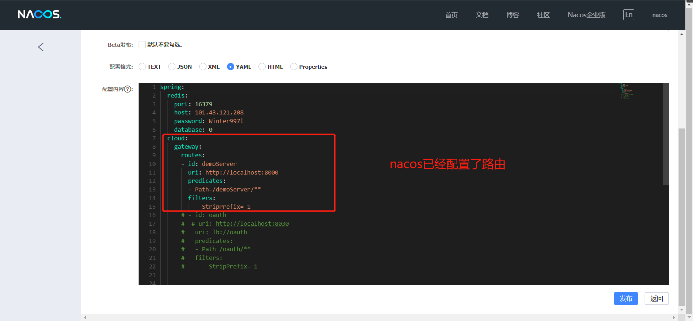
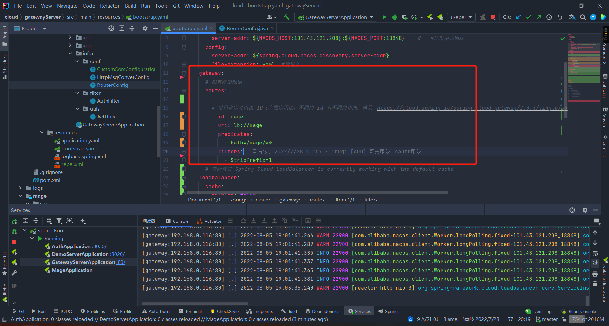

路由映射不上

由于nacos配置中心中已经做了路由配置，所以本地的配置文件配置路由会失效。流式API编写的路由并不会失效



同时又在本地配置文件进行路由配置，本地的路由配置将会全部失效



### 路由配置

```yml
gateway:
  # 配置路由规则
  routes:
    - id: mage
      uri: lb://mage
      predicates:
        - Path=/mage/**
      filters:
        - StripPrefix=1
```

id唯一

uri为将要路由到的服务

predicates：断言，检查请求的url中是否与之匹配

filters：StripPrefix=1。去除第1个前缀mage.

举例，当请求的地址为 `localhost/mage/get经过filters`将会转换成 `localhost/get` 之后再负载均衡转发到mage服务

