## IOC

在平时的java应用开发中，我们要实现某一个功能或者说是完成某个业务逻辑时至少需要两个或以上的对象来协作完成。在没有使用Spring的时候，每个对象在需要使用他的合作对象时，自己均要使用像new object() 这样的语法来将合作对象创建出来，这个合作对象是由自己主动创建出来的，创建合作对象的主动权在自己手上，自己需要哪个合作对象，就主动去创建，创建合作对象的主动权和创建时机是由自己把控的，而这样就会使得对象间的耦合度高了。比如A对象需要使用合作对象B来共同完成一件事，A要使用B，那么A就对B产生了依赖，也就是A和B之间存在一种耦合关系，并且是紧密耦合在一起。而使用了Spring之后就不一样了，创建合作对象B的工作是由Spring来做的，Spring创建好B对象，然后存储到一个容器里面，当A对象需要使用B对象时，Spring就从存放对象的那个容器里面取出那个B对象，然后交给A对象使用，至于Spring是如何创建那个对象，以及什么时候创建好，A对象不需要关心这些细节问题，A得到Spring给之后，两个对象一起协作完成要完成的工作即可。

所以控制反转是将创建对象的控制权进行转移，以前创建对象的主动权和创建时机是由自己把控的，而现在这种权力转移到第三方，比如转移交给了IOC容器，它就是一个专门用来创建对象的工厂，你要什么对象，它就给你什么对象，有了 IOC容器，依赖关系就变了，原先的依赖关系就没了，它们都依赖IOC容器了，通过IOC容器来建立它们之间的关系。


## Bean

在 Spring 中，构成应用程序主干并由Spring IOC容器管理的对象称为bean。bean是一个由Spring IOC容器实例化、组装和管理的对象。简而言之，bean是对象，而且由Spring中IOC容器进行管理，我们的应用程序由一个个bean构成。

## Bean生命周期

Spring的IoC容器功能非常强大，负责Spring的Bean的创建和管理等功能。而Spring 的bean是整个Spring应用中很重要的一部分，了解Spring Bean的生命周期对我们了解整个spring框架会有很大的帮助。BeanFactory和ApplicationContext是Spring两种很重要的容器，前者提供了最基本的依赖注入的支持，而后者在继承前者的基础进行了功能的拓展，例如增加了事件传播，资源访问和国际化的消息访问等功能。


### `ApplicationContext Bean`生命周期

流程图

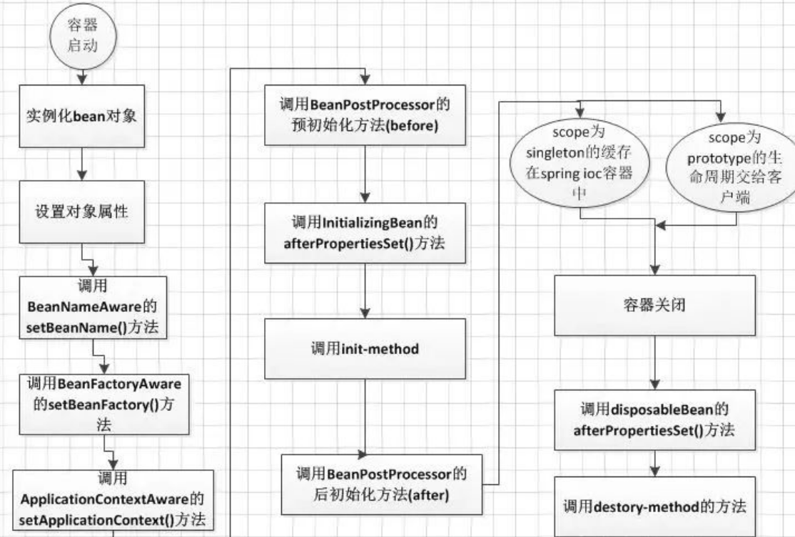

`ApplicationContext Bean`流程：

　　1、首先容器启动后，会对scope为singleton且非延迟加载的bean进行实例化，

　　2、按照Bean定义信息配置信息，注入所有的属性，

　　3、如果Bean实现了`BeanNameAware`接口，会回调该接口的`setBeanName()`方法，传入该Bean的id，此时该Bean就获得了自己在配置文件中的id，

　　4、如果Bean实现了`BeanFactoryAware`接口，会回调该接口的`setBeanFactory()`方法，传入该Bean的`BeanFactory`，这样该Bean就获得了自己所在的`BeanFactory`，

　　5、如果Bean实现了`ApplicationContextAware`接口，会回调该接口的`setApplicationContext()`方法，传入该Bean的`ApplicationContext`，这样该Bean就获得了自己所在的`ApplicationContext`，

　　6、如果有Bean实现了`BeanPostProcessor`接口，则会回调该接口的`postProcessBeforeInitialzation()`方法，

　　7、如果Bean实现了`InitializingBean`接口，则会回调该接口的`afterPropertiesSet()`方法，

　　8、如果Bean配置了`init-method`方法，则会执行`init-method`配置的方法，

　　9、如果有Bean实现了`BeanPostProcessor`接口，则会回调该接口的`postProcessAfterInitialization()`方法，

　　10、经过流程9之后，就可以正式使用该Bean了，对于scope为singleton的Bean，Spring的IoC容器中会缓存一份该bean的实例，而对于scope为prototype的Bean，每次被调用都会new一个新的对象，其生命周期就交给调用方管理了，不再是Spring容器进行管理了，

　　11、容器关闭后，如果Bean实现了`DisposableBean`接口，则会回调该接口的destroy()方法，

　　12、如果Bean配置了`destroy-method`方法，则会执行`destroy-method`配置的方法，至此，整个Bean的生命周期结束。

 


### `BeanFactory Bean`生命周期

   流程图：

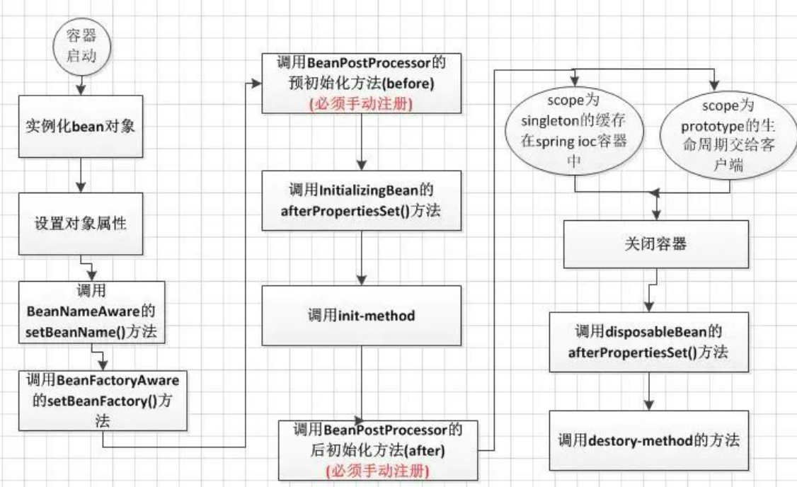


`BeanFactory Bean`生命周期流程：

1. 　容器寻找Bean的定义信息，并将其实例化。
2. 　使用依赖注入，Spring按照Bean定义信息配置Bean的所有属性。
3. 　如果Bean实现了`BeanNameAware`接口，工厂调用Bean的`setBeanName()`方法传递Bean的id。
4. 　如果实现了`BeanFactoryAware`接口，工厂调用`setBeanFactory()`方法传入工厂自身。
5. 　如果`BeanPostProcessor`和Bean关联，那么它们的`postProcessBeforeInitialization()`方法将被调用。（需要手动进行注册！）
6. 　如果Bean实现了`InitializingBean`接口，则会回调该接口的`afterPropertiesSet()`方法。
7. 　如果Bean指定了`init-method`方法，就会调用`init-method`方法。
8. 　如果`BeanPostProcessor`和Bean关联，那么它的`postProcessAfterInitialization()`方法将被调用。（需要手动注册！）
9. 　现在Bean已经可以使用了。scope为singleton的Bean缓存在Spring IOC容器中。scope为prototype的Bean生命周期交给客户端。
10. 　销毁。如果Bean实现了`DisposableBean`接口，`destory()`方法将会被调用。如果配置了`destory-method`方法，就调用这个方法。

 


### `BeanFactoty`和`ApplicationContext`比较


1. `BeanFactory`容器中，不会调用`ApplicationContextAware`接口的`setApplicationContext()`方法，
2. `BeanPostProcessor`接口的`postProcessBeforeInitialzation()`方法和`postProcessAfterInitialization()`方法不会自动调用，必须自己通过代码手动注册
3. `BeanFactory`容器启动的时候，不会去实例化所有Bean，包括所有scope为singleton且非延迟加载的Bean也是一样，而是在调用的时候去实例化。

 

## 两种方式实现IOC

### 1、基于xml方式

```xml
<?xml version="1.0" encoding="UTF-8"?>
<beans xmlns="http://www.springframework.org/schema/beans"
    xmlns:xsi="http://www.w3.org/2001/XMLSchema-instance"
    xsi:schemaLocation="http://www.springframework.org/schema/beans
        https://www.springframework.org/schema/beans/spring-beans.xsd">

    <bean id="..." class="...">  
        
    </bean>
    
</beans>
```

#### beans标签

包含常用的 \<bean\>、\<import\>、\<alias\>、标签

#### bean标签

用于

`bean`的常用属性：

1. **`id`**:Bean的id
2. **`class`**：用于实例化的Bean的全类名与id对应
3. **`init-method`**：Bean初始化时执行的方法
4. **`destroy-method`**：当bean的生命周期结束时调用
5. **` name`**:设置对象名（唯一标识符）
6. **`scope`**:用于设置的对象的作用范围，可选参数如下：

-   ​      singleton:单例（默认）


            对象出生：当程序加载配置文件创建容器时，创建
    
            对象活着：只要容器还在，一直活着
    
            对象死亡：应用停止，容器销毁，对象死亡

-   ​      prototype:多例（原型对象）


         对象出生：当程序加载配置文件创建容器时创建（每次调用会创建一个新对象）
    
         对象活着：只要对象被使用，一直活着
         
         对象死亡：对象长时间不用，会被Java垃圾回收机制回收 （该对象不被容器管理）

- ​      reqeust: web项目中，Spring将创建的对象放在request作用域中


- ​      session: web项目中，Spring将创建的对象放在session作用域中


#### import标签

如果有多个xml配置文件，可以选择一个主配置文件，将其他的配置文件通过`import`标签进行导入

如：我们选用application.xml为主配置文件，spring.xml为其他配置文件，spring.xml也配置了bean对象，

可以在application.xml的\<beans\>里使用\<import\>标签把spring.xml进行导入。或者也可以在java代码中读取两个配置文件，如下面代码段

```java
        ApplicationContext context = new ClassPathXmlApplicationContext("application.xml","spring.xml");
```


#### alias标签

可以为一个类起别名，一般不需要。我们为 userService 起 service的别名进行测试

```xml
 <alias name="userService" alias="service"/>
```

```java
public class ApplicationTest {
    @Test
  public   void IocTest(){
        ClassPathXmlApplicationContext context = new ClassPathXmlApplicationContext("application.xml");
        UserService userService = (UserService) context.getBean("userService");
        userService.business();
        System.out.println("=====import=======");
        AdminService adminService = (AdminService) context.getBean("adminService");
        adminService.query();
        System.out.println("=====alias=======");
        UserService service = (UserService) context.getBean("service");
        service.business();
        context.close();
    }
}
```

运行结果

> UserService.initMethod
> UserService.business
> =====import=======
> AdminService.query
> =====alias=======
> UserService.business
> UserService.destroyMethod

可以发现当一个bean启用了别名之后，他的原本的bean的id还是可以进行实例化的


#### XML中Bean标签的解析

```xml
<?xml version="1.0" encoding="UTF-8"?>
<beans xmlns="http://www.springframework.org/schema/beans"
    xmlns:xsi="http://www.w3.org/2001/XMLSchema-instance"
    xsi:schemaLocation="http://www.springframework.org/schema/beans
        https://www.springframework.org/schema/beans/spring-beans.xsd">

    <bean id="..." class="...">  
        
    </bean>
    
</beans>
```

##### （一）默认标签

org.springframework.beans.factory.xml的DefaultBeanDefinitionDocumentReader类的parseDefaultElement()方法


```java

private void parseDefaultElement(Element ele, BeanDefinitionParserDelegate delegate) {
		if (delegate.nodeNameEquals(ele, IMPORT_ELEMENT)) {
			importBeanDefinitionResource(ele);
		}
		else if (delegate.nodeNameEquals(ele, ALIAS_ELEMENT)) {
			processAliasRegistration(ele);
		}
		else if (delegate.nodeNameEquals(ele, BEAN_ELEMENT)) {
			processBeanDefinition(ele, delegate);
		}
		else if (delegate.nodeNameEquals(ele, NESTED_BEANS_ELEMENT)) {
			// recurse
			doRegisterBeanDefinitions(ele);
		}
	}

```

按默认标签是import、alias、bean、beans四类情况分别处理。其中，bean标签的解析最为复杂。

##### （二）bean标签的解析及注册

当读取配置文件的\<bean\>标签时，调用`processBeanDefinition()`

```java
	/**
	 * Process the given bean element, parsing the bean definition
	 * and registering it with the registry.
	 */
	protected void processBeanDefinition(Element ele, BeanDefinitionParserDelegate delegate) {
        //方法调用完成后，bdHolder实例就包含我们配置的各种属性，例如：class、name、id、alias之类的属性。
		BeanDefinitionHolder bdHolder = delegate.parseBeanDefinitionElement(ele);
        
        //当返回的bdHolder不为空的情况下，若存在默认标签的子节点下面还有自定义的属性，还需要再次对自定义的标签进行解析
		if (bdHolder != null) {
			bdHolder = delegate.decorateBeanDefinitionIfRequired(ele, bdHolder);
			try {
				// Register the final decorated instance.
				BeanDefinitionReaderUtils.registerBeanDefinition(bdHolder, getReaderContext().getRegistry());
			}
			catch (BeanDefinitionStoreException ex) {
				getReaderContext().error("Failed to register bean definition with name '" +
						bdHolder.getBeanName() + "'", ele, ex);
			}
			// Send registration event.
          //发出响应事件，通知相关的监听器，该bean加载完成。  
			getReaderContext().fireComponentRegistered(new BeanComponentDefinition(bdHolder));
		}
	}
```

##### （三）解析BeanDefinition

（对应上述代码的BeanDefinitionHolder bdHolder = delegate.parseBeanDefinitionElement(ele)）

```java
/**
     * Parses the supplied {@code <bean>} element. May return {@code null}
     * if there were errors during parse. Errors are reported to the
     * {@link org.springframework.beans.factory.parsing.ProblemReporter}.
     */
    @Nullable
    public BeanDefinitionHolder parseBeanDefinitionElement(Element ele, @Nullable BeanDefinition containingBean) {
    /*********提取元素中的id以及name属性*********/
        //解析id属性
        String id = ele.getAttribute(ID_ATTRIBUTE);
        //解析name属性
        String nameAttr = ele.getAttribute(NAME_ATTRIBUTE);
        //分割name属性
        List<String> aliases = new ArrayList<>();
        if (StringUtils.hasLength(nameAttr)) {
            //将name属性的值通过,; 进行分割 转为字符串数字(即在配置文件中如配置多个name在此做处理)
            String[] nameArr = StringUtils.tokenizeToStringArray(nameAttr, MULTI_VALUE_ATTRIBUTE_DELIMITERS);
            aliases.addAll(Arrays.asList(nameArr));
        }

        String beanName = id;
        // 如果ID为空 使用配置的第一个name属性作为ID
        if (!StringUtils.hasText(beanName) && !aliases.isEmpty()) {
            beanName = aliases.remove(0);
            if (logger.isTraceEnabled()) {
                logger.trace("No XML 'id' specified - using '" + beanName +
                        "' as bean name and " + aliases + " as aliases");
            }
        }

        if (containingBean == null) {
            // 校验beanName和aliases的唯一性
            // 内部核心为使用usedNames集合保存所有已经使用了的beanName和alisa
            checkNameUniqueness(beanName, aliases, ele);
        }
    /*********进一步解析其他所有属性到GenericBeanDefinition对象中*********/
        AbstractBeanDefinition beanDefinition = parseBeanDefinitionElement(ele, beanName, containingBean);
    /*********如果检测到Bean没有指定beanName，那么使用默认规则为此Bean生成对应的beanName*********/
        if (beanDefinition != null) {
            if (!StringUtils.hasText(beanName)) {
                try {
                    if (containingBean != null) {
                        beanName = BeanDefinitionReaderUtils.generateBeanName(
                                beanDefinition, this.readerContext.getRegistry(), true);
                    }
                    else {
                        beanName = this.readerContext.generateBeanName(beanDefinition);
                        // Register an alias for the plain bean class name, if still possible,
                        // if the generator returned the class name plus a suffix.
                        // This is expected for Spring 1.2/2.0 backwards compatibility.
                        String beanClassName = beanDefinition.getBeanClassName();
                        if (beanClassName != null &&
                                beanName.startsWith(beanClassName) && beanName.length() > beanClassName.length() &&
                                !this.readerContext.getRegistry().isBeanNameInUse(beanClassName)) {
                            aliases.add(beanClassName);
                        }
                    }
                    if (logger.isTraceEnabled()) {
                        logger.trace("Neither XML 'id' nor 'name' specified - " +
                                "using generated bean name [" + beanName + "]");
                    }
                }
                catch (Exception ex) {
                    error(ex.getMessage(), ele);
                    return null;
                }
            }
            String[] aliasesArray = StringUtils.toStringArray(aliases);
    /*********将获取到的信息封装到BeanDefinitionHolder的实例中*********/
            return new BeanDefinitionHolder(beanDefinition, beanName, aliasesArray);
        }

        return null;
    }
```
在对属性展开解析之前，Spring在外层又做了一个当前层的功能架构。重点看“进一步解析其他所有属性到GenericBeanDefinition对象中”，对应的代码为AbstractBeanDefinition beanDefinition = parseBeanDefinitionElement(ele, beanName, containingBean);，
```java
/**
     * Parse the bean definition itself, without regard to name or aliases. May return
     * {@code null} if problems occurred during the parsing of the bean definition.
     */
    @Nullable
    public AbstractBeanDefinition parseBeanDefinitionElement(
            Element ele, String beanName, @Nullable BeanDefinition containingBean) {

        this.parseState.push(new BeanEntry(beanName));
        //解析class属性
        String className = null;
        if (ele.hasAttribute(CLASS_ATTRIBUTE)) {
            className = ele.getAttribute(CLASS_ATTRIBUTE).trim();
        }
        //解析parent属性
        String parent = null;
        if (ele.hasAttribute(PARENT_ATTRIBUTE)) {
            parent = ele.getAttribute(PARENT_ATTRIBUTE);
        }

        try {
            //创建用于承载属性的AbstractBeanDefinition类型的GenericBeanDefinition
            AbstractBeanDefinition bd = createBeanDefinition(className, parent);
            //硬编码解析默认bean的各种属性
            parseBeanDefinitionAttributes(ele, beanName, containingBean, bd);
            //提取description
            bd.setDescription(DomUtils.getChildElementValueByTagName(ele, DESCRIPTION_ELEMENT));
            //解析元数据
            parseMetaElements(ele, bd);
            //解析lookup-Method属性
            parseLookupOverrideSubElements(ele, bd.getMethodOverrides());
            //解析replaced-method属性
            parseReplacedMethodSubElements(ele, bd.getMethodOverrides());
            //解析构造函数参数
            parseConstructorArgElements(ele, bd);
            //解析property子元素
            parsePropertyElements(ele, bd);
            //解析qualifier子元素
            parseQualifierElements(ele, bd);

            bd.setResource(this.readerContext.getResource());
            bd.setSource(extractSource(ele));

            return bd;
        }
        catch (ClassNotFoundException ex) {
            error("Bean class [" + className + "] not found", ele, ex);
        }
        catch (NoClassDefFoundError err) {
            error("Class that bean class [" + className + "] depends on not found", ele, err);
        }
        catch (Throwable ex) {
            error("Unexpected failure during bean definition parsing", ele, ex);
        }
        finally {
            this.parseState.pop();
        }

        return null;
    }
    
    
```

##### （四）创建用于承载属性的GenericBeanDefinition

（对应上述代码的AbstractBeanDefinition bd = createBeanDefinition(className, parent)）

　BeanDefinition是一个接口，详见（三、BeanDefinition解析）。有三个对应它的实现：RootBeanDefinition、ChildBeanDefinition、GenericBeanDefinition。这三种实现均继承了AbstractBeanDefinition，其中BeanDefinition是配置文件元素标签在容器中的内部表示形式。元素有class、scope、lazy-init等配置属性。BeanDefinition则提供了相应的beanClass、scope、lazyInit属性，两者的属性是一一对应的。在配置文件中可以定义父和子，父用RootBeanDefinition表示，而子用ChildBeanDefinition表示，而没有父的就使用RootBeanDefinition表示。AbstractBeanDefinition对两者共同的类信息进行抽象。Spring通过BeanDefinition将配置文件中的配置信息转换为容器的内部表示，并将这些BeanDefinition注册到BeanDefinitionRegistry中。Spring容器的BeanDefinitionRegistry就像是Spring配置信息的内存数据库，主要以map形式进行保存，后续操作直接从BeanDefinitionRegistry中读取配置信息。要解析属性首先要创建用于承载属性的实例，也就是创建GenericBeanDefinition类型的实例。对应的代码为AbstractBeanDefinition bd = createBeanDefinition(className, parent)，进入该函数：

```java
/**
     * Create a bean definition for the given class name and parent name.
     * @param className the name of the bean class
     * @param parentName the name of the bean's parent bean
     * @return the newly created bean definition
     * @throws ClassNotFoundException if bean class resolution was attempted but failed
     */
    protected AbstractBeanDefinition createBeanDefinition(@Nullable String className, @Nullable String parentName)
            throws ClassNotFoundException {

        return BeanDefinitionReaderUtils.createBeanDefinition(
                parentName, className, this.readerContext.getBeanClassLoader());
    }
```


```java
/**
     * Create a new GenericBeanDefinition for the given parent name and class name,
     * eagerly loading the bean class if a ClassLoader has been specified.
     * @param parentName the name of the parent bean, if any
     * @param className the name of the bean class, if any
     * @param classLoader the ClassLoader to use for loading bean classes
     * (can be {@code null} to just register bean classes by name)
     * @return the bean definition
     * @throws ClassNotFoundException if the bean class could not be loaded
     */
    public static AbstractBeanDefinition createBeanDefinition(
            @Nullable String parentName, @Nullable String className, @Nullable ClassLoader classLoader) throws ClassNotFoundException {

        GenericBeanDefinition bd = new GenericBeanDefinition();
        bd.setParentName(parentName);
        // parentName可能为空
        if (className != null) {
            //如果classLoader不为空,则使用传入的classLoader同一虚拟机加载类对象
            if (classLoader != null) {
                bd.setBeanClass(ClassUtils.forName(className, classLoader));
            }
            //否则只记录classLoader
            else {
                bd.setBeanClassName(className);
            }
        }
        return bd;
    }
```

##### (五)解析各种属性

（对应（三）解析BeanDefinition中的代码 parseBeanDefinitionAttributes(ele, beanName, containingBean, bd);）


上述已经创建了bean信息的承载实例，接下来就可以进行bean信息的各种属性分析了。进入parseBeanDefinitionAttributes方法，此方法是对Element所有的元素属性进行分析。该方法也在类BeanDefinitionParserDelegate中。


```java
/**
     * Apply the attributes of the given bean element to the given bean * definition.
     * @param ele bean declaration element
     * @param beanName bean name
     * @param containingBean containing bean definition
     * @return a bean definition initialized according to the bean element attributes
     */
    public AbstractBeanDefinition parseBeanDefinitionAttributes(Element ele, String beanName,
            @Nullable BeanDefinition containingBean, AbstractBeanDefinition bd) {
        //scope和singleton两种属性只能指定其中之一，不可以同时出现，否则Spring会抛出异常
        if (ele.hasAttribute(SINGLETON_ATTRIBUTE)) {
            error("Old 1.x 'singleton' attribute in use - upgrade to 'scope' declaration", ele);
        }
        //解析scope属性
        else if (ele.hasAttribute(SCOPE_ATTRIBUTE)) {
            bd.setScope(ele.getAttribute(SCOPE_ATTRIBUTE));
        }
        else if (containingBean != null) {
            //在嵌入BeanDefinition情况下且没有单独指定scope属性则使用父类默认的属性
            bd.setScope(containingBean.getScope());
        }
        //解析abstract属性
        if (ele.hasAttribute(ABSTRACT_ATTRIBUTE)) {
            bd.setAbstract(TRUE_VALUE.equals(ele.getAttribute(ABSTRACT_ATTRIBUTE)));
        }
        //解析lazy-init属性
        String lazyInit = ele.getAttribute(LAZY_INIT_ATTRIBUTE);
        if (isDefaultValue(lazyInit)) {
            lazyInit = this.defaults.getLazyInit();
        }
        //若没有设置或者设置成其他字符都会被设置为false
        bd.setLazyInit(TRUE_VALUE.equals(lazyInit));
        //解析autowire属性
        String autowire = ele.getAttribute(AUTOWIRE_ATTRIBUTE);
        bd.setAutowireMode(getAutowireMode(autowire));
        //解析depends-on属性
        if (ele.hasAttribute(DEPENDS_ON_ATTRIBUTE)) {
            String dependsOn = ele.getAttribute(DEPENDS_ON_ATTRIBUTE);
            bd.setDependsOn(StringUtils.tokenizeToStringArray(dependsOn, MULTI_VALUE_ATTRIBUTE_DELIMITERS));
        }
        //解析autowire-candidate属性
        String autowireCandidate = ele.getAttribute(AUTOWIRE_CANDIDATE_ATTRIBUTE);
        if (isDefaultValue(autowireCandidate)) {
            String candidatePattern = this.defaults.getAutowireCandidates();
            if (candidatePattern != null) {
                String[] patterns = StringUtils.commaDelimitedListToStringArray(candidatePattern);
                bd.setAutowireCandidate(PatternMatchUtils.simpleMatch(patterns, beanName));
            }
        }
        else {
            bd.setAutowireCandidate(TRUE_VALUE.equals(autowireCandidate));
        }
        //解析primary属性
        if (ele.hasAttribute(PRIMARY_ATTRIBUTE)) {
            bd.setPrimary(TRUE_VALUE.equals(ele.getAttribute(PRIMARY_ATTRIBUTE)));
        }
        //解析init-method属性
        if (ele.hasAttribute(INIT_METHOD_ATTRIBUTE)) {
            String initMethodName = ele.getAttribute(INIT_METHOD_ATTRIBUTE);
            bd.setInitMethodName(initMethodName);
        }
        else if (this.defaults.getInitMethod() != null) {
            bd.setInitMethodName(this.defaults.getInitMethod());
            bd.setEnforceInitMethod(false);
        }
        //解析destroy-method属性
        if (ele.hasAttribute(DESTROY_METHOD_ATTRIBUTE)) {
            String destroyMethodName = ele.getAttribute(DESTROY_METHOD_ATTRIBUTE);
            bd.setDestroyMethodName(destroyMethodName);
        }
        else if (this.defaults.getDestroyMethod() != null) {
            bd.setDestroyMethodName(this.defaults.getDestroyMethod());
            bd.setEnforceDestroyMethod(false);
        }
        //解析factory-method属性
        if (ele.hasAttribute(FACTORY_METHOD_ATTRIBUTE)) {
            bd.setFactoryMethodName(ele.getAttribute(FACTORY_METHOD_ATTRIBUTE));
        }
        //解析factory-bean属性
        if (ele.hasAttribute(FACTORY_BEAN_ATTRIBUTE)) {
            bd.setFactoryBeanName(ele.getAttribute(FACTORY_BEAN_ATTRIBUTE));
        }

        return bd;
    }
```

在完成上面步骤后，也就是对bean所有的属性的解析后，将会把获取到的信息都封装到BeanDefinitionHolder中（在包org.springframework.beans.factory.config中）。查看其构造函数：


```java
public BeanDefinitionHolder(BeanDefinition beanDefinition, String beanName, @Nullable String[] aliases) {
    Assert.notNull(beanDefinition, "BeanDefinition must not be null");
    Assert.notNull(beanName, "Bean name must not be null");
    this.beanDefinition = beanDefinition;
    this.beanName = beanName;
    this.aliases = aliases;
}
```

#### Bean的加载

https://www.cnblogs.com/xxkj/p/13929565.html

下面一段简单的代码可以作为Spring代码加载的入口：MyTestBean myTestBean = (MyTestBean) beanFactory.getBean("myTestBean");。Spring通过调用BeanFactory的getBean()方法来加载bean。getBean()方法的真正实现在类AbstractBeanFactory中（在org.springframework.beans.factory.support包中），看下该方法的源码：

```java
/**
     * Return an instance, which may be shared or independent, of the specified bean.
     * @param name the name of the bean to retrieve
     * @param requiredType the required type of the bean to retrieve
     * @param args arguments to use when creating a bean instance using explicit arguments
     * (only applied when creating a new instance as opposed to retrieving an existing one)
     * @param typeCheckOnly whether the instance is obtained for a type check,
     * not for actual use
     * @return an instance of the bean
     * @throws BeansException if the bean could not be created
     */
    @SuppressWarnings("unchecked")
    protected <T> T doGetBean(final String name, @Nullable final Class<T> requiredType,
            @Nullable final Object[] args, boolean typeCheckOnly) throws BeansException {
    /***************************（1）转换对应的beanName ***************************/
        // 提取对应的bean名称
        final String beanName = transformedBeanName(name);
        Object bean;
    /***************************（2）尝试从缓存中加载单例 **************************/
        // 检查缓存中或者实例工厂中是否有对应的实例，直接尝试从缓存中获取或者singletonFactories中的ObjectFactory中获取
        // 为什么会首先使用这段代码？
        // 因为在创建单例bean的时候会存在依赖注入的情况，而在创建依赖的时候为了避免循环依赖
        // Spring创建bean的原则是不等bean创建完成就会将创建bean的ObjectFactory提早曝光
        // 也就是将ObjectFactory加入到缓存中，一旦下个bean创建的时候需要依赖上个bean则直接使用ObjectFactory
        Object sharedInstance = getSingleton(beanName);
        if (sharedInstance != null && args == null) {
            if (logger.isTraceEnabled()) {
                if (isSingletonCurrentlyInCreation(beanName)) {
                    logger.trace("Returning eagerly cached instance of singleton bean '" + beanName +
                            "' that is not fully initialized yet - a consequence of a circular reference");
                }
                else {
                    logger.trace("Returning cached instance of singleton bean '" + beanName + "'");
                }
            }
    /******************************（3）bean的实例化 ******************************/
            // 如果从缓存中得到了bean的原始状态，则需要对bean进行实例化。
            // 有时候存在诸如BeanFactory的情况并不是直接返回实例本身而是返回指定方法返回的实例
            bean = getObjectForBeanInstance(sharedInstance, name, beanName, null);
        }
        // 缓存中取不到
        else {
            // 只有在单例情况下才会尝试解决循环依赖；
            // 原型模式情况下，如果存在A中有B的属性，B中有A的属性，那么当依赖注入的时候，就会产生当A还未创建完的时候因为
            // 对于B的创建再次返回到创建A，造成循环依赖，也就是下面的情况。对于“prototype”作用域Bean，Spring容器无法完成依赖注入，
            // 因为“prototype”作用域的Bean，Spring容器不进行缓存，因此无法提前暴露一个创建中的Bean。
    /**********************（4）原型模式(prototype)的依赖检查 **********************/
            if (isPrototypeCurrentlyInCreation(beanName)) {
                throw new BeanCurrentlyInCreationException(beanName);
            }
    /*************************（5）检测parentBeanFactory **************************/
            //确认是否存在父类工厂
            BeanFactory parentBeanFactory = getParentBeanFactory();
            //若父类不为空并且BeanDefinitionMap中所有加载的类不包括beanName，则尝试在父类工厂去检测
            if (parentBeanFactory != null && !containsBeanDefinition(beanName)) {
                // Not found -> check parent.
                String nameToLookup = originalBeanName(name);
                if (parentBeanFactory instanceof AbstractBeanFactory) {
                    return ((AbstractBeanFactory) parentBeanFactory).doGetBean(
                            nameToLookup, requiredType, args, typeCheckOnly);
                }
                else if (args != null) {
                    // 委托给具有显示参数args的父工厂，递归到BeanFactory中寻找
                    return (T) parentBeanFactory.getBean(nameToLookup, args);
                }
                else if (requiredType != null) {
                    //委托给标准的父工厂getBean方法
                    return parentBeanFactory.getBean(nameToLookup, requiredType);
                }
                else {
                    return (T) parentBeanFactory.getBean(nameToLookup);
                }
            }

            // 如果不仅仅是做类型检查而是创建bean，在这里进行记录
            if (!typeCheckOnly) {
                markBeanAsCreated(beanName);
            }

            try {
    /***************（6）GenericBeanDefinition转为RootBeanDefinition **************/
                // 将存储XML配置文件的GenericBeanDefinition转换为RootBeanDefinition，
                // 如果指定BeanName是子Bean的话同时会合并父类的相关属性
                final RootBeanDefinition mbd = getMergedLocalBeanDefinition(beanName);
                checkMergedBeanDefinition(mbd, beanName, args);
    /*********************************（7）寻找依赖 *******************************/
                //得到该bean所依赖的相关bean
                String[] dependsOn = mbd.getDependsOn();
                // 若存在依赖则需要递归实例化依赖的bean
                if (dependsOn != null) {
                    for (String dep : dependsOn) {
                        if (isDependent(beanName, dep)) {
                            throw new BeanCreationException(mbd.getResourceDescription(), beanName,
                                    "Circular depends-on relationship between '" + beanName + "' and '" + dep + "'");
                        }
                        // 缓存依赖调用
                        registerDependentBean(dep, beanName);
                        try {
                            getBean(dep);
                        }
                        catch (NoSuchBeanDefinitionException ex) {
                            throw new BeanCreationException(mbd.getResourceDescription(), beanName,
                                    "'" + beanName + "' depends on missing bean '" + dep + "'", ex);
                        }
                    }
                }
    /*********************（8）依据scope创建bean(最关键的一步) ********************/
                //到这里已经实例化完依赖的bean了，所以开始实例化mbd本身了
                // singleton模式的创建
                if (mbd.isSingleton()) {
                    sharedInstance = getSingleton(beanName, () -> {
                        try {
                            return createBean(beanName, mbd, args);
                        }
                        catch (BeansException ex) {
                            // Explicitly remove instance from singleton cache: It might have been put there
                            // eagerly by the creation process, to allow for circular reference resolution.
                            // Also remove any beans that received a temporary reference to the bean.
                            destroySingleton(beanName);
                            throw ex;
                        }
                    });
                    bean = getObjectForBeanInstance(sharedInstance, name, beanName, mbd);
                }

                else if (mbd.isPrototype()) {
                    // prototype原型模式的创建(new)
                    Object prototypeInstance = null;
                    try {
                        beforePrototypeCreation(beanName);
                        prototypeInstance = createBean(beanName, mbd, args);
                    }
                    finally {
                        afterPrototypeCreation(beanName);
                    }
                    bean = getObjectForBeanInstance(prototypeInstance, name, beanName, mbd);
                }

                else {
                    // 指定的scope上实例化bean
                    String scopeName = mbd.getScope();
                    final Scope scope = this.scopes.get(scopeName);
                    if (scope == null) {
                        throw new IllegalStateException("No Scope registered for scope name '" + scopeName + "'");
                    }
                    try {
                        Object scopedInstance = scope.get(beanName, () -> {
                            beforePrototypeCreation(beanName);
                            try {
                                return createBean(beanName, mbd, args);
                            }
                            finally {
                                afterPrototypeCreation(beanName);
                            }
                        });
                        bean = getObjectForBeanInstance(scopedInstance, name, beanName, mbd);
                    }
                    catch (IllegalStateException ex) {
                        throw new BeanCreationException(beanName,
                                "Scope '" + scopeName + "' is not active for the current thread; consider " +
                                "defining a scoped proxy for this bean if you intend to refer to it from a singleton",
                                ex);
                    }
                }
            }
            catch (BeansException ex) {
                cleanupAfterBeanCreationFailure(beanName);
                throw ex;
            }
        }
    /*********************************（9）类型转换 *******************************/
        // 检查需要的类型是否符合bean的实际类型
        if (requiredType != null && !requiredType.isInstance(bean)) {
            try {
                T convertedBean = getTypeConverter().convertIfNecessary(bean, requiredType);
                if (convertedBean == null) {
                    throw new BeanNotOfRequiredTypeException(name, requiredType, bean.getClass());
                }
                return convertedBean;
            }
            catch (TypeMismatchException ex) {
                if (logger.isTraceEnabled()) {
                    logger.trace("Failed to convert bean '" + name + "' to required type '" +
                            ClassUtils.getQualifiedName(requiredType) + "'", ex);
                }
                throw new BeanNotOfRequiredTypeException(name, requiredType, bean.getClass());
            }
        }
        return (T) bean;
    }
```


上述1-9步在上述代码中已用分割线隔开，下面依次进行分析：
　　（1）转换对应的beanName转换对应的 beanName 是根据 getBean(String name) 方法传入的 name 参数进行的，传入的 name 并不一定是 beanName，可能是别名，也可能是 FactoryBean 。由于 name 的多种可能，Spring会进行对应的转换。这些转换包括： 1）去除 FactoryBean 的修饰符，一般就是去除 name 参数的 & 前缀；2）取指定的 alias 所表示的最终 beanName，例如别名 A 指向别名 B，别名 B 指向名称为 C 的 bean，则最后返回 C。实际是由org.springframework.beans.factory包中的BeanFactoryUtils类中的函数transformedBeanName()完成此功能。

　　（2）尝试从缓存中加载单例，单例在Spring中的同一个容器内只会被创建一次，后续再获取 bean就直接从单例缓存中获取了。当然代码实现上首先进行尝试从缓存中进行加载，如果不成功再尝试从 singletonFactories 中加载，最后都不行才判断是没有创建过继而新建并放入缓存。之所以需要从 singletonFactories 中加载，因为在创建单例 bean 的时候会存在依赖注入 的情况，而在创建依赖 bean 的时候，为了避免循环依赖，Spring中创建 bean 的原则是不等 bean 创建完成就会提前将创建 bean 的 ObjectFactory 曝光加入到缓存中，一旦下一个 bean 创建的时候需要依赖该 bean 时则可以直接使用 ObjectFactory 作为依赖进行注入。

　　（3）bean的实例化如果从缓存中得到了 bean 的原始状态，则需要对 bean 进行实例化。缓存中记录的只是最原始的 bean 状态，并不是我们最终想要的 bean。例如：假如我们需要对工厂 bean 进行处理，那么这里得到的其实是工厂 bean 的初始状态，但我们真正需要的是工厂 bean 中定义的 factory-method方法中返回的 bean，而 getObjectForBeanInstance(sharedInstance, name, beanName, null) 就是完成这项工作。

　　（4）原型模式(prototype)的依赖检查Spring能够尝试解决的循环依赖问题只有单例模式下，对于原型模式的循环依赖问题Spring是没有方法解决的。因为在原型模式（prototype）下，如果 A 依赖 B，B 同时又依赖 A，那么就会出现创建 A 时因为创建依赖 B 而又要创建 A ，因为是多例的，所以会一直循环创建。Spring对于原型模式下的循环依赖会进行检测，检测代码为 isPrototypeCurrentlyInCreation(beanName) ，如果为 true，则会抛出异常。

　　（5）检测parentBeanFactory代码上的逻辑可以看出，如果从缓存中没有取到，那么直接转到父类工厂上去加载了。因为代码中的判断逻辑是：if (parentBeanFactory != null && !containsBeanDefinition(beanName))，前半部分还好，parentBeanFactory 不能为空，后半部分 !containsBeanDefinition(beanName)意思如果当前的 beanDefinitionMap （XML配置文件）中没有 beanName 对应的配置，就只能到 parentBeanFactory 中去尝试下，再递归的调用 getBean()方法了。

　　（6）GenericBeanDefinition转为RootBeanDefinition如果从缓存中获取不到，同时当前的 beanDefinitionMap 中存在对应 beanName 的配置，我们就可以依据包含有XML配置文件信息的 beanDefinition 进行创建 bean 了。从XML配置文件中读取到的 bean 信息是利用 GenericBeanDefinition 存储的，但是后面Spring对所有 bean 的后续处理都是针对于 RootBeanDefinition 的，所以需要进行转换，转换的同时如果父类 bean 不为空，则会一并合并父类的属性。

　　（7）寻找依赖因为 bean 的初始化过程中很可能会用到某些属性，而某些属性很可能是动态配置的，并且配置的成功依赖于其他的 bean，那么此时应该先加载依赖的 bean。所以在流程中，Spring初始化一个 bean，会先初始化其依赖的所有的其他 bean。

　　（8）依据scope创建beanSpring存在不同的 scope，其中默认的是 singleton，但是还有其他的配置像 prototype、request 等。在这一步中，Spring会根据配置进行采取对应的初始化策略。

　　（9）类型转换待 scope 创建完 bean 成功后，一般可以直接返回即可。但当传入 doGetBean 方法中的 requireType 参数不为空时，意味着我们对最后返回的 bean 有着类型上的要求。Spring一般通过类型转换器将第八步创建完成的 bean 转换为 requireType 指定的类型。Spring自身提供了一些转换器，用户也可以自己扩展转换器来满足需求。经过以上的九个步骤，bean 创建完成，这个时候返回的就是我们需要的bean。其中第八步最为关键：针对不同的 scope 进行 bean 的创建。


## Bean的创建过程

1. 创建`BeanFactory`容器
2. 加载配置文件，解析bean的定义信息，包装成`BeanDefinition`
3. 执行`BeanFactoryPostProcessor`的`postProcessBeanFactory()`方法
4. 准备工作
   - 准备`BeanPostProcessor`、监听器、广播器
5. 实例化
6. 初始化
7. 获取对象

### 源码解析

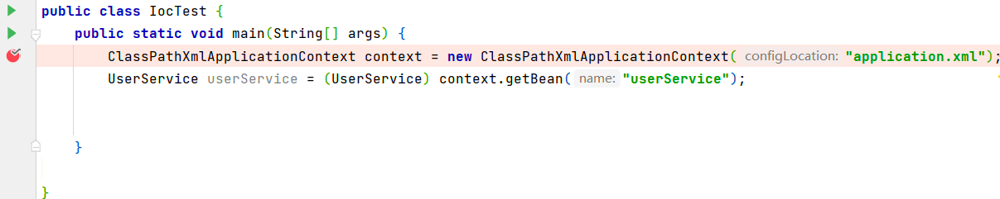

debug方式启动后首先进入到构造器

```java
	public ClassPathXmlApplicationContext(
			String[] configLocations, boolean refresh, @Nullable ApplicationContext parent)
			throws BeansException {
//调用父类构造方法，进行相关的对象创建，属性赋值
		super(parent);
		setConfigLocations(configLocations);
		if (refresh) {
			refresh();
		}
	}
```

之后进入`refresh()`方法

```java
@Override
	public void refresh() throws BeansException, IllegalStateException {
		synchronized (this.startupShutdownMonitor) {
			StartupStep contextRefresh = this.applicationStartup.start("spring.context.refresh");

			// Prepare this context for refreshing.
			prepareRefresh();

			// Tell the subclass to refresh the internal bean factory.
			ConfigurableListableBeanFactory beanFactory = obtainFreshBeanFactory();

			// Prepare the bean factory for use in this context.
            //为BeanFactory设置属性值
			prepareBeanFactory(beanFactory);

			try {
				// Allows post-processing of the bean factory in context subclasses.
				postProcessBeanFactory(beanFactory);

				StartupStep beanPostProcess = this.applicationStartup.start("spring.context.beans.post-process");
				// Invoke factory processors registered as beans in the context.
                /		//调用BeanFactory处理器，执行了BeanFactoryPostProcessor
				invokeBeanFactoryPostProcessors(beanFactory);

				// Register bean processors that intercept bean creation.
				registerBeanPostProcessors(beanFactory);
				beanPostProcess.end();

				// Initialize message source for this context.
				initMessageSource();

				// Initialize event multicaster for this context.
				initApplicationEventMulticaster();

				// Initialize other special beans in specific context subclasses.
				onRefresh();

				// Check for listener beans and register them.
				registerListeners();

				// Instantiate all remaining (non-lazy-init) singletons.
				finishBeanFactoryInitialization(beanFactory);

				// Last step: publish corresponding event.
				finishRefresh();
			}

			catch (BeansException ex) {
				if (logger.isWarnEnabled()) {
					logger.warn("Exception encountered during context initialization - " +
							"cancelling refresh attempt: " + ex);
				}

				// Destroy already created singletons to avoid dangling resources.
				destroyBeans();

				// Reset 'active' flag.
				cancelRefresh(ex);

				// Propagate exception to caller.
				throw ex;
			}

			finally {
				// Reset common introspection caches in Spring's core, since we
				// might not ever need metadata for singleton beans anymore...
				resetCommonCaches();
				contextRefresh.end();
			}
		}
	}
```


下面逐个研究`refresh()`方法里面的子方法

1. `prepareRefresh()`

准备刷新方法，为接下来的创建容器做准备

```java
protected void prepareRefresh() {
		// 切换到激活状态
		this.startupDate = System.currentTimeMillis();//当容器启动完成之后记录消耗的时间
		this.closed.set(false);
		this.active.set(true);

		if (logger.isDebugEnabled()) {
			if (logger.isTraceEnabled()) {
				logger.trace("Refreshing " + this);
			}
			else {
				logger.debug("Refreshing " + getDisplayName());
			}
		}

		// Initialize any placeholder property sources in the context environment.
    		//初始化属性实现。里面是空方法
		initPropertySources();

		// Validate that all properties marked as required are resolvable:
		// see ConfigurablePropertyResolver#setRequiredProperties
    //创建并获取环境对象，检查需要的文件是否都已经放入环境中
		getEnvironment().validateRequiredProperties();

		// Store pre-refresh ApplicationListeners...
//	准备监听器集合对象
		if (this.earlyApplicationListeners == null) {
			this.earlyApplicationListeners = new LinkedHashSet<>(this.applicationListeners);
		}
		else {
			// Reset local application listeners to pre-refresh state.
			this.applicationListeners.clear();
			this.applicationListeners.addAll(this.earlyApplicationListeners);
		}

		// Allow for the collection of early ApplicationEvents,
		// to be published once the multicaster is available...
		this.earlyApplicationEvents = new LinkedHashSet<>();
	}
```

2. `ConfigurableListableBeanFactory beanFactory = obtainFreshBeanFactory();`

加载xml配置文件的属性值到当前工厂

进入到` obtainFreshBeanFactory();`

```java
protected ConfigurableListableBeanFactory obtainFreshBeanFactory() {
		refreshBeanFactory();
		return getBeanFactory();
	}
```

再进入`refreshBeanFactory();`

该方法首先判断容器中是否有BeanFactory。如果有的话就销毁，之后在创建，总之，要拿到最新的BeanFactory


```java
protected final void refreshBeanFactory() throws BeansException {
		if (hasBeanFactory()) {
			destroyBeans();
			closeBeanFactory();
		}
		try {
            //创建bean工厂，但是属性值并没有值
			DefaultListableBeanFactory beanFactory = createBeanFactory();
            //为beanFactory设置基本的属性
			beanFactory.setSerializationId(getId());
			customizeBeanFactory(beanFactory);
            //通过beanDefinitionReader读取xml配置文件bean信息
			loadBeanDefinitions(beanFactory);
			this.beanFactory = beanFactory;
		}
		catch (IOException ex) {
			throw new ApplicationContextException("I/O error parsing bean definition source for " + getDisplayName(), ex);
		}
	}
```

进入到`loadBeanDefinitions(beanFactory);`方法

```java
protected void loadBeanDefinitions(DefaultListableBeanFactory beanFactory) throws BeansException, IOException {
		// Create a new XmlBeanDefinitionReader for the given BeanFactory.
		XmlBeanDefinitionReader beanDefinitionReader = new XmlBeanDefinitionReader(beanFactory);

		// Configure the bean definition reader with this context's
		// resource loading environment.
		beanDefinitionReader.setEnvironment(this.getEnvironment());
		beanDefinitionReader.setResourceLoader(this);
		beanDefinitionReader.setEntityResolver(new ResourceEntityResolver(this));

		// Allow a subclass to provide custom initialization of the reader,
		// then proceed with actually loading the bean definitions.
		initBeanDefinitionReader(beanDefinitionReader);
		loadBeanDefinitions(beanDefinitionReader);
	}
```

当执行完`loadBeanDefinitions(beanDefinitionReader);`方法后xml文件中定义的bean信息将会存储在beanFactory的`beanDefinitionMap`中。beanDefinitionNames将会存放bean的id

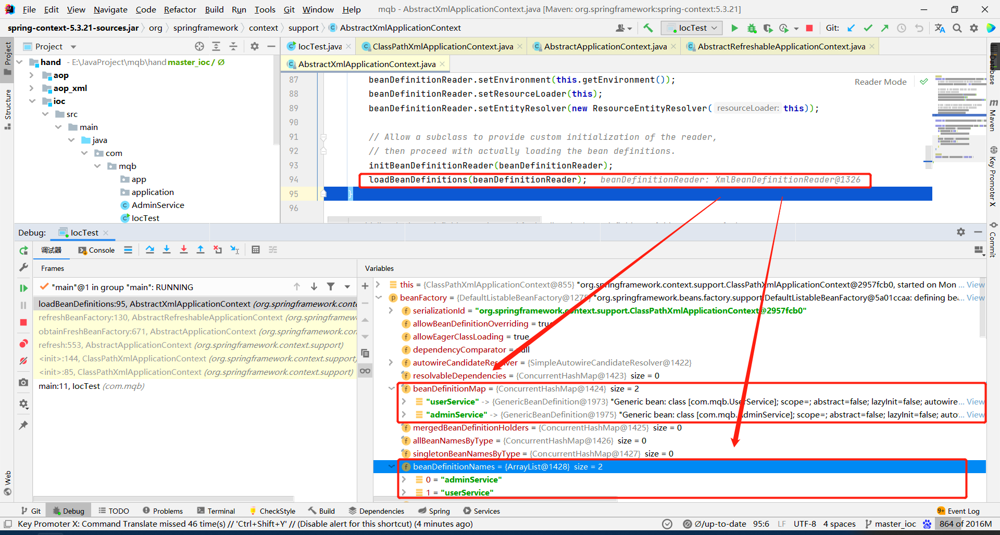

现在已经将bean封装成了`BeanDefinition

3. `invokeBeanFactoryPostProcessors(beanFactory);`

下一步将执行`BeanFactoryPostProcessor`,暂时未看懂

调用`registerBeanPostProcessors(beanFactory);`准备BeanPostProcessor

4. `initMessageSource();` 处理国际化

5. `initApplicationEventMulticaster();`

   初始化广播器，为监听器使用

6. `registerListeners();`

   注册监听器

7. `finishBeanFactoryInitialization(beanFactory);`

   实例化所有的非懒加载的单例对象，此时进入了**实例化**操作

   进入`finishBeanFactoryInitialization(beanFactory);`方法

   ```java
   protected void finishBeanFactoryInitialization(ConfigurableListableBeanFactory beanFactory) {
   		// 类型转换服务
   		if (beanFactory.containsBean(CONVERSION_SERVICE_BEAN_NAME) &&
   				beanFactory.isTypeMatch(CONVERSION_SERVICE_BEAN_NAME, ConversionService.class)) {
   			beanFactory.setConversionService(
   					beanFactory.getBean(CONVERSION_SERVICE_BEAN_NAME, ConversionService.class));
   		}
   
   		// Register a default embedded value resolver if no BeanFactoryPostProcessor
   		// (such as a PropertySourcesPlaceholderConfigurer bean) registered any before:
   		// at this point, primarily for resolution in annotation attribute values.
   		if (!beanFactory.hasEmbeddedValueResolver()) {
   			beanFactory.addEmbeddedValueResolver(strVal -> getEnvironment().resolvePlaceholders(strVal));
   		}
   
   		// Initialize LoadTimeWeaverAware beans early to allow for registering their transformers early.
   		String[] weaverAwareNames = beanFactory.getBeanNamesForType(LoadTimeWeaverAware.class, false, false);
   		for (String weaverAwareName : weaverAwareNames) {
   			getBean(weaverAwareName);
   		}
   
   		// Stop using the temporary ClassLoader for type matching.
   		beanFactory.setTempClassLoader(null);
   
   		// Allow for caching all bean definition metadata, not expecting further changes.
   		beanFactory.freezeConfiguration();
   
   		// Instantiate all remaining (non-lazy-init) singletons.
       //实例化所有剩余的（非延迟初始化）单例
   		beanFactory.preInstantiateSingletons();
   	}
   ```

   进入到实例化所有剩余的（非延迟初始化）单例`beanFactory.preInstantiateSingletons();`方法

   ```java
   public void preInstantiateSingletons() throws BeansException {
   		if (logger.isTraceEnabled()) {
   			logger.trace("Pre-instantiating singletons in " + this);
   		}
   
   		// Iterate over a copy to allow for init methods which in turn register new bean definitions.
   		// While this may not be part of the regular factory bootstrap, it does otherwise work fine.
   		List<String> beanNames = new ArrayList<>(this.beanDefinitionNames);
   
   		// Trigger initialization of all non-lazy singleton beans...
   		for (String beanName : beanNames) {
   			RootBeanDefinition bd = getMergedLocalBeanDefinition(beanName);
   			if (!bd.isAbstract() && bd.isSingleton() && !bd.isLazyInit()) {
   				if (isFactoryBean(beanName)) {
   					Object bean = getBean(FACTORY_BEAN_PREFIX + beanName);
   					if (bean instanceof FactoryBean) {
   						FactoryBean<?> factory = (FactoryBean<?>) bean;
   						boolean isEagerInit;
   						if (System.getSecurityManager() != null && factory instanceof SmartFactoryBean) {
   							isEagerInit = AccessController.doPrivileged(
   									(PrivilegedAction<Boolean>) ((SmartFactoryBean<?>) factory)::isEagerInit,
   									getAccessControlContext());
   						}
   						else {
   							isEagerInit = (factory instanceof SmartFactoryBean &&
   									((SmartFactoryBean<?>) factory).isEagerInit());
   						}
   						if (isEagerInit) {
   							getBean(beanName);
   						}
   					}
   				}
   				else {
   					getBean(beanName);
   				}
   			}
   		}
   
   		// Trigger post-initialization callback for all applicable beans...
   		for (String beanName : beanNames) {
   			Object singletonInstance = getSingleton(beanName);
   			if (singletonInstance instanceof SmartInitializingSingleton) {
   				StartupStep smartInitialize = this.getApplicationStartup().start("spring.beans.smart-initialize")
   						.tag("beanName", beanName);
   				SmartInitializingSingleton smartSingleton = (SmartInitializingSingleton) singletonInstance;
   				if (System.getSecurityManager() != null) {
   					AccessController.doPrivileged((PrivilegedAction<Object>) () -> {
   						smartSingleton.afterSingletonsInstantiated();
   						return null;
   					}, getAccessControlContext());
   				}
   				else {
   					smartSingleton.afterSingletonsInstantiated();
   				}
   				smartInitialize.end();
   			}
   		}
   	}
   ```

   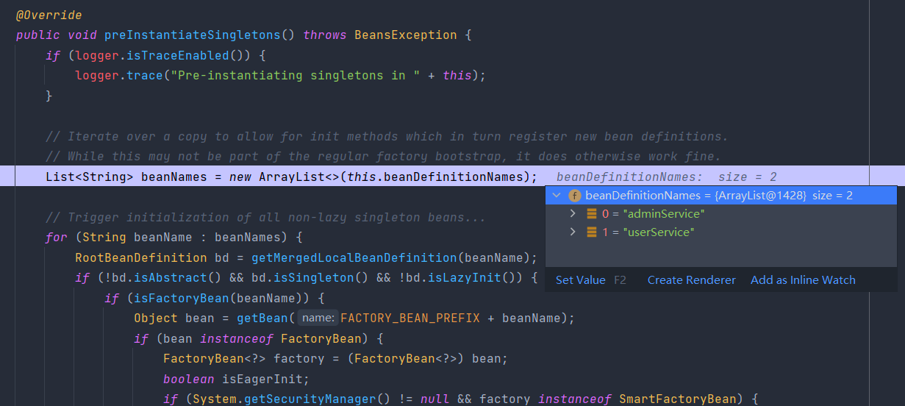

遍历所有的`beanNames`,通过beanName创建`RootBeanDefinition`对象，通过`RootBeanDefinition`检查该bean是否是抽象的，是否是单例的，是否懒加载，如果不是抽象的同时是单例的并且不是懒加载那么再判断是否实现了`FactoryBean`接口，如果没有实现，那么就调用getBean

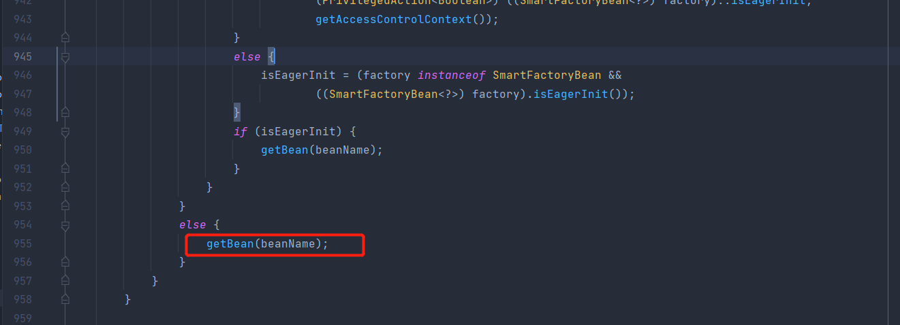


getBean有很多重载方法

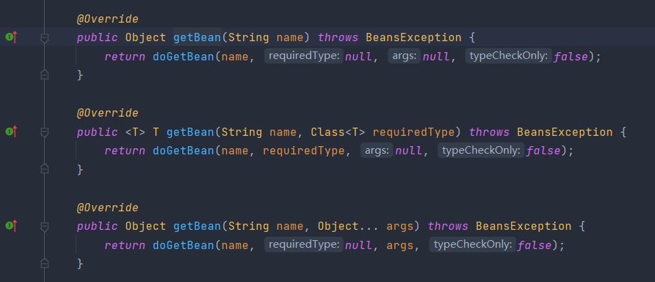


我们通过name获取Bean，之后进入`doGetBean`

```java
protected <T> T doGetBean(
			String name, @Nullable Class<T> requiredType, @Nullable Object[] args, boolean typeCheckOnly)
			throws BeansException {
		//转换beanName，去掉工厂取消引用前缀，并将别名解析为规范名称。
		String beanName = transformedBeanName(name);
		Object beanInstance;

		// 检查bean是否已经存在，
		Object sharedInstance = getSingleton(beanName);
		if (sharedInstance != null && args == null) {
			if (logger.isTraceEnabled()) {
				if (isSingletonCurrentlyInCreation(beanName)) {
					logger.trace("Returning eagerly cached instance of singleton bean '" + beanName +
							"' that is not fully initialized yet - a consequence of a circular reference");
				}
				else {
					logger.trace("Returning cached instance of singleton bean '" + beanName + "'");
				}
			}
			beanInstance = getObjectForBeanInstance(sharedInstance, name, beanName, null);
		}

		else {
			// Fail if we're already creating this bean instance:
			// We're assumably within a circular reference.
			if (isPrototypeCurrentlyInCreation(beanName)) {
				throw new BeanCurrentlyInCreationException(beanName);
			}

			// Check if bean definition exists in this factory.
			BeanFactory parentBeanFactory = getParentBeanFactory();
			if (parentBeanFactory != null && !containsBeanDefinition(beanName)) {
				// Not found -> check parent.
				String nameToLookup = originalBeanName(name);
				if (parentBeanFactory instanceof AbstractBeanFactory) {
					return ((AbstractBeanFactory) parentBeanFactory).doGetBean(
							nameToLookup, requiredType, args, typeCheckOnly);
				}
				else if (args != null) {
					// Delegation to parent with explicit args.
					return (T) parentBeanFactory.getBean(nameToLookup, args);
				}
				else if (requiredType != null) {
					// No args -> delegate to standard getBean method.
					return parentBeanFactory.getBean(nameToLookup, requiredType);
				}
				else {
					return (T) parentBeanFactory.getBean(nameToLookup);
				}
			}

			if (!typeCheckOnly) {
				markBeanAsCreated(beanName);
			}

			StartupStep beanCreation = this.applicationStartup.start("spring.beans.instantiate")
					.tag("beanName", name);
			try {
				if (requiredType != null) {
					beanCreation.tag("beanType", requiredType::toString);
				}
				RootBeanDefinition mbd = getMergedLocalBeanDefinition(beanName);
				checkMergedBeanDefinition(mbd, beanName, args);

				// Guarantee initialization of beans that the current bean depends on.
				String[] dependsOn = mbd.getDependsOn();
				if (dependsOn != null) {
					for (String dep : dependsOn) {
						if (isDependent(beanName, dep)) {
							throw new BeanCreationException(mbd.getResourceDescription(), beanName,
									"Circular depends-on relationship between '" + beanName + "' and '" + dep + "'");
						}
						registerDependentBean(dep, beanName);
						try {
							getBean(dep);
						}
						catch (NoSuchBeanDefinitionException ex) {
							throw new BeanCreationException(mbd.getResourceDescription(), beanName,
									"'" + beanName + "' depends on missing bean '" + dep + "'", ex);
						}
					}
				}

				// Create bean instance.
				if (mbd.isSingleton()) {
					sharedInstance = getSingleton(beanName, () -> {
						try {
                            //创建对象
							return createBean(beanName, mbd, args);
						}
						catch (BeansException ex) {
							// Explicitly remove instance from singleton cache: It might have been put there
							// eagerly by the creation process, to allow for circular reference resolution.
							// Also remove any beans that received a temporary reference to the bean.
							destroySingleton(beanName);
							throw ex;
						}
					});
					beanInstance = getObjectForBeanInstance(sharedInstance, name, beanName, mbd);
				}

				else if (mbd.isPrototype()) {
					// It's a prototype -> create a new instance.
					Object prototypeInstance = null;
					try {
						beforePrototypeCreation(beanName);
						prototypeInstance = createBean(beanName, mbd, args);
					}
					finally {
						afterPrototypeCreation(beanName);
					}
					beanInstance = getObjectForBeanInstance(prototypeInstance, name, beanName, mbd);
				}

				else {
					String scopeName = mbd.getScope();
					if (!StringUtils.hasLength(scopeName)) {
						throw new IllegalStateException("No scope name defined for bean '" + beanName + "'");
					}
					Scope scope = this.scopes.get(scopeName);
					if (scope == null) {
						throw new IllegalStateException("No Scope registered for scope name '" + scopeName + "'");
					}
					try {
						Object scopedInstance = scope.get(beanName, () -> {
							beforePrototypeCreation(beanName);
							try {
								return createBean(beanName, mbd, args);
							}
							finally {
								afterPrototypeCreation(beanName);
							}
						});
						beanInstance = getObjectForBeanInstance(scopedInstance, name, beanName, mbd);
					}
					catch (IllegalStateException ex) {
						throw new ScopeNotActiveException(beanName, scopeName, ex);
					}
				}
			}
			catch (BeansException ex) {
				beanCreation.tag("exception", ex.getClass().toString());
				beanCreation.tag("message", String.valueOf(ex.getMessage()));
				cleanupAfterBeanCreationFailure(beanName);
				throw ex;
			}
			finally {
				beanCreation.end();
			}
		}

		return adaptBeanInstance(name, beanInstance, requiredType);
	}
```


进入到`createBean(beanName, mbd, args);`


```java
	protected Object createBean(String beanName, RootBeanDefinition mbd, @Nullable Object[] args)
			throws BeanCreationException {

		if (logger.isTraceEnabled()) {
			logger.trace("Creating instance of bean '" + beanName + "'");
		}
		RootBeanDefinition mbdToUse = mbd;

		// Make sure bean class is actually resolved at this point, and
		// clone the bean definition in case of a dynamically resolved Class
		// which cannot be stored in the shared merged bean definition.
		Class<?> resolvedClass = resolveBeanClass(mbd, beanName);
		if (resolvedClass != null && !mbd.hasBeanClass() && mbd.getBeanClassName() != null) {
			mbdToUse = new RootBeanDefinition(mbd);
			mbdToUse.setBeanClass(resolvedClass);
		}

		// Prepare method overrides.
		try {
			mbdToUse.prepareMethodOverrides();
		}
		catch (BeanDefinitionValidationException ex) {
			throw new BeanDefinitionStoreException(mbdToUse.getResourceDescription(),
					beanName, "Validation of method overrides failed", ex);
		}

		try {
			// Give BeanPostProcessors a chance to return a proxy instead of the target bean instance.
			Object bean = resolveBeforeInstantiation(beanName, mbdToUse);
			if (bean != null) {
				return bean;
			}
		}
		catch (Throwable ex) {
			throw new BeanCreationException(mbdToUse.getResourceDescription(), beanName,
					"BeanPostProcessor before instantiation of bean failed", ex);
		}

		try {
            
            //创建bean的核心
			Object beanInstance = doCreateBean(beanName, mbdToUse, args);
			if (logger.isTraceEnabled()) {
				logger.trace("Finished creating instance of bean '" + beanName + "'");
			}
			return beanInstance;
		}
		catch (BeanCreationException | ImplicitlyAppearedSingletonException ex) {
			// A previously detected exception with proper bean creation context already,
			// or illegal singleton state to be communicated up to DefaultSingletonBeanRegistry.
			throw ex;
		}
		catch (Throwable ex) {
			throw new BeanCreationException(
					mbdToUse.getResourceDescription(), beanName, "Unexpected exception during bean creation", ex);
		}
	}
```


进入`doCreateBean(beanName, mbdToUse, args);`


```java

	protected Object doCreateBean(final String beanName, final RootBeanDefinition mbd, final @Nullable Object[] args)
			throws BeanCreationException {

		// Instantiate the bean.
		BeanWrapper instanceWrapper = null;
		if (mbd.isSingleton()) {
			instanceWrapper = this.factoryBeanInstanceCache.remove(beanName);
		}
		if (instanceWrapper == null) {
            //开始创建bean实例
			instanceWrapper = createBeanInstance(beanName, mbd, args);
		}
		final Object bean = instanceWrapper.getWrappedInstance();
		Class<?> beanType = instanceWrapper.getWrappedClass();
		if (beanType != NullBean.class) {
			mbd.resolvedTargetType = beanType;
		}

		// Allow post-processors to modify the merged bean definition.
		synchronized (mbd.postProcessingLock) {
			if (!mbd.postProcessed) {
				try {
					applyMergedBeanDefinitionPostProcessors(mbd, beanType, beanName);
				}
				catch (Throwable ex) {
					throw new BeanCreationException(mbd.getResourceDescription(), beanName,
							"Post-processing of merged bean definition failed", ex);
				}
				mbd.postProcessed = true;
			}
		}

		// Eagerly cache singletons to be able to resolve circular references
		// even when triggered by lifecycle interfaces like BeanFactoryAware.
		boolean earlySingletonExposure = (mbd.isSingleton() && this.allowCircularReferences &&
				isSingletonCurrentlyInCreation(beanName));
		if (earlySingletonExposure) {
			if (logger.isTraceEnabled()) {
				logger.trace("Eagerly caching bean '" + beanName +
						"' to allow for resolving potential circular references");
			}
			addSingletonFactory(beanName, () -> getEarlyBeanReference(beanName, mbd, bean));
		}

		// Initialize the bean instance.
		Object exposedObject = bean;
		try {
			populateBean(beanName, mbd, instanceWrapper);
			exposedObject = initializeBean(beanName, exposedObject, mbd);
		}
		catch (Throwable ex) {
			if (ex instanceof BeanCreationException && beanName.equals(((BeanCreationException) ex).getBeanName())) {
				throw (BeanCreationException) ex;
			}
			else {
				throw new BeanCreationException(
						mbd.getResourceDescription(), beanName, "Initialization of bean failed", ex);
			}
		}

		if (earlySingletonExposure) {
			Object earlySingletonReference = getSingleton(beanName, false);
			if (earlySingletonReference != null) {
				if (exposedObject == bean) {
					exposedObject = earlySingletonReference;
				}
				else if (!this.allowRawInjectionDespiteWrapping && hasDependentBean(beanName)) {
					String[] dependentBeans = getDependentBeans(beanName);
					Set<String> actualDependentBeans = new LinkedHashSet<>(dependentBeans.length);
					for (String dependentBean : dependentBeans) {
						if (!removeSingletonIfCreatedForTypeCheckOnly(dependentBean)) {
							actualDependentBeans.add(dependentBean);
						}
					}
					if (!actualDependentBeans.isEmpty()) {
						throw new BeanCurrentlyInCreationException(beanName,
								"Bean with name '" + beanName + "' has been injected into other beans [" +
								StringUtils.collectionToCommaDelimitedString(actualDependentBeans) +
								"] in its raw version as part of a circular reference, but has eventually been " +
								"wrapped. This means that said other beans do not use the final version of the " +
								"bean. This is often the result of over-eager type matching - consider using " +
								"'getBeanNamesOfType' with the 'allowEagerInit' flag turned off, for example.");
					}
				}
			}
		}

		// Register bean as disposable.
		try {
			registerDisposableBeanIfNecessary(beanName, bean, mbd);
		}
		catch (BeanDefinitionValidationException ex) {
			throw new BeanCreationException(
					mbd.getResourceDescription(), beanName, "Invalid destruction signature", ex);
		}

		return exposedObject;
	}

```


进入到`createBeanInstance(beanName, mbd, args);`通过反射方式创建对象

```java
protected BeanWrapper createBeanInstance(String beanName, RootBeanDefinition mbd, @Nullable Object[] args) {
		// Make sure bean class is actually resolved at this point.
		Class<?> beanClass = resolveBeanClass(mbd, beanName);

		if (beanClass != null && !Modifier.isPublic(beanClass.getModifiers()) && !mbd.isNonPublicAccessAllowed()) {
			throw new BeanCreationException(mbd.getResourceDescription(), beanName,
					"Bean class isn't public, and non-public access not allowed: " + beanClass.getName());
		}

		Supplier<?> instanceSupplier = mbd.getInstanceSupplier();
		if (instanceSupplier != null) {
			return obtainFromSupplier(instanceSupplier, beanName);
		}

		if (mbd.getFactoryMethodName() != null) {
			return instantiateUsingFactoryMethod(beanName, mbd, args);
		}

		// Shortcut when re-creating the same bean...
		boolean resolved = false;
		boolean autowireNecessary = false;
		if (args == null) {
			synchronized (mbd.constructorArgumentLock) {
				if (mbd.resolvedConstructorOrFactoryMethod != null) {
					resolved = true;
					autowireNecessary = mbd.constructorArgumentsResolved;
				}
			}
		}
		if (resolved) {
			if (autowireNecessary) {
				return autowireConstructor(beanName, mbd, null, null);
			}
			else {
				return instantiateBean(beanName, mbd);
			}
		}

		// Candidate constructors for autowiring?
    //获取到了构造器
		Constructor<?>[] ctors = determineConstructorsFromBeanPostProcessors(beanClass, beanName);
		if (ctors != null || mbd.getResolvedAutowireMode() == AUTOWIRE_CONSTRUCTOR ||
				mbd.hasConstructorArgumentValues() || !ObjectUtils.isEmpty(args)) {
			return autowireConstructor(beanName, mbd, ctors, args);
		}

		// Preferred constructors for default construction?
		ctors = mbd.getPreferredConstructors();
		if (ctors != null) {
			return autowireConstructor(beanName, mbd, ctors, null);
		}

		// No special handling: simply use no-arg constructor.
    	//进入到无参构造
		return instantiateBean(beanName, mbd);
	}

```

进入instantiateBean(beanName, mbd); 方法 找到  SimpleInstantiationStrategy的instantiate方法，里面得到了无参构造

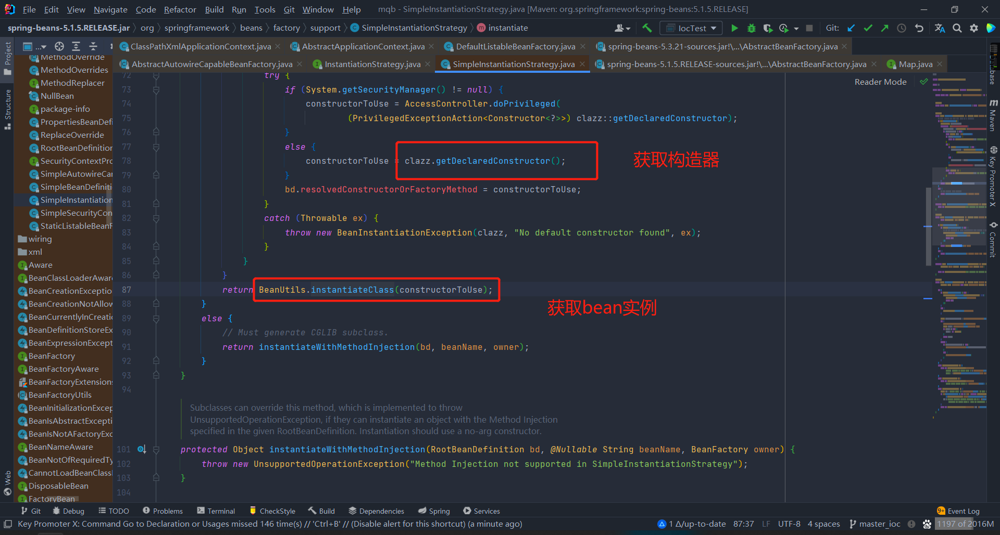

执行完之后就获得了对象，但是对象中的属性并未赋值，之后进行属性填充`AbstractAutowireCapableBeanFactory`类的`doCreateBean`方法

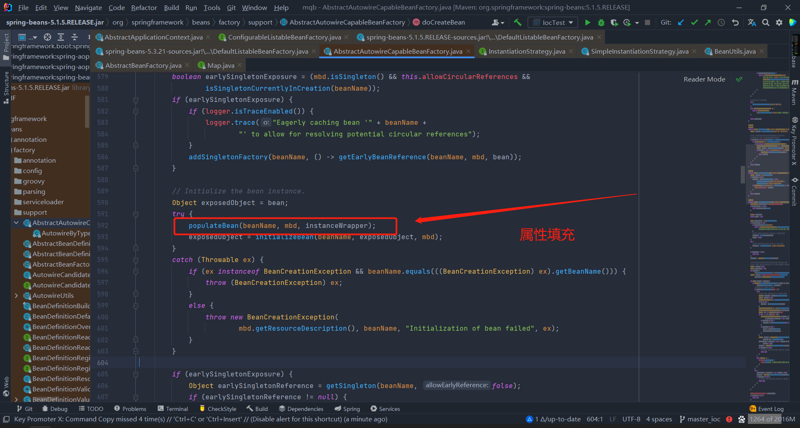

进入到populateBean方法

```java
	protected void populateBean(String beanName, RootBeanDefinition mbd, @Nullable BeanWrapper bw) {
		if (bw == null) {
			if (mbd.hasPropertyValues()) {
				throw new BeanCreationException(
						mbd.getResourceDescription(), beanName, "Cannot apply property values to null instance");
			}
			else {
				// Skip property population phase for null instance.
				return;
			}
		}

		// Give any InstantiationAwareBeanPostProcessors the opportunity to modify the
		// state of the bean before properties are set. This can be used, for example,
		// to support styles of field injection.
		boolean continueWithPropertyPopulation = true;

		if (!mbd.isSynthetic() && hasInstantiationAwareBeanPostProcessors()) {
			for (BeanPostProcessor bp : getBeanPostProcessors()) {
				if (bp instanceof InstantiationAwareBeanPostProcessor) {
					InstantiationAwareBeanPostProcessor ibp = (InstantiationAwareBeanPostProcessor) bp;
					if (!ibp.postProcessAfterInstantiation(bw.getWrappedInstance(), beanName)) {
						continueWithPropertyPopulation = false;
						break;
					}
				}
			}
		}

		if (!continueWithPropertyPopulation) {
			return;
		}

		PropertyValues pvs = (mbd.hasPropertyValues() ? mbd.getPropertyValues() : null);

		if (mbd.getResolvedAutowireMode() == AUTOWIRE_BY_NAME || mbd.getResolvedAutowireMode() == AUTOWIRE_BY_TYPE) {
			MutablePropertyValues newPvs = new MutablePropertyValues(pvs);
			// Add property values based on autowire by name if applicable.
			if (mbd.getResolvedAutowireMode() == AUTOWIRE_BY_NAME) {
				autowireByName(beanName, mbd, bw, newPvs);
			}
			// Add property values based on autowire by type if applicable.
			if (mbd.getResolvedAutowireMode() == AUTOWIRE_BY_TYPE) {
				autowireByType(beanName, mbd, bw, newPvs);
			}
			pvs = newPvs;
		}

		boolean hasInstAwareBpps = hasInstantiationAwareBeanPostProcessors();
		boolean needsDepCheck = (mbd.getDependencyCheck() != AbstractBeanDefinition.DEPENDENCY_CHECK_NONE);

		PropertyDescriptor[] filteredPds = null;
		if (hasInstAwareBpps) {
			if (pvs == null) {
				pvs = mbd.getPropertyValues();
			}
			for (BeanPostProcessor bp : getBeanPostProcessors()) {
				if (bp instanceof InstantiationAwareBeanPostProcessor) {
					InstantiationAwareBeanPostProcessor ibp = (InstantiationAwareBeanPostProcessor) bp;
					PropertyValues pvsToUse = ibp.postProcessProperties(pvs, bw.getWrappedInstance(), beanName);
					if (pvsToUse == null) {
						if (filteredPds == null) {
							filteredPds = filterPropertyDescriptorsForDependencyCheck(bw, mbd.allowCaching);
						}
						pvsToUse = ibp.postProcessPropertyValues(pvs, filteredPds, bw.getWrappedInstance(), beanName);
						if (pvsToUse == null) {
							return;
						}
					}
					pvs = pvsToUse;
				}
			}
		}
		if (needsDepCheck) {
			if (filteredPds == null) {
				filteredPds = filterPropertyDescriptorsForDependencyCheck(bw, mbd.allowCaching);
			}
			checkDependencies(beanName, mbd, filteredPds, pvs);
		}

		if (pvs != null) {
			applyPropertyValues(beanName, mbd, bw, pvs);
		}
	}

```


当属性填充之后，一般属性被填充。


假如说adminService     bean对象中通过Aware接口设置进去ApplicationContext对象的话，接下来执行Aware接口的方法。


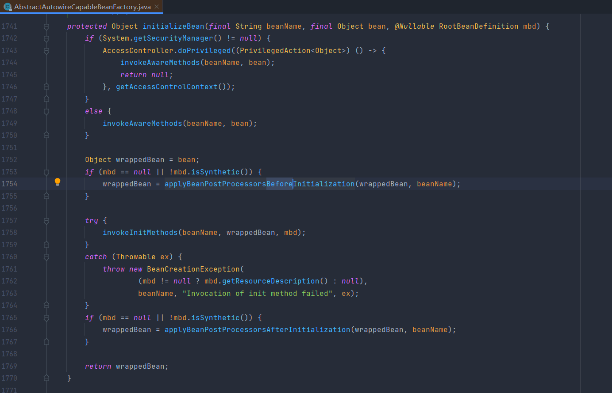


执行Aware接口方法之后，在执行Before方法也就是` applyBeanPostProcessorsBeforeInitialization`


再执行init方法

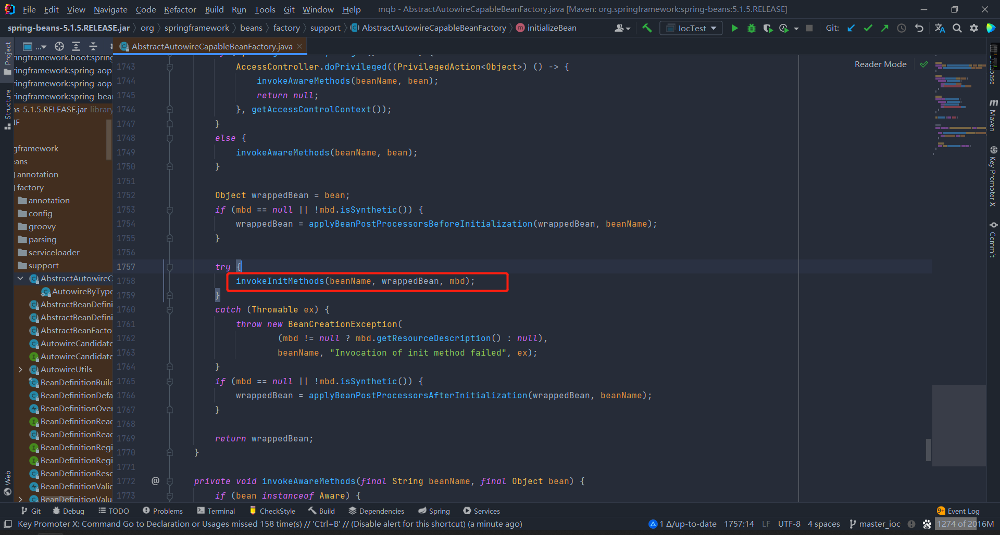

之后在执行after方法

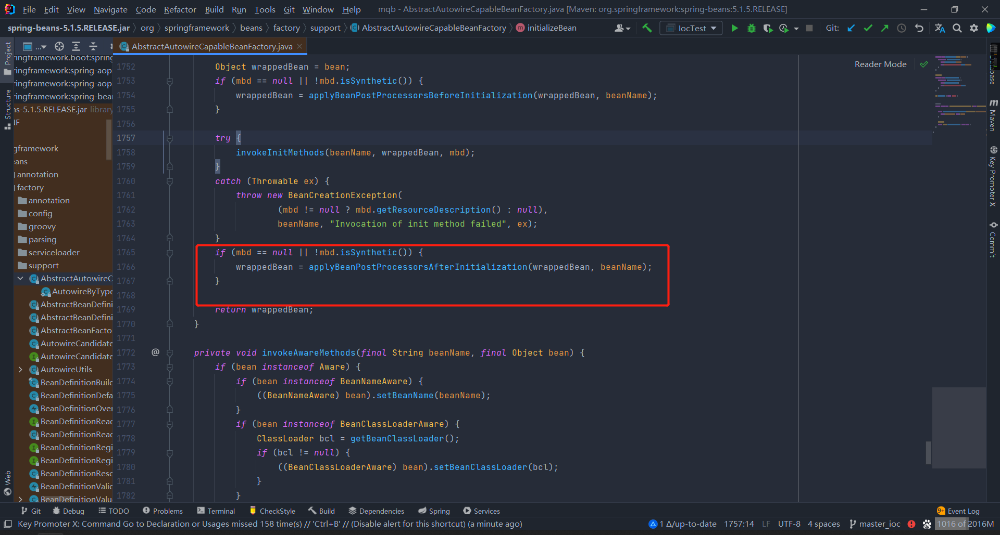

至此完成对象创建完毕，可以使用


## Spring的IOC容器的一级缓存、二级缓存、三级缓存

一级缓存-singletonObjects是用来存放就绪状态的Bean。保存在该缓存中的Bean所实现Aware子接口的方法已经回调完毕，自定义初始化方法已经执行完毕，也经过BeanPostProcessor实现类的postProcessorBeforeInitialization、postProcessorAfterInitialization方法处理；

二级缓存-earlySingletonObjects是用来存放早期曝光的Bean，一般只有处于循环引用状态的Bean才会被保存在该缓存中。保存在该缓存中的Bean所实现Aware子接口的方法还未回调，自定义初始化方法未执行，也未经过BeanPostProcessor实现类的postProcessorBeforeInitialization、postProcessorAfterInitialization方法处理。如果启用了Spring AOP，并且处于切点表达式处理范围之内，那么会被增强，即创建其代理对象。

这里额外提一点，普通Bean被增强(JDK动态代理或CGLIB)的时机是在AbstractAutoProxyCreator实现的BeanPostProcessor的postProcessorAfterInitialization方法中，而处于循环引用状态的Bean被增强的时机是在AbstractAutoProxyCreator实现的SmartInstantiationAwareBeanPostProcessor的getEarlyBeanReference方法中。

三级缓存-singletonFactories是用来存放创建用于获取Bean的工厂类-ObjectFactory实例。在IoC容器中，所有刚被创建出来的Bean，默认都会保存到该缓存中。

Bean在这三个缓存之间的流转顺序为（存在循环引用）：

1. 通过反射创建Bean实例。是单例Bean，并且IoC容器允许Bean之间循环引用，保存到三级缓存中。
2. 当发生了循环引用时，从三级缓存中取出Bean对应的ObjectFactory实例，调用其getObject方法，来获取早期曝光Bean，从三级缓存中移除，保存到二级缓存中。
3.  Bean初始化完成，生命周期的相关方法执行完毕，保存到一级缓存中，从二级缓存以及三级缓存中移除。

Bean在这三个缓存之间的流转顺序为（没有循环引用）：

通过反射创建Bean实例。是单例Bean，并且IoC容器允许Bean之间循环引用，保存到三级缓存中。
Bean初始化完成，生命周期的相关方法执行完毕，保存到一级缓存中，从二级缓存以及三级缓存中移除。
简略流程图：

总结
通过以上分析，我们可以得知Bean在一级缓存、二级缓存、三级缓存中的流转顺序为：三级缓存->二级缓存->一级缓存。但是并不是所有Bean都会经历这个过程，例如对于原型Bean(Prototype)，IoC容器不会将其保存到任何一个缓存中的，另外即便是单例Bean(Singleton)，如果没有循环引用关系，也不会被保存到二级缓存中的。


