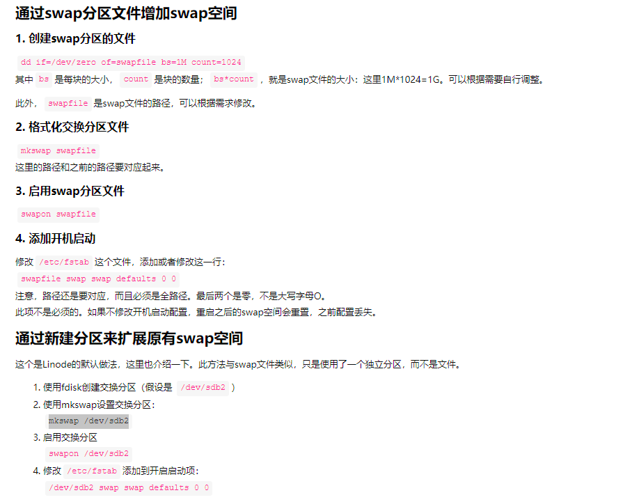

```
[root@study ~]# gdisk /dev/vda
Command （? for help）: n
Partition number （6-128, default 6）:
First sector （34-83886046, default = 69220352） or {+-}size{KMGTP}:
Last sector （69220352-83886046, default = 83886046） or {+-}size{KMGTP}: +512M
Current type is 'Linux filesystem'
Hex code or GUID （L to show codes, Enter = 8300）: 8200
Changed type of partition to 'Linux swap'

Command （? for help）: p
Number  Start （sector）    End （sector）  Size       Code  Name
   6        69220352        70268927   512.0 MiB   8200  Linux swap  # 重点就是产生这东西！

Command （? for help）: w

Do you want to proceed? （Y/N）: y

[root@study ~]# partprobe
[root@study ~]# lsblk
NAME            MAJ:MIN RM  SIZE RO TYPE MOUNTPOINT
vda             252:0    0   40G  0 disk
.....（中间省略）.....
`-vda6          252:6    0  512M  0 part   # 确定这里是存在的才行！
# 鸟哥有简化输出喔！结果可以看到我们多了一个 /dev/vda6 可以使用于 swap 喔！
```

