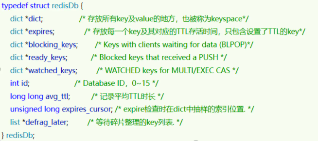
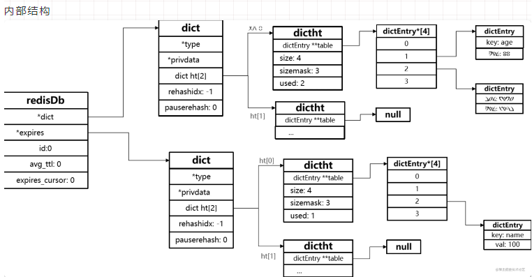
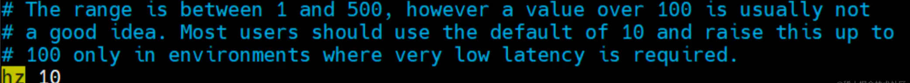
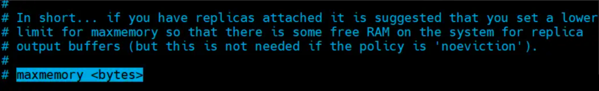
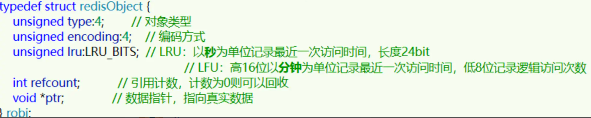

## 1. 过期 key 处理

Redis 之所以性能强，最主要的原因就是基于内存存储。然而单节点的 Redis 其内存大小不宜过大，会影响持久化或主从同步性能。

我们可以通过修改配置文件来设置 Redis 的最大内存：

```sh
maxmemory 1gb
```

当内存使用达到上限时，就无法存储更多数据了。为了解决这个问题，Redis 提供了一些策略实现内存回收：

先要了解的是：redis 是一个存储键值数据库系统，那它源码中是如何存储所有键值对的呢？

Redis 本身是一个典型的 key-value 内存存储数据库，因此所有的 key、value 都保存在之前学习过的 Dict 结构中。不过在其 database 结构体中，有两个 Dict：一个用来记录 key-value；另一个用来记录 key-TTL。








- dict 是 hash 结构，用来存放所有的 键值对
- expires 也是 hash 结构，用来存放所有设置了 过期时间的 键值对，不过它的 value 值是过期时间

这里有两个问题需要我们思考：

- Redis 是如何知道一个 key 是否过期呢？
- 利用两个 Dict 分别记录 key-value 对及 key-ttl 对，是不是 TTL 到期就立即删除了呢？

总结：Redis的过期删除策略就是：惰性删除和定期删除两种策略配合使用

#### 惰性删除

惰性删除：顾明思议并不是在 TTL 到期后就立刻删除，而是在访问一个 key 的时候，检查该 key 的存活时间，如果已经过期才执行删除。

#### 周期删除

周期删除：顾明思议是通过一个定时任务，周期性的抽样部分过期的 key，然后执行删除。执行周期有两种：

- Redis 服务初始化函数 initServer () 中设置定时任务，按照 server.hz 的频率来执行过期 key 清理，模式为 SLOW
- Redis 的每个事件循环前会调用 beforeSleep () 函数，执行过期 key 清理，模式为 FAST

SLOW 模式规则：



- 执行频率受 server.hz 影响，默认为 10，即每秒执行 10 次，每个执行周期 100ms。
- 执行清理耗时不超过一次执行周期的 25%. 默认 slow 模式耗时不超过 25ms
- 逐个遍历 db，逐个遍历 db 中的 bucket，抽取 20 个 key 判断是否过期
- 如果没达到时间上限（25ms）并且过期 key 比例大于 10%，再进行一次抽样，否则结束

FAST 模式规则（过期 key 比例小于 10% 不执行 ）：

- 执行频率受 beforeSleep () 调用频率影响，但两次 FAST 模式间隔不低于 2ms
- 执行清理耗时不超过 1ms
- 逐个遍历 db，逐个遍历 db 中的 bucket，抽取 20 个 key 判断是否过期
- 如果没达到时间上限（1ms）并且过期 key 比例大于 10%，再进行一次抽样，否则结束

## 2.内存淘汰策略

#### ①、设置Redis最大内存

　　在配置文件redis.conf 中，可以通过参数 maxmemory  来设定最大内存：




```
不设定该参数默认是无限制的，但是通常会设定其为物理内存的四分之三

```

#### ②、设置内存淘汰方式

当现有内存大于 maxmemory 时，便会触发redis主动淘汰内存方式，通过设置 maxmemory-policy

有如下几种淘汰方式：

- `volatile-lru`：设置了过期时间的key使用LRU算法淘汰；
- `allkeys-lru`：所有key使用LRU算法淘汰；
- `volatile-lfu`：设置了过期时间的key使用LFU算法淘汰；
- `allkeys-lfu`：所有key使用LFU算法淘汰；
- `volatile-random`：设置了过期时间的key使用随机淘汰；
- `allkeys-random`：所有key使用随机淘汰；
- `volatile-ttl`：设置了过期时间的key根据过期时间淘汰，越早过期越早淘汰；
- `noeviction`：默认策略，当内存达到设置的最大值时，所有申请内存的操作都会报错(如set,lpush等)，只读操作如get命令可以正常执行；

比较容易混淆的有两个：

​	**LRU（Least Recently Used），最少最近使用。用当前时间减去最后一次访问时间，这个值越大则淘汰优先级越高。**

​    LFU（Least Frequently Used），最少频率使用。会统计每个 key 的访问频率，值越小淘汰优先级越高。

```markdown
* LRU、LFU和volatile-ttl都是近似随机算法；
```

使用下面的参数*maxmemory-policy*配置淘汰策略：

```sh
#配置文件
maxmemory-policy noeviction
 
#命令行
127.0.0.1:6379> config get maxmemory-policy
1) "maxmemory-policy"
2) "noeviction"
127.0.0.1:6379> config set maxmemory-policy allkeys-random
OK
127.0.0.1:6379> config get maxmemory-policy
1) "maxmemory-policy"
2) "allkeys-random"
```

Redis 的数据都会被封装为 RedisObject 结构：



LFU 的访问次数之所以叫做逻辑访问次数，是因为并不是每次 key 被访问都计数，而是通过运算：

- 生成 0~1 之间的随机数 R
- 计算 (旧次数 * lfu_log_factor + 1)，记录为 P
- 如果 R < P ，则计数器 + 1，且最大不超过 255
- 访问次数会随时间衰减，距离上一次访问时间每隔 lfu_decay_time 分钟，计数器 -1


# 参考文章：

[Redis这个内存回收，确实有点牛逼！！！ - 掘金 (juejin.cn)](https://juejin.cn/post/7174660768300793913)