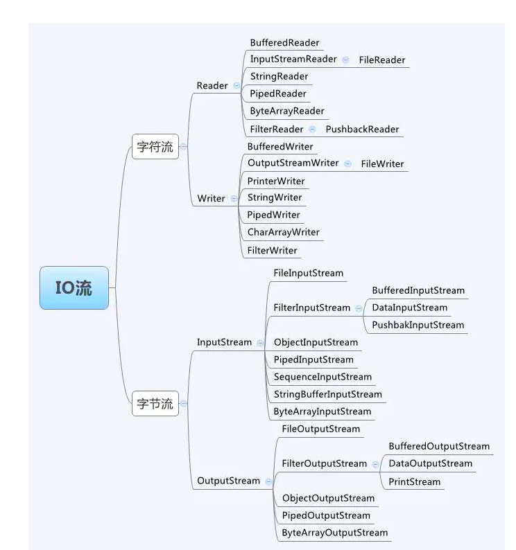
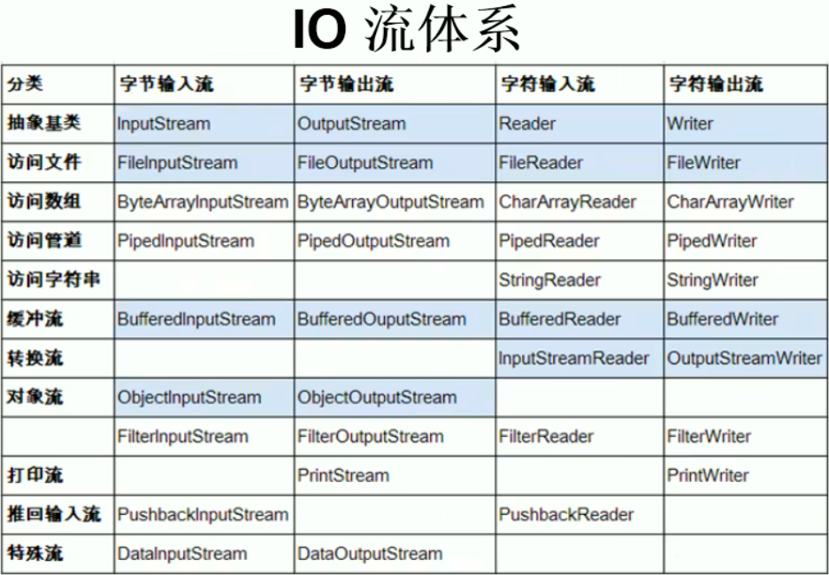

1. 按数据流向分为`输入流`和`输出流`
2. 按数据类型分为`字节流`和`字符流`
3.  按照流的角色来分为`节点流`和`处理流`

## 输入流和输出流

## 字节流和字符流

只要是处理纯文本数据，就优先考虑使用字符流。 除此之外都使用字节流。

## 节点流和处理流

可以从/向一个特定的IO设备（如磁盘、网络）读/写数据的流，称为节点流，节点流也被成为`低级流`。

处理流是对一个已存在的流进行连接或封装，通过封装后的流来实现数据读/写功能，处理流也被称为`高级流`。

节点流（FileReader、FileWriter、FileOutputStream、FileInputStream）又叫文件流