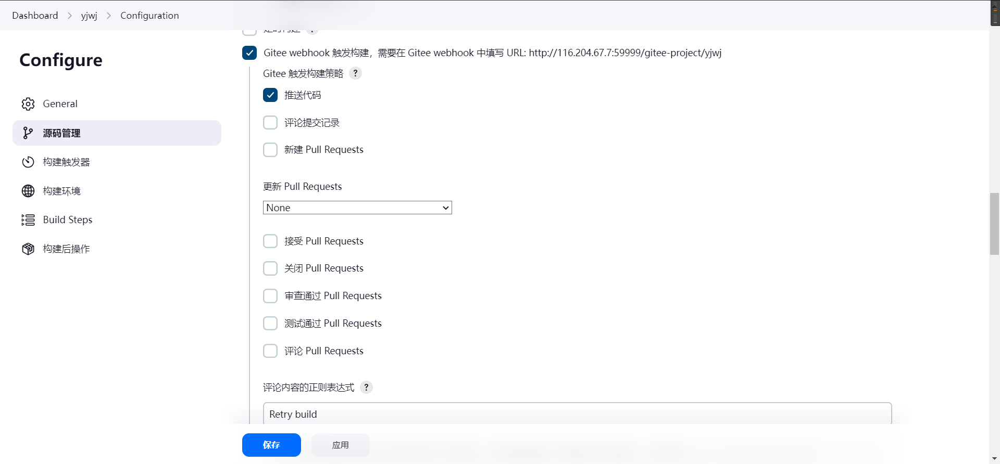
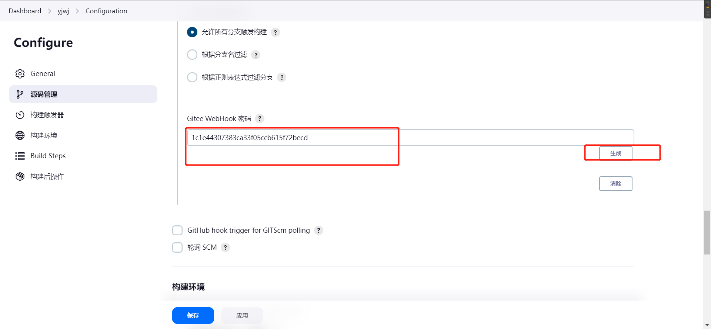
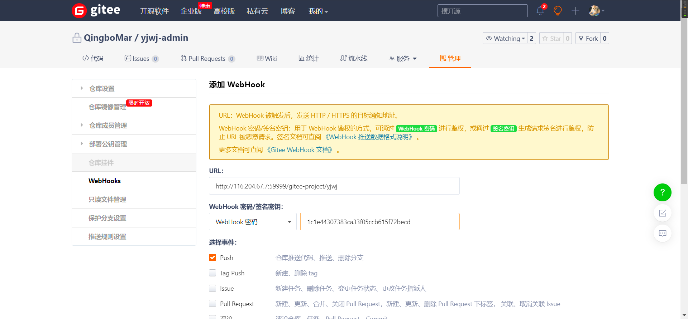
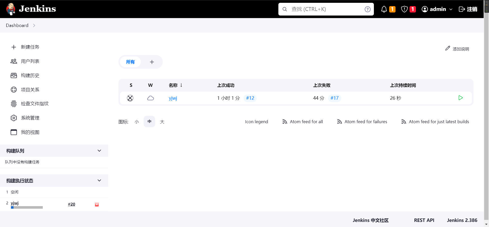

下载jenkins

http://mirrors.jenkins.io/war-stable/latest/jenkins.war

　　2.在安装包根路径下，运行命令

`nohup java -Dhudson.model.DownloadService.noSignatureCheck=true -jar jenkins.war > jenkins.log 2>&1 --httpPort=9090 &`

　　3.打开浏览器进入链接 [`http://localhost:8080`](http://localhost:8080/).

　　4.填写初始密码，激活系统

账号 admin 

密码  在vi /root/.jenkins/secrets/initialAdminPassword

2ac9a7663f6741fdac3b4e9005c1a1f1


## Docker启动jenkins


```bash
docker run -d --name my-jenkins -p 59999:8080 -p 59998:5000 -v /usr/local/maven:/usr/local/maven -v /etc/localtime:/etc/localtime --restart always   jenkins/jenkins
```

进入容器

docker exec -it a7 /bash/bin

初始密码位置

/var/jenkins_home/secrets/initialAdminPassword

管理员：admin

92fddf6de7044d82aac9ded6b9033d6d

账号 maqingbo

密码 vnewihbdsldjq^@53gc238r7g


## 自动化构建

### gitee插件

去插件管理下载gitee插件

### 新建job

在job的构建触发器使用	`Gitee webhook 触发构建`







并在gitee的项目管理中配置`Gitee webhook` 以及生成的密码



每当master代码有变动之后就会触发jenkins自动构建

### 改动master分支代码



会自动触发构建