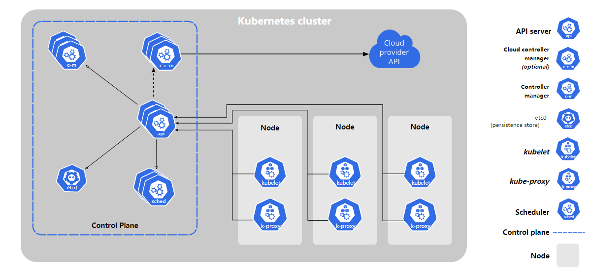
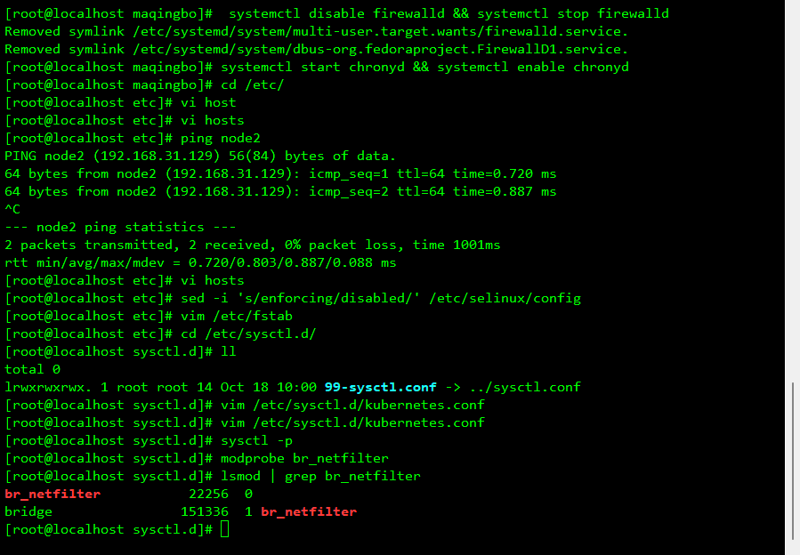
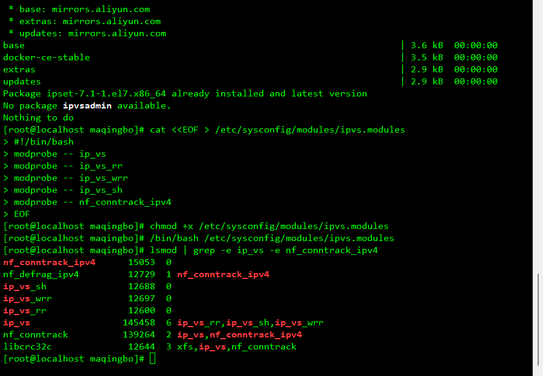
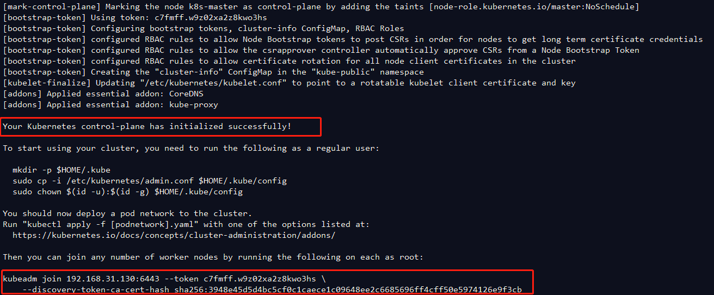
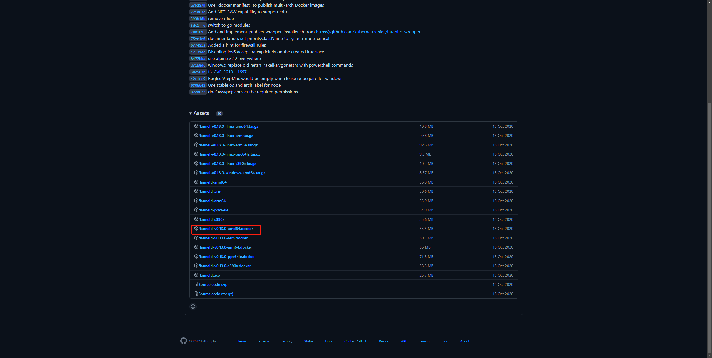
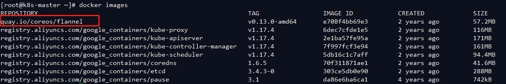
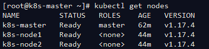
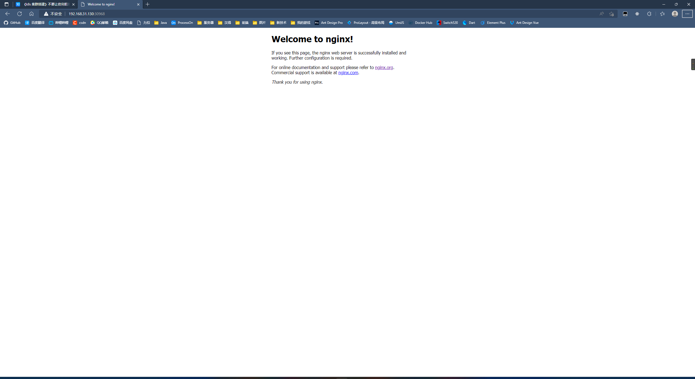
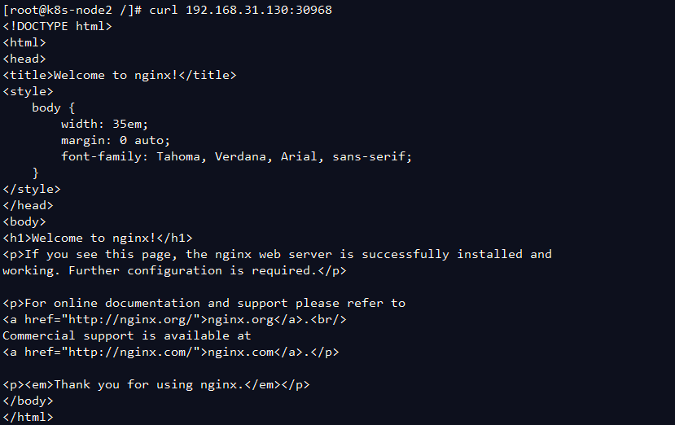

## K8s能做什么

- **服务发现和负载均衡**

  Kubernetes 可以使用 DNS 名称或自己的 IP 地址来曝露容器。 如果进入容器的流量很大， Kubernetes 可以负载均衡并分配网络流量，从而使部署稳定。

- **存储编排**

  Kubernetes 允许你自动挂载你选择的存储系统，例如本地存储、公共云提供商等。

- **自动部署和回滚**

  你可以使用 Kubernetes 描述已部署容器的所需状态， 它可以以受控的速率将实际状态更改为期望状态。 例如，你可以自动化 Kubernetes 来为你的部署创建新容器， 删除现有容器并将它们的所有资源用于新容器。

- **自动完成装箱计算**

  你为 Kubernetes 提供许多节点组成的集群，在这个集群上运行容器化的任务。 你告诉 Kubernetes 每个容器需要多少 CPU 和内存 (RAM)。 Kubernetes 可以将这些容器按实际情况调度到你的节点上，以最佳方式利用你的资源。

- **自我修复**

  Kubernetes 将重新启动失败的容器、替换容器、杀死不响应用户定义的运行状况检查的容器， 并且在准备好服务之前不将其通告给客户端。

- **密钥与配置管理**

  Kubernetes 允许你存储和管理敏感信息，例如密码、OAuth 令牌和 ssh 密钥。 你可以在不重建容器镜像的情况下部署和更新密钥和应用程序配置，也无需在堆栈配置中暴露密钥

## k8s组件




### kube-apiserver

API 服务器是 Kubernetes控制平面的组件， 该组件负责公开了 Kubernetes API，负责处理接受请求的工作。 API 服务器是 Kubernetes 控制平面的前端。

Kubernetes API 服务器的主要实现是 kube-apiserver。 `kube-apiserver` 设计上考虑了水平扩缩，也就是说，它可通过部署多个实例来进行扩缩。 你可以运行 `kube-apiserver` 的多个实例，并在这些实例之间平衡流量。

### etcd

一致且高度可用的键值存储，用作 Kubernetes 的所有集群数据的后台数据库。

### kube-scheduler

`kube-scheduler` 是控制平面的组件， 负责监视新创建的、未指定运行节点（node）的 Pods， 并选择节点来让 Pod 在上面运行。

调度决策考虑的因素包括单个 Pod 及 Pods 集合的资源需求、软硬件及策略约束、 亲和性及反亲和性规范、数据位置、工作负载间的干扰及最后时限。

### kube-controller-manager

kube-controller-manager是控制平面的组件， 负责运行控制器进程。

从逻辑上讲， 每个控制器都是一个单独的进程， 但是为了降低复杂性，它们都被编译到同一个可执行文件，并在同一个进程中运行。

这些控制器包括：

- 节点控制器（Node Controller）：负责在节点出现故障时进行通知和响应
- 任务控制器（Job Controller）：监测代表一次性任务的 Job 对象，然后创建 Pods 来运行这些任务直至完成
- 端点控制器（Endpoints Controller）：填充端点（Endpoints）对象（即加入 Service 与 Pod）
- 服务帐户和令牌控制器（Service Account & Token Controllers）：为新的命名空间创建默认帐户和 API 访问令牌

### cloud-controller-manager

一个 Kubernetes 控制平面组件， 嵌入了特定于云平台的控制逻辑。 云控制器管理器（Cloud Controller Manager）允许你将你的集群连接到云提供商的 API 之上， 并将与该云平台交互的组件同与你的集群交互的组件分离开来。

`cloud-controller-manager` 仅运行特定于云平台的控制器。 因此如果你在自己的环境中运行 Kubernetes，或者在本地计算机中运行学习环境， 所部署的集群不需要有云控制器管理器。

与 `kube-controller-manager` 类似，`cloud-controller-manager` 将若干逻辑上独立的控制回路组合到同一个可执行文件中， 供你以同一进程的方式运行。 你可以对其执行水平扩容（运行不止一个副本）以提升性能或者增强容错能力。

下面的控制器都包含对云平台驱动的依赖：

- 节点控制器（Node Controller）：用于在节点终止响应后检查云提供商以确定节点是否已被删除
- 路由控制器（Route Controller）：用于在底层云基础架构中设置路由
- 服务控制器（Service Controller）：用于创建、更新和删除云提供商负载均衡器

## k8s对象管理

| 管理技术       | 作用于   | 建议的环境 | 支持的写者 | 学习难度 |
| -------------- | -------- | ---------- | ---------- | -------- |
| 指令式命令     | 活跃对象 | 开发项目   | 1+         | 最低     |
| 指令式对象配置 | 单个文件 | 生产项目   | 1          | 中等     |
| 声明式对象配置 | 文件目录 | 生产项目   | 1+         | 最高     |


### 指令式命令

`kubectl create deployment nginx --image nginx`

与对象配置相比的优点：

- 命令简单，易学且易于记忆。
- 命令仅需一步即可对集群进行更改。

与对象配置相比的缺点：

- 命令不与变更审查流程集成。
- 命令不提供与更改关联的审核跟踪。
- 除了实时内容外，命令不提供记录源。
- 命令不提供用于创建新对象的模板

### 指令式对象配置

在指令式对象配置中，kubectl 命令指定操作（创建，替换等），可选标志和 至少一个文件名。指定的文件必须包含 YAML 或 JSON 格式的对象的完整定义。

> `replace` 指令式命令将现有规范替换为新提供的规范，并放弃对配置文件中 缺少的对象的所有更改。此方法不应与对象规约被独立于配置文件进行更新的 资源类型一起使用。比如类型为 `LoadBalancer` 的服务，它的 `externalIPs` 字段就是独立于集群配置进行更新。


创建配置文件中定义的对象：

```sh
kubectl create -f nginx.yaml
```

删除两个配置文件中定义的对象：

```sh
kubectl delete -f nginx.yaml -f redis.yaml
```

通过覆盖活动配置来更新配置文件中定义的对象：

```sh
kubectl replace -f nginx.yaml
```

### 声明式对象配置

使用声明式对象配置时，用户对本地存储的对象配置文件进行操作，但是用户 未定义要对该文件执行的操作。 `kubectl` 会自动检测每个文件的创建、更新和删除操作。 这使得配置可以在目录上工作，根据目录中配置文件对不同的对象执行不同的操作。


> 声明式对象配置保留其他编写者所做的修改，即使这些更改并未合并到对象配置文件中。 可以通过使用 `patch` API 操作仅写入观察到的差异，而不是使用 `replace` API 操作来替换整个对象配置来实现。


处理 `configs` 目录中的所有对象配置文件，创建并更新活跃对象。 可以首先使用 `diff` 子命令查看将要进行的更改，然后在进行应用：

```sh
kubectl diff -f configs/
kubectl apply -f configs/
```

递归处理目录：

```sh
kubectl diff -R -f configs/
kubectl apply -R -f configs/
```

与指令式对象配置相比的优点：

- 对活动对象所做的更改即使未合并到配置文件中，也会被保留下来。
- 声明性对象配置更好地支持对目录进行操作并自动检测每个文件的操作类型（创建，修补，删除）。

与指令式对象配置相比的缺点：

- 声明式对象配置难于调试并且出现异常时结果难以理解。
- 使用 diff 产生的部分更新会创建复杂的合并和补丁操作

## 搭建k8s集群

三台虚拟机

| hostname   | ip             |               |
| ---------- | -------------- | ------------- |
| k8s-master | 192.168.31.130 | 225.225.225.0 |
| k8s-node1  | 192.168.31.128 | 225.225.225.0 |
| k8s-node2  | 192.168.31.129 | 225.225.225.0 |

### 环境配置


设置hostname

```bash
hostnamectl --static set-hostname k8s-master
hostnamectl --static set-hostname k8s-node1
hostnamectl --static set-hostname k8s-node2
```


所有机器禁用**iptables**和**firewalld**服务

kubernetes和docker在运行中会产生大量的**iptables**规则，为了不让系统规则跟它们混淆，直接关闭系统的规则。三台虚拟机需做同样操作：

```bash
# 1 关闭firewalld服务
systemctl disable firewalld && systemctl stop firewalld
 

# 2 关闭iptables服务
systemctl stop iptables && systemctl disable iptables

```


禁用**selinux**

**selinux**是**linux**系统下的一个安全服务，如果不关闭它，在安装集群中会产生各种各样的奇葩问题

```bash
# 永久关闭
sed -i 's/enforcing/disabled/' /etc/selinux/config
# 临时关闭
setenforce 0
```


设置主机名解析```vim /etc/hosts```,配置hosts，确保各个主机间能互ping

>192.168.31.130 master
>192.168.31.128 node1
>192.168.31.129 node2


禁用swap分区

swap分区指的是虚拟内存分区，它的作用是在物理内存使用完之后，将磁盘空间虚拟成内存来使用启用swap设备会对系统的性能产生非常负面的影响，因此kubernetes要求每个节点都要禁用swap设备但是如果因为某些原因确实不能关闭swap分区，就需要在集群安装过程中通过明确的参数进行配置说明

```bash
# 永久关闭
vim /etc/fstab
# 临时关闭
swapoff -a
```


修改**linux**的内核参数

我们需要修改**linux**的内核参数，添加网桥过滤和地址转发功能，编辑`/etc/sysctl.d/kubernetes.conf`文件，添加如下配置:

```text
net.bridge.bridge-nf-call-ip6tables = 1
net.bridge.bridge-nf-call-iptables = 1
net.ipv4.ip_forward = 1
sysctl --system
```

添加后进行以下操作：

```text
# 重新加载配置
sysctl -p
# 加载网桥过滤模块
modprobe br_netfilter
# 查看网桥过滤模块是否加载成功
lsmod | grep br_netfilter
```




配置 **ipvs** 功能

在**kubernetes**中**service**有两种代理模型，一种是基于**iptables**的，一种是基于**ipvs**的 相比较的话，**ipvs**的性能明显要高一些，但是如果要使用它，需要手动载入**ipvs**模块

```text
# 安装ipset和ipvsadm
[root@master ~]# yum install ipset ipvsadmin -y

# 添加需要加载的模块写入脚本文件
[root@master ~]# cat <<EOF > /etc/sysconfig/modules/ipvs.modules
#!/bin/bash
modprobe -- ip_vs
modprobe -- ip_vs_rr
modprobe -- ip_vs_wrr
modprobe -- ip_vs_sh
modprobe -- nf_conntrack_ipv4
EOF
# 为脚本文件添加执行权限
[root@master ~]# chmod +x /etc/sysconfig/modules/ipvs.modules
# 执行脚本文件
[root@master ~]# /bin/bash /etc/sysconfig/modules/ipvs.modules
# 查看对应的模块是否加载成功
[root@master ~]# lsmod | grep -e ip_vs -e nf_conntrack_ipv4
```




重启

```bash
reboot
```


配置Docker的镜像源

docker安装，自行百度

```
第一步：新建或编辑daemon.json
vi /etc/docker/daemon.json

第二步：daemon.json中编辑如下
{
    "registry-mirrors": ["http://hub-mirror.c.163.com"]
}

第三步：重启docker
systemctl restart docker.service

第四步：执行docker info查看是否修改成功
docker info
```


### 集群初始化


1、由于 **kubernetes** 的镜像源在国外，速度比较慢，因此我们需要切换成国内的镜像源

```bash
# 编辑 /etc/yum.repos.d/kubernetes.repo 添加一下配置
[root@master ~]# vim /etc/yum.repos.d/kubernetes.repo
[kubernetes]
name=Kubernetes
baseurl=http://mirrors.aliyun.com/kubernetes/yum/repos/kubernetes-el7-x86_64
enabled=1
gpgcheck=0
repo_gpgcheck=0
gpgkey=http://mirrors.aliyun.com/kubernetes/yum/doc/yum-key.gpg
http://mirrors.aliyun.com/kubernetes/yum/doc/rpm-package-key.gpg
```


2、安装**kubeadm**、**kubelet**和**kubectl** 三个组件，并启动**kubelet**

```bash
yum install --setopt=obsoletes=0 kubeadm-1.17.4-0 kubelet-1.17.4-0
kubectl-1.17.4-0 -y
#启动
systemctl enable --now kubelet.service 
```


3、配置 kubelet 的group

```text
# 编辑 /etc/sysconfig/kubelet，添加下面的配置
KUBELET_CGROUP_ARGS="--cgroup-driver=systemd"
KUBE_PROXY_MODE="ipvs"
```


4、这步是来初始化集群的，`因此只需在 master 服务器上执行即可`，上面那些是每个服务器都需要执行！

```text
# 创建集群
# 由于默认拉取镜像地址 k8s.gcr.io 国内无法访问，这里指定阿里云镜像仓库地址
#初始化k8s控制面板
[root@master ~]# kubeadm init \
--apiserver-advertise-address=192.168.31.130 \
--image-repository registry.aliyuncs.com/google_containers  \
--kubernetes-version=v1.17.4 \
--pod-network-cidr=10.244.0.0/16 \
--service-cidr=10.96.0.0/12 

#使用 kubectl 工具
[root@master ~]# mkdir -p $HOME/.kube
[root@master ~]# sudo cp -i /etc/kubernetes/admin.conf $HOME/.kube/config
[root@master ~]# sudo chown $(id -u):$(id -g) $HOME/.kube/config
```

k8s控制面板初始化完毕，复制下面这个命令，用于添加集群节点


```bash
kubeadm join 192.168.31.130:6443 --token c7fmff.w9z02xa2z8kwo3hs \
    --discovery-token-ca-cert-hash sha256:3948e45d5d4bc5cf0c1caece1c09648ee2c6685696ff4cff50e5974126e9f3cb 
```





使用 `kubectl get nodes`命令，查看pod信息

NAME         STATUS     ROLES    AGE   VERSION
k8s-master   NotReady   master   16m   v1.17.4

目前只有master节点，下面添加工作节点


**kubeadm参数**

> --apiserver-advertise-address string API Server将要广播的监听地址。如指定为 `0.0.0.0` 将使用缺省的网卡地址。 
>
> --apiserver-bind-port int32     缺省值: 6443 API Server绑定的端口 
>
> --apiserver-cert-extra-sans stringSlice 可选的额外提供的证书主题别名（SANs）用于指定API Server的服务器证书。可以是IP地址也可以是DNS名称。 
>
> --cert-dir string     缺省值: "/etc/kubernetes/pki" 证书的存储路径。 
>
> --config string kubeadm配置文件的路径。警告：配置文件的功能是实验性的。 
>
> --cri-socket string     缺省值: "/var/run/dockershim.sock" 指明要连接的CRI socket文件 
>
> --dry-run 不会应用任何改变；只会输出将要执行的操作。 
>
> --feature-gates string 键值对的集合，用来控制各种功能的开关。可选项有: Auditing=true|false (当前为ALPHA状态 - 缺省值=false) CoreDNS=true|false (缺省值=true) DynamicKubeletConfig=true|false (当前为BETA状态 - 缺省值=false) 
>
> -h, --help 获取init命令的帮助信息 
>
> --ignore-preflight-errors stringSlice 忽视检查项错误列表，列表中的每一个检查项如发生错误将被展示输出为警告，而非错误。 例如: 'IsPrivilegedUser,Swap'. 如填写为 'all' 则将忽视所有的检查项错误。 
>
> --kubernetes-version string     缺省值: "stable-1" 为control plane选择一个特定的Kubernetes版本。 
>
> --node-name string 指定节点的名称。 --pod-network-cidr string 指明pod网络可以使用的IP地址段。 如果设置了这个参数，control plane将会为每一个节点自动分配CIDRs。 
>
> --service-cidr string     缺省值: "10.96.0.0/12" 为service的虚拟IP地址另外指定IP地址段 
>
> --service-dns-domain string     缺省值: "cluster.local" 为services另外指定域名, 例如： "myorg.internal". 
>
> --skip-token-print 不打印出由 `kubeadm init` 命令生成的默认令牌。 
>
> --token string 这个令牌用于建立主从节点间的双向受信链接。格式为 [a-z0-9]{6}\.[a-z0-9]{16} - 示例： abcdef.0123456789abcdef 
>
> --token-ttl duration     缺省值: 24h0m0s 令牌被自动删除前的可用时长 (示例： 1s, 2m, 3h). 如果设置为 '0', 令牌将永不过期。


然后我们需要将**node** 节点加入集群中，在 `node 服务器` 上执行上面kubeadm控制面板提示的命令：

```bash
kubeadm join 192.168.31.130:6443 --token c7fmff.w9z02xa2z8kwo3hs \
    --discovery-token-ca-cert-hash sha256:3948e45d5d4bc5cf0c1caece1c09648ee2c6685696ff4cff50e5974126e9f3cb 
```

使用 `kubectl get nodes`命令，查看pod信息

k8s-master   NotReady   master   18m   v1.17.4
k8s-node1    NotReady   <none>   31s   v1.17.4
k8s-node2    NotReady   <none>   36s   v1.17.4


5、安装网络插件

**kubernetes**支持多种网络插件，比如**flannel**、**calico**、**canal**等等，这里选择使用**flanne**

下载 **flanneld-v0.13.0-amd64.docker** ：**[下载地址](https://link.zhihu.com/?target=https%3A//github.com/flannel-io/flannel/releases/)**



下载完成后，上传至 **master 服务器** 执行以下命令

```text
docker load < flanneld-v0.13.0-amd64.docker
```




然后我们需要获取**flannel**的配置文件来部署 **flannel** 服务

```text
[root@master ~]# wget https://raw.githubusercontent.com/coreos/flannel/master/Documentation/kube-flannel.yml

# 使用配置文件启动fannel
[root@master ~]# kubectl apply -f kube-flannel.yml

# 再次查看集群节点的状态
[root@master ~]# kubectl get nodes
```





`kube-flannel.yml`文件

```yml
---
kind: Namespace
apiVersion: v1
metadata:
  name: kube-flannel
  labels:
    pod-security.kubernetes.io/enforce: privileged
---
kind: ClusterRole
apiVersion: rbac.authorization.k8s.io/v1
metadata:
  name: flannel
rules:
- apiGroups:
  - ""
  resources:
  - pods
  verbs:
  - get
- apiGroups:
  - ""
  resources:
  - nodes
  verbs:
  - list
  - watch
- apiGroups:
  - ""
  resources:
  - nodes/status
  verbs:
  - patch
---
kind: ClusterRoleBinding
apiVersion: rbac.authorization.k8s.io/v1
metadata:
  name: flannel
roleRef:
  apiGroup: rbac.authorization.k8s.io
  kind: ClusterRole
  name: flannel
subjects:
- kind: ServiceAccount
  name: flannel
  namespace: kube-flannel
---
apiVersion: v1
kind: ServiceAccount
metadata:
  name: flannel
  namespace: kube-flannel
---
kind: ConfigMap
apiVersion: v1
metadata:
  name: kube-flannel-cfg
  namespace: kube-flannel
  labels:
    tier: node
    app: flannel
data:
  cni-conf.json: |
    {
      "name": "cbr0",
      "cniVersion": "0.3.1",
      "plugins": [
        {
          "type": "flannel",
          "delegate": {
            "hairpinMode": true,
            "isDefaultGateway": true
          }
        },
        {
          "type": "portmap",
          "capabilities": {
            "portMappings": true
          }
        }
      ]
    }
  net-conf.json: |
    {
      "Network": "10.244.0.0/16",
      "Backend": {
        "Type": "vxlan"
      }
    }
---
apiVersion: apps/v1
kind: DaemonSet
metadata:
  name: kube-flannel-ds
  namespace: kube-flannel
  labels:
    tier: node
    app: flannel
spec:
  selector:
    matchLabels:
      app: flannel
  template:
    metadata:
      labels:
        tier: node
        app: flannel
    spec:
      affinity:
        nodeAffinity:
          requiredDuringSchedulingIgnoredDuringExecution:
            nodeSelectorTerms:
            - matchExpressions:
              - key: kubernetes.io/os
                operator: In
                values:
                - linux
      hostNetwork: true
      priorityClassName: system-node-critical
      tolerations:
      - operator: Exists
        effect: NoSchedule
      serviceAccountName: flannel
      initContainers:
      - name: install-cni-plugin
       #image: flannelcni/flannel-cni-plugin:v1.1.0 for ppc64le and mips64le (dockerhub limitations may apply)
        image: docker.io/rancher/mirrored-flannelcni-flannel-cni-plugin:v1.1.0
        command:
        - cp
        args:
        - -f
        - /flannel
        - /opt/cni/bin/flannel
        volumeMounts:
        - name: cni-plugin
          mountPath: /opt/cni/bin
      - name: install-cni
       #image: flannelcni/flannel:v0.20.0 for ppc64le and mips64le (dockerhub limitations may apply)
        image: docker.io/rancher/mirrored-flannelcni-flannel:v0.20.0
        command:
        - cp
        args:
        - -f
        - /etc/kube-flannel/cni-conf.json
        - /etc/cni/net.d/10-flannel.conflist
        volumeMounts:
        - name: cni
          mountPath: /etc/cni/net.d
        - name: flannel-cfg
          mountPath: /etc/kube-flannel/
      containers:
      - name: kube-flannel
       #image: flannelcni/flannel:v0.20.0 for ppc64le and mips64le (dockerhub limitations may apply)
        image: docker.io/rancher/mirrored-flannelcni-flannel:v0.20.0
        command:
        - /opt/bin/flanneld
        args:
        - --ip-masq
        - --kube-subnet-mgr
        resources:
          requests:
            cpu: "100m"
            memory: "50Mi"
          limits:
            cpu: "100m"
            memory: "50Mi"
        securityContext:
          privileged: false
          capabilities:
            add: ["NET_ADMIN", "NET_RAW"]
        env:
        - name: POD_NAME
          valueFrom:
            fieldRef:
              fieldPath: metadata.name
        - name: POD_NAMESPACE
          valueFrom:
            fieldRef:
              fieldPath: metadata.namespace
        - name: EVENT_QUEUE_DEPTH
          value: "5000"
        volumeMounts:
        - name: run
          mountPath: /run/flannel
        - name: flannel-cfg
          mountPath: /etc/kube-flannel/
        - name: xtables-lock
          mountPath: /run/xtables.lock
      volumes:
      - name: run
        hostPath:
          path: /run/flannel
      - name: cni-plugin
        hostPath:
          path: /opt/cni/bin
      - name: cni
        hostPath:
          path: /etc/cni/net.d
      - name: flannel-cfg
        configMap:
          name: kube-flannel-cfg
      - name: xtables-lock
        hostPath:
          path: /run/xtables.lock
          type: FileOrCreate
```


这个时候所有节点的状态都是`Ready` 的状态，到此为止，我们的 **k8s** 集群就算搭建完成了！

### 集群功能验证

- 首先我们创建一个 deployment

```text
[root@master ~]# kubectl create deployment nginx --image=nginx:1.14-alpine
deployment.apps/nginx created

[root@master ~]# kubectl get deploy
NAME    READY   UP-TO-DATE   AVAILABLE   AGE
nginx   1/1     1            1           31s
```

- 然后创建一个 service 来让外界能够访问到我们 nginx 服务

```text
[root@master ~]# kubectl expose deploy nginx --port=80 --target-port=80 --type=NodePort
service/nginx exposed

[root@master ~]# kubectl get svc 
NAME         TYPE        CLUSTER-IP       EXTERNAL-IP   PORT(S)        AGE
kubernetes   ClusterIP   10.96.0.1        <none>        443/TCP        64m
nginx        NodePort    10.105.166.198   <none>        80:30968/TCP   8s
```

之后可以在宿主主机上通过master的ip+端口号访问nginx   `192.168.31.130:30968`



也可以在其他worker节点访问





# 其他

## 参考文档

[《k8s 集群搭建》不要让贫穷扼杀了你学 k8s 的兴趣！ - 知乎 (zhihu.com)](https://zhuanlan.zhihu.com/p/363978095)

[Kubernetes 对象管理 | Kubernetes](https://kubernetes.io/zh-cn/docs/concepts/overview/working-with-objects/object-management/)

[K8S工作原理 - 疯狂的米粒儿 - 博客园 (cnblogs.com)](https://www.cnblogs.com/Su-per-man/p/11101823.html)