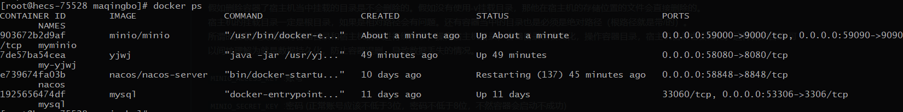

##  Docker 搭建minio （可行）

```bash
docker search minio
docker pull minio/minio

docker run -d -p 9000:9000 -p 9090:9090--name=minio --restart=always -e "MINIO_ROOT_USER=maqingbo" -e "MINIO_ROOT_PASSWORD=najkhqw*87324vn" -v /home/data:/data -v /home/config:/root/.minio  minio/minio server /data --console-address ":9000" --address ":9090"

docker logs -f containerid 
```

[docker搭建最新minio访问不了页面解决 - 代码先锋网 (codeleading.com)](https://www.codeleading.com/article/55455848124/#:~:text=docker搭建最新minio访问不了页面解决 1 一、搭建过程 当出现如下图所示即代码运行成功，通过宿主机ip%3A9000访问，输入命令里的账号%2F密码登录即可：! [在这里插入图片描述] (https%3A%2F%2Fimg-blog.csdnimg.cn%2Fimg_convert%2Fda19f3bfb50572c2e53ce753f3a4de4c.png) 2,二、注意事项 1.最新版本latest： 2.启动minio，动态端口云服务器会改变%2C需要在docker run 最后加上： 不加会导致端口一直变，页面访问不了! [在这里插入图片描述] (https%3A%2F%2Fimg-blog.csdnimg.cn%2Fimg_convert%2F6b24b3f99227960f90b04d8e89853e6f.png))


## 第二种方式搭建minio

1. 、下载minIO的镜像
   docker pull minio/minio

2. 、创建minIO容器
   minio官网：https://docs.min.io/docs/minio-docker-quickstart-guide.html

   查看所有镜像

   docker images
   创建并启动minIO容器：

```bash
docker run -p 9000:9000 -p 9090:9090 \
 --name myminio \
 -d --restart=always \
 -e "MINIO_ACCESS_KEY=fsvakjeh&*(GBG^&g3asd=ae2133" \
 -e "MINIO_SECRET_KEY=najkhqw*87324vn" \
 -v /home/maqingbo/minio/data:/data \
 minio/minio server  /data  \
 --console-address ":9090" \
 -address ":9000"
```


> 这里的 \ 指的是命令还没有输入完，还需要继续输入命令，先不要执行的意思。
>
> 这里的9090端口指的是minio的客户端端口。虽然设置9090，但是我们在访问9000的时候，他也会自动跳到9090。9000端口是minio的服务端端口，我们程序在连接minio的时候，就是通过这个端口来连接的。
>
> -v就是docker run当中的挂载，这里的/mydata/minio/data:/data意思就是将容器的/data目录和宿主机的/mydata/minio/data目录做映射，这样我们想要查看容器的文件的时候，就不需要看容器当中的文件了。
>
> 注意在执行命令的时候，他是会自动在宿主机当中创建目录的。我们不需要手动创建。
>
> minio所上传的文件默认都是存储在容器的data目录下的！
>
> 假如删除容器了宿主机当中挂载的目录是不会删除的。假如没有使用-v挂载目录，那他在宿主机的存储位置的文件会直接删除的。
> 宿主机的挂载目录一定是根目录，如果是相对路径会有问题。还有容器当中的目录也是必须是绝对路径（根路径就是带/的）。
> 所谓的挂载其实就是将容器目录和宿主机目录进行绑定了，操作宿主机目录，容器目录也会变化，操作容器目录，宿主机目录也会变化。这样做的目的 可以间接理解为就是数据持久化，防止容器误删，导致数据丢失的情况。
>
> `MINIO_ACCESS_KEY` :账号 
>
> `MINIO_SECRET_KEY` :密码 (正常账号应该不低于3位，密码不低于8位，不然容器会启动不成功)
>
> `--console-address` : 指定客户端端口
> `-d --restart=always` :代表重启linux的时候容器自动启动
> `--name myminio` 容器名称

3. 使用docker ps查看正在运行的容器：



