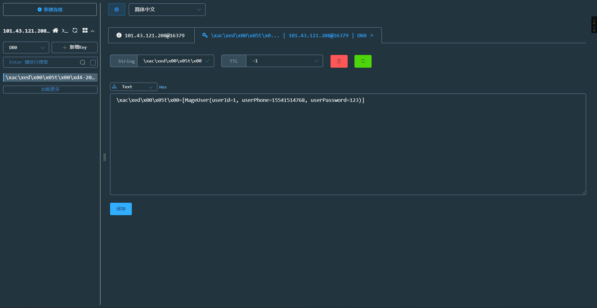
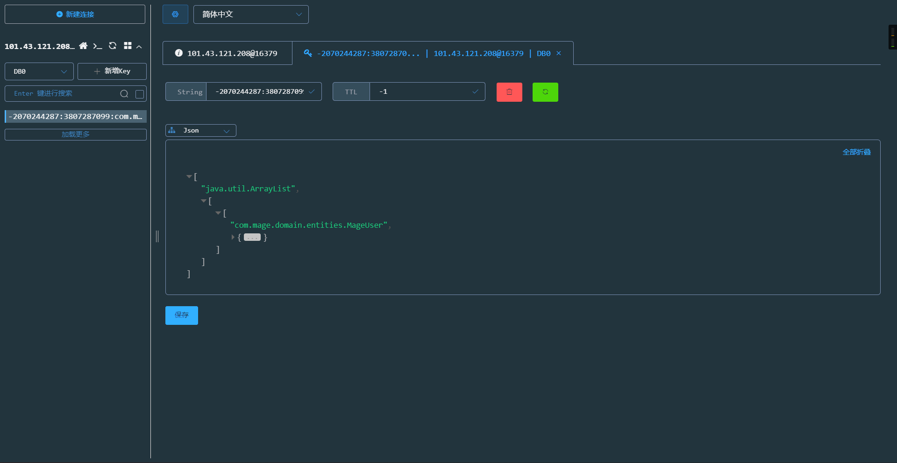

## 为什么使用缓存

对于一些我们经常查询的并且不经常改变的数据，如果每次查询都要与数据库进行交互，那么很大程度加重数据库的压力，降低数据库的性能。因为我们使用缓存，将一些对结果影响不大且经常查询的数据存放在内存中，从而减少与数据 库的交互来提高效率


MyBatis缓存的分类：

- 一级缓存(默认开启)：一级缓存是SqlSession级别的。同一个`SqlSession `对象， 在参数和 SQL 完全一样的情况下， 只执行一次 SQL 语句 （前提缓存没有过期），但是不同的`SqlSession`对象，参数和SQL完全一样的情况下还是会查询数据库.如果同一个sqlSession会话中2 个查询中间有一个 insert 、update或delete 语句，那么之前查询的所有缓存都会清空。


- 二级缓存(默认不开启)：二级缓存是mapper级别缓存，多个SQLSession去操作同一个mapper的SQL语句，多个SQLSession操作都会存在二级缓存中，多个SQLSession共用二级缓存，二级缓存是跨SQLSession的。

  > 二级缓存是mapper级别缓存，多个SQLSession去操作同一个mapper的SQL语句，多个SQLSession操作都会存在二级缓存中，多个SQLSession共用二级缓存，二级缓存是跨SQLSession的。

  


### 多个命名空间中共享相同的缓存配置和实例。

要实现这种需求，你可以使用 cache-ref 元素来引用另一个缓存。

```<cache-ref namespace="com.someone.application.data.SomeMapper"/>```

## 一级缓存测试

配置文件

```yml
mybatis:
  mapper-locations: classpath*:mappers/*.xml
  configuration:
    log-impl: org.apache.ibatis.logging.stdout.StdOutImpl
```

### 使用同一个SqlSession执行相同的sql

```java
 @Autowired
 SqlSessionFactory sqlSessionFactory;

    @GetMapping("all")
    public Object all() {
        SqlSession sqlSession2 = sqlSessionFactory.openSession();
        PositionMapper mapper2 = sqlSession2.getMapper(PositionMapper.class);
        //同一个sqlSession 第一次查询
        List<Position> list1 = mapper2.queryAll();
        //同一个sqlSession 第二次查询
        List<Position> list2 = mapper2.queryAll();
        sqlSession2.close();
        return new List[]{list1,list2};
    }

```

执行日志


日志显示仅执行了一次SQL查询，说明第二次查询是从缓存中取出的

### 使用不同的SqlSession，执行相同的sql


```java
 @Autowired
SqlSessionFactory sqlSessionFactory;
      
 @GetMapping("all")
    public Object all() {
        SqlSession sqlSession1 = sqlSessionFactory.openSession();
        SqlSession sqlSession2 = sqlSessionFactory.openSession();

        PositionMapper mapper1 = sqlSession1.getMapper(PositionMapper.class);
        List<Position> list1 = mapper1.queryAll();

        PositionMapper mapper2 = sqlSession2.getMapper(PositionMapper.class);
        List<Position> list2 = mapper2.queryAll();

        sqlSession1.close();
        sqlSession2.close();

        return list1 == list2;

    }
```

输出日志


可见，当使用不同的SqlSession对象执行相同的SQL时，都会执行sql，并不会从缓存中取另一个SqlSession所缓存的数据


### 使用同一个SqlSession对象。两次查询中间有其他操作

```java
    @Test
    public Object all3() {
        SqlSession sqlSession = sqlSessionFactory.openSession();

        PositionMapper mapper = sqlSession.getMapper(PositionMapper.class);
        List<Position> list1 = mapper.queryAll();
        //穿插其他操作
        Position position = list1.get(0);
        position.setExperience(3L);
        mapper.updateRow(position);

        List<Position> list2 = mapper.queryAll();

        return list1 == list2;
    }
```

输出日志


经测试，当同一个SqlSession对象两次查询操作中间参杂其他操作时（增删改），不能够从缓存中取出第一次的查询结果，而是继续执行sql


## 二级缓存测试

配置文件

```yml
mybatis:
  mapper-locations: classpath*:mappers/*.xml
  configuration:
    log-impl: org.apache.ibatis.logging.stdout.StdOutImpl
    cacheEnabled: true #默认开启
```

实体类实现Serializable接口


首先先发送请求到

```http
http://localhost:11111/StorageCache
```


再请求到

```http
http://localhost:11111/all
```

查看日志


可以看到第二次的两个请求都命中了缓存，并且SqlSession是不同的。


## 使用redis实现二级缓存

> 我们一般在项目中实现Mybatis的二级缓存，虽然Mybatis自带二级缓存功能，但是如果实在集群环境下，使用自带的二级缓存只是针对单个的节点，所以我们采用分布式的二级缓存功能。一般的缓存NoSql数据库如redis，Mancache等，或者EhCache都可以实现，从而更好地服务tomcat集群中ORM的查询。


1. `ApplicationContextHolder`实现`ApplicationContextAware `接口，以便于手动获取`StringRedisTemplate `对象，因为在自己写的`RedisCeche`中注入`StringRedisTemplate` 时会注入失败，原因不太清楚。需要手动从容器中获取`StringRedisTemplate `的bean对象

```java
package com.mage.infra.context;

import lombok.NonNull;
import org.springframework.beans.BeansException;
import org.springframework.context.ApplicationContext;
import org.springframework.context.ApplicationContextAware;
import org.springframework.stereotype.Component;

/**
 * @author maqingbo
 */
@Component
public class ApplicationContextHolder implements ApplicationContextAware {

    private static ApplicationContext applicationContext;

    @Override
    public void setApplicationContext(@NonNull ApplicationContext applicationContext) throws BeansException {
        ApplicationContextHolder.applicationContext = applicationContext;
    }

    public static ApplicationContext getApplicationContext(){
        assertApplicationContext();
        return applicationContext;
    }

    public static <T> T getBean(String beanName){
        assertApplicationContext();
        return (T)applicationContext.getBean(beanName);
    }

    public static <T>T getBean(Class<T> requiredType){
        assertApplicationContext();
        return applicationContext.getBean(requiredType);
    }

    private static void assertApplicationContext(){
        if(null == ApplicationContextHolder.applicationContext){
            throw new RuntimeException("applicationContext属性为空");
        }
    }

}

```

2. `RedisCache`实现`Cache`接口

```java
package com.mage.infra.config;

import com.mage.infra.context.ApplicationContextHolder;
import lombok.extern.slf4j.Slf4j;
import org.apache.ibatis.cache.Cache;
import org.springframework.beans.factory.annotation.Autowired;
import org.springframework.data.redis.connection.RedisConnection;
import org.springframework.data.redis.connection.RedisServerCommands;
import org.springframework.data.redis.core.RedisCallback;
import org.springframework.data.redis.core.RedisTemplate;
import org.springframework.data.redis.core.StringRedisTemplate;
import org.springframework.util.ObjectUtils;

import java.util.concurrent.locks.ReadWriteLock;
import java.util.concurrent.locks.ReentrantReadWriteLock;

/**
 * @author maqingbo
 */
@Slf4j
public class RedisCache implements Cache {
    /**
     * 读写锁
     */
    private final ReadWriteLock lock = new ReentrantReadWriteLock(true);

    @Autowired
    private StringRedisTemplate stringRedisTemplate;

    private String id;

    public RedisCache(final String id) {
        if (null == id) {
            throw new IllegalStateException("Cache instances require an ID");
        }
        this.id = id;
    }

    @Override
    public String getId() {
        return this.id;
    }

    @Override
    public void putObject(Object key, Object value) {
        if (ObjectUtils.isEmpty(stringRedisTemplate)){
            stringRedisTemplate = ApplicationContextHolder.getBean(StringRedisTemplate.class);
        }

        if (value != null) {
            stringRedisTemplate.opsForValue().set(key.toString(), value.toString());
        }
    }

    @Override
    public ReadWriteLock getReadWriteLock() {
        return this.lock;
    }

    @Override
    public Object getObject(Object key) {
        try {
            if (null != key) {
                return stringRedisTemplate.opsForValue().get(key.toString());
            }
        } catch (Exception e) {
            log.error("缓存错误");
        }
        return null;
    }

    @Override
    public Object removeObject(Object key) {
        if (null != key) {
            return stringRedisTemplate.delete(key.toString());
        }
        return null;
    }

    @Override
    public void clear() {
        log.debug("清空二级缓存");

        if (ObjectUtils.isEmpty(stringRedisTemplate)){
            stringRedisTemplate = ApplicationContextHolder.getBean(StringRedisTemplate.class);
        }
        RedisConnection connection = stringRedisTemplate.getConnectionFactory().getConnection();
        connection.flushAll();
    }

    /**
     * 获取缓存中的缓存数量
     *
     * @return
     */
    @Override
    public int getSize() { // 获取缓存中的缓存数量
        return stringRedisTemplate.execute((RedisCallback<Long>) RedisServerCommands::dbSize).intValue();
    }


}

```
3. `mapper`添加`@CacheNamespace`注解,设置自定义的RedisCache缓存实现类

```java

@Repository
@CacheNamespace(implementation = RedisCache.class)
public interface MageUserMapper extends BaseMapper<MageUser> {
}

```

4. 实体类实现`Serializable`接口

```java
@Data
@Builder
@AllArgsConstructor
@NoArgsConstructor
@TableName("mage_user")
public class MageUser  implements Serializable{
    @TableId(type = IdType.ASSIGN_ID)
    private long userId;
    private String userPhone;
    private String userPassword;
}
```

### 测试

共有两个接口，一个查询，一个新增。

先执行查询，再去redis查看是否加入到了redis


再执行新增，查询redis，发现redis已经被清空。


## 学习过程中遇到的问题

### 注解与配置文件不能同时使用


### 二级缓存配置不生效


### redisTemplate注入不成功（Mybatis-plus）

配置文件

```yml
mybatis-plus:
  mapperLocations: classpath:mappers/*.xml
  configuration:
    log-impl: org.apache.ibatis.logging.stdout.StdOutImpl
    cache-enabled: true
```


```java
package com.mage.infra.config;

import com.mysql.cj.log.Log;
import lombok.extern.slf4j.Slf4j;
import org.apache.commons.lang3.StringUtils;
import org.apache.ibatis.cache.Cache;
import org.springframework.beans.factory.annotation.Autowired;
import org.springframework.dao.DataAccessException;
import org.springframework.data.redis.connection.RedisConnection;
import org.springframework.data.redis.core.RedisCallback;
import org.springframework.data.redis.core.RedisTemplate;
import org.springframework.data.redis.core.StringRedisTemplate;
import org.springframework.stereotype.Component;

import javax.annotation.Resource;
import java.util.concurrent.TimeUnit;

/**
 * @author maqingbo
 * @date 2022/8/12 21:51
 */
@Slf4j
public class RedisCache implements Cache {
    private final String id;

    @Autowired
    private StringRedisTemplate redisTemplate;

    public RedisCache(String id) {
        if (StringUtils.isNotEmpty(id)){
        this.id = id;
        }else {
            throw new IllegalArgumentException("Cache request an id");
        }
    }


    @Override
    public String getId() {
        return id;
    }

    @Override
    public void putObject(Object key, Object value) {
        int expirationTime = 60;
        redisTemplate.opsForValue().set(key.toString(),value.toString(), expirationTime, TimeUnit.SECONDS);
    }

    @Override
    public Object getObject(Object key) {
        log.info("从redis缓存获取");
        return redisTemplate.opsForValue().get(key);
    }

    @Override
    public Object removeObject(Object o) {
        return redisTemplate.delete(o.toString());
    }

    @Override
    public void clear() {

        RedisConnection connection = redisTemplate.getConnectionFactory().getConnection();
        connection.flushAll();
    }

    @Override
    public int getSize() {
        return 0;
    }
}

```

在mapper类添加CacheNamespace注解，并指定自定义的RedisCache


错误信息


在Controller中注入StringRedisTemplate能正常注入并使用,但是在RedisCache中就注入不了

#### 原因

原因暂未查明


### 不推荐使用二级缓存

为什么mybatis默认不开启二级缓存？

不推荐使用二级缓存！

二级缓存虽然能带来一定的好处，但是有很大的隐藏危害！

它的缓存是以 namespace(mapper) 为单位的，不同 namespace 下的操作互不影响。且 insert/update/delete 操作会清空所在 namespace 下的全部缓存。

那么问题就出来了，假设现在有 ItemMapper 以及 XxxMapper，在 XxxMapper 中做了表关联查询，且做了二级缓存。此时在 ItemMapper 中将 item 信息给删了，由于不同 namespace 下的操作互不影响，XxxMapper 的二级缓存不会变，那之后再次通过 XxxMapper 查询的数据就不对了，非常危险。


1. 缓存是以namespace为单位的，不同namespace下的操作互不影响。
2. insert,update,delete操作会清空所在namespace下的全部缓存。
   通常使用MyBatis Generator生成的代码中，都是各个表独立的，每个表都有自己的namespace。
3. 多表操作一定不要使用二级缓存，因为多表操作进行更新操作，一定会产生脏数据。
4. 如果你遵守二级缓存的注意事项，那么你就可以使用二级缓存。

但是，如果不能使用多表操作，二级缓存不就可以用一级缓存来替换掉吗？而且二级缓存是表级缓存，开销大，没有一级缓存直接使用 HashMap 来存储的效率更高，所以二级缓存并不推荐使用。


# `重要，上面都是错的`

不可以用`RedisTemplate<String, String>` 来存储和获取二级缓存数据。而需要使用`RedisTemplate<String, Object>`来存储或者获取，不然会报String不能转换List异常


如果不配置`RedisTemplate`的bean，那么存储的数据是下面这样的。



配置`RedisTemplate`

```java
package com.mage.infra.config.test;

import com.fasterxml.jackson.annotation.JsonAutoDetect;
import com.fasterxml.jackson.annotation.PropertyAccessor;
import com.fasterxml.jackson.databind.DeserializationFeature;
import com.fasterxml.jackson.databind.ObjectMapper;
import com.fasterxml.jackson.databind.jsontype.impl.LaissezFaireSubTypeValidator;
import org.springframework.context.annotation.Bean;
import org.springframework.context.annotation.Configuration;
import org.springframework.data.redis.connection.RedisConnectionFactory;
import org.springframework.data.redis.core.RedisTemplate;
import org.springframework.data.redis.serializer.Jackson2JsonRedisSerializer;
import org.springframework.data.redis.serializer.RedisSerializer;
import org.springframework.data.redis.serializer.StringRedisSerializer;

@Configuration
public class RedisConfig {

    
   // RedisConnectionFactory在配置文件中配置（主机io，端口号等），爆红不用管
    @Bean(value = "redisTemplate")
    public RedisTemplate<String, Object> redisTemplate(RedisConnectionFactory connectionFactory) {
        RedisTemplate<String, Object> redisTemplate = new RedisTemplate<>();
        redisTemplate.setConnectionFactory(connectionFactory);
        //使用jackson序列化工具(default JDK serialization)
        Jackson2JsonRedisSerializer jackson2JsonRedisSerializer = new Jackson2JsonRedisSerializer(Object.class);
        ObjectMapper objectMapper = new ObjectMapper();
        //设置任何属性可见
        objectMapper.setVisibility(PropertyAccessor.ALL, JsonAutoDetect.Visibility.ANY);
        //序列化的时候将类名称序列化到json串中
        objectMapper.activateDefaultTyping(LaissezFaireSubTypeValidator.instance, ObjectMapper.DefaultTyping.NON_FINAL);
        //设置输入时忽略JSON字符串中存在而Java对象实际没有的属性
        objectMapper.configure(DeserializationFeature.FAIL_ON_UNKNOWN_PROPERTIES, false);
        jackson2JsonRedisSerializer.setObjectMapper(objectMapper);
        //使用redis自带的字符串序列化工具序列化key和value
        RedisSerializer redisSerializer = new StringRedisSerializer();
        //key
        redisTemplate.setKeySerializer(redisSerializer);
        redisTemplate.setHashKeySerializer(redisSerializer);
        //value
        redisTemplate.setValueSerializer(jackson2JsonRedisSerializer);
        redisTemplate.setHashValueSerializer(jackson2JsonRedisSerializer);
        //初始化redisTemplate
        redisTemplate.afterPropertiesSet();
        return redisTemplate;
    }

}

```

redis数据就变成了下面这样

