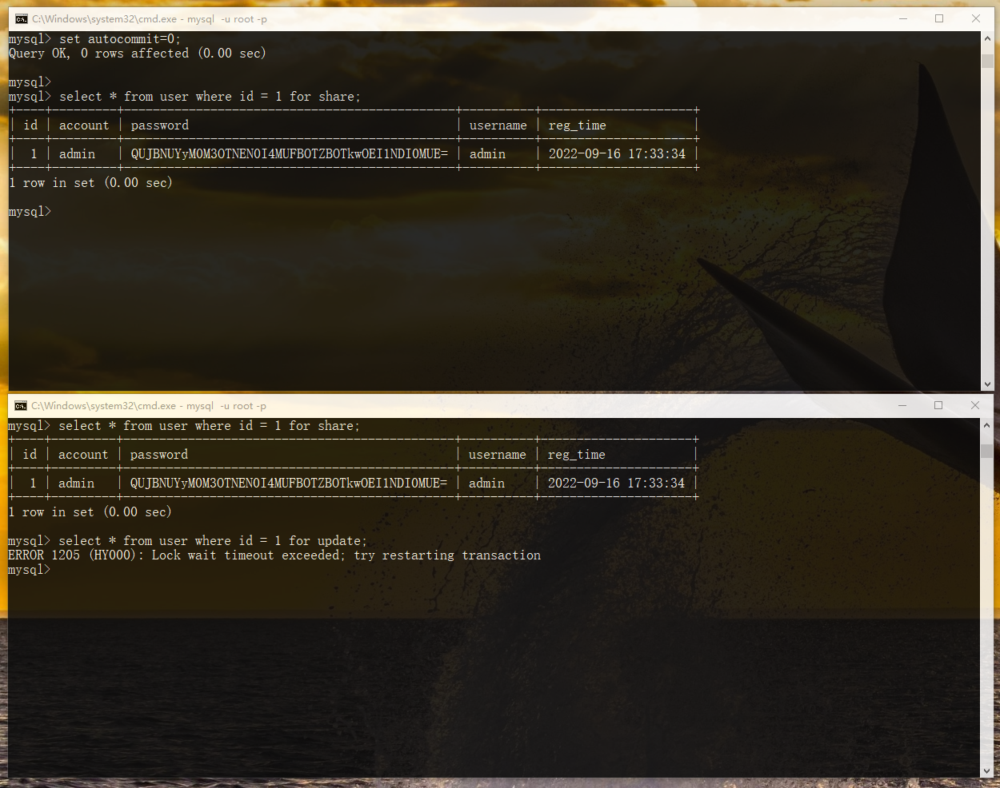

# 1、按封锁粒度分为行锁和表锁

## (1)行锁 

innodb实现了两种类型的行锁分别是共享锁(S锁、读锁)和排他锁(X锁、写锁)

- 共享锁

  允许获得该锁的事务读取数据行，同时也允许其他事务获得该数据行上的共享锁，并阻止其他事务对该数据行加排他锁

- 排他锁

  允许获得该锁 的事务更新或删除数据行，同时阻止其他事物对该数据行加共享锁和排他锁

### 测试

- 共享锁

  先取消事务自动提交

  `set  autocommit = 0`

  两个控制台都可以读取加了共享锁后的数据

  

  

  两个控制台可以使用同一个共享锁，但是如果下面的连接对该行数据使用排他锁，那么将会阻塞，一直等待上面的共享锁释放。

  

  将上面事务提交后，下面就能查询出该行数据

  

- 排他锁

  上面的控制台对id=1的记录添加排他锁，下面控制台对该行数据添加共享锁尝试查询数据，同样也是等待排他锁释放

  

  

  

## (2)表锁

表级别的锁分为`意向共享锁(IS)`和`意向排他锁(IX)` ,都称为意向锁。

意向锁的作用：如果需要对表添加表锁，需要判断当前表中的某行记录是否有行级的排他锁，如果一行行去遍历来查看是否有对应的锁的话，效率是十分低下的，所以可以所用意向锁来判断是否可以对某张表添加表锁

- 意向共享锁(**Intention Shared Lock，IS 锁**):事务有意向对表中的某些记录添加共享锁，对某行记录加共享锁之前必须先在对应表加意向共享锁
- 意向排他锁(**Intention Exclusive Lock，IX 锁**):事务有意向对表中的某些记录添加排他锁，对某行记录加排他锁之前必须先在对应表加意向共享锁

意向锁是有数据库引擎来维护的，用户无需干涉

#### 表级锁的兼容性

意向排他锁(IX)和排他锁(X),当事务A对表加了IX锁，表示事务A准备修改表中的某一行数据、那么事务B想要对零一行数据添加X锁的时候，就会先获取IX锁，此时IX锁已经被事务A取到了，事务B就拿不到IX锁，那么事务B将会阻塞，等待事务A去释放IX锁，之后事务B才可进行相关操作。

重点看IX和IX是兼容的，也就是同一张表可以加两个IX锁。原因是，两个事务A、B，如果他们需要修改的数据并不是同一条记录，那么并不会产生互斥效果，所以应当允许A、B事务同时加IX锁

