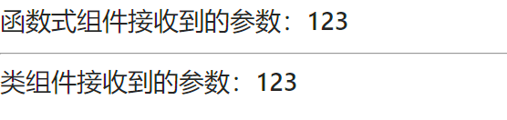
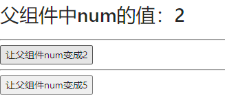
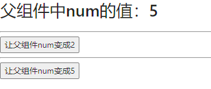
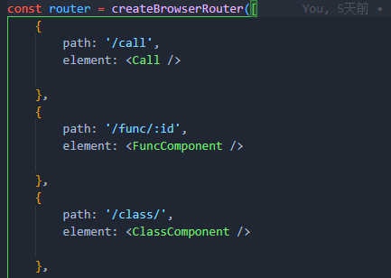
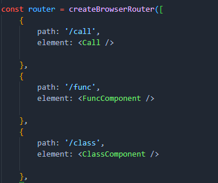
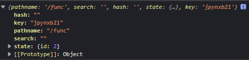
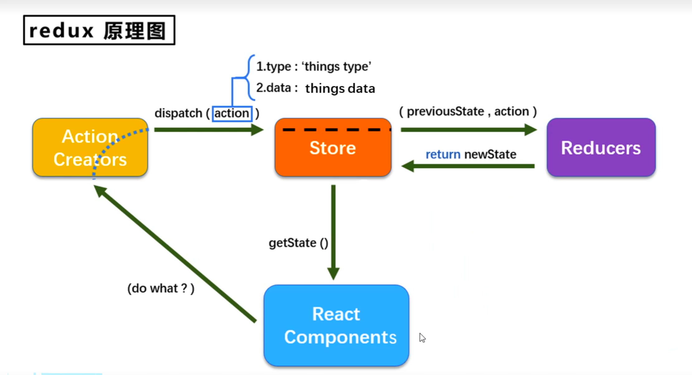
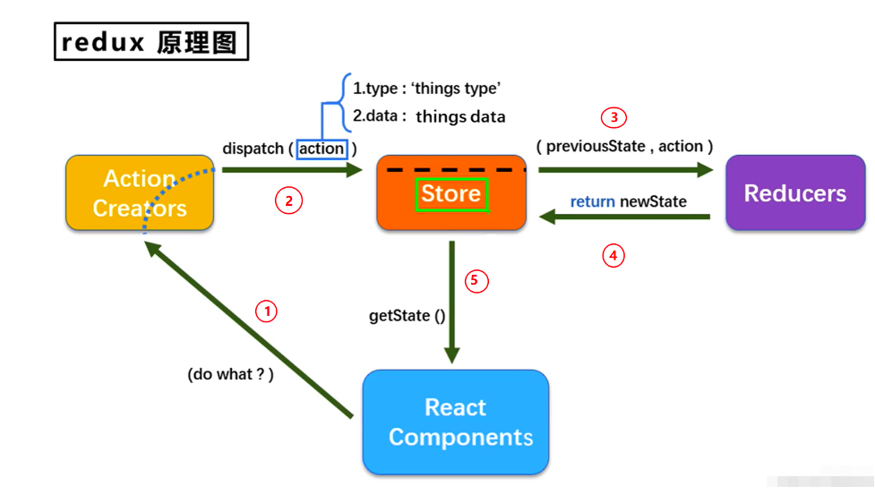
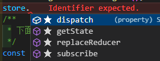

# React

## 组件传参

### 父传子


```jsx
import { Layout } from 'antd';
import React from 'react';

function FunctionComp(props) {
  return <h1>函数式组件接收到的参数：{props.msg}</h1>
}
class ClassComp extends React.Component {

  render() {
    return <h1>类组件接收到的参数：{this.props.msg}</h1>
  }
}
const App = () => {
  return (
    <>
      <FunctionComp msg={"123"} />
      <hr />
      <ClassComp msg={"123"} />
    </>
  )
}

export default App;
```




### 子传父

```jsx
import React, { useState } from 'react';

function FunctionComp(props) {
  const { appfunc } = props
  return <button onClick={() => { appfunc(2) }}>让父组件num变成2</button>
}
class ClassComp extends React.Component {

  render() {
    return <button onClick={() => { this.props.appfunc(5) }}>让父组件num变成5</button>
  }
}
const App = () => {
  const [num, setNum] = useState(0);
  const appfunc = (num) => {
    setNum(num)
  }
  return (
    <>
      <h1>父组件中num的值：{num}</h1>
      <hr />
      <FunctionComp appfunc={appfunc} />
      <hr />
      <ClassComp appfunc={appfunc} />
    </>
  )
}

export default App;


```






### 兄弟间互传


## Hooks

### useEffect

```js
 useEffect(() => {
        document.title = `You clicked ${count} times`;
  }, []);
```

第一个参数是函数，当页面渲染时会自动调用一次，第二个参数是一个空数组，如果第二个参数存在，那么第一个参数只会被执行一次

### useSearchParams()

见路由参数

### useParams()

见路由参数

### useLocation()

见路由参数

### useInRouterContext()

路由上下文，只要某个组件被BrowserRouter或者是HashRouter包裹，都会返回true

### useNavigationType()

1. 作用:返回当前的导航类型（用户如何来到当前页面的）

2. 返回值`POP`、`PUSH`、`REPLACE`

   备注：`POP`是指在浏览器中打开了这个路由组件，当再次刷新时，就是`POP`

### useOutLet()

找出当前组件中的渲染的嵌套路由

### useResolvedPath()

类似useLocation()

```tsx
 const resolvePath = useResolvedPath('/func/id=21')

 console.log(resolvePath);
```

## react-router v6

分别使用类组件和函数式组件来记录

### 嵌套路由

```tsx
import Home from "@/pages/Home";
import { Navigate, RouteObject } from "react-router-dom";
import Artcle from "@/pages/Home/Artcle";
import Details from "@/pages/Home/Artcle/Details";
import React, { lazy } from "react";
import Login from "@/pages/Login";
import Profile from "@/pages/Home/User/Profile/index";
import AccountSetting from "@/pages/Home/User/AccountSetting";
import { NotFount } from "@/pages/Error/404";
import ModifyPhone from "@/pages/Home/User/AccountSetting/ModifPhone";
import ModifyEmail from "@/pages/Home/User/AccountSetting/ModifyEmail";
import ModifyPwd from "@/pages/Home/User/AccountSetting/ModifyPwd";
import AccountWriteOff from "@/pages/Home/User/AccountSetting/AccountWriteOff";
import MyArtcleList from "@/pages/Home/User/MyArtcleList";
import ShowLoginHistory from "@/pages/Home/User/AccountSetting/ShowLoginHistory";
import { createBrowserRouter, createHashRouter } from "react-router-dom";
import User from "@/pages/Home/User";
import Call from "@/pages/Test/Call";
import FuncComponent from "@/pages/Test/FuncComponent";
import ClassComponent from "@/pages/Test/ClassComponent";
import ReduxTest from "@/pages/Test/ReduxTest/ReduxTest";
const lazyRouter = (
  jsxCom: JSX.Element // 路由懒加载
) => <React.Suspense fallback={<h1>加载中</h1>}>{jsxCom}</React.Suspense>;

const router = createBrowserRouter([
  {
    path: "/",
    element: <Navigate to={"/login"} />,
  },

  {
    path: "/home",
    element: <Home />,
    children: [
      {
        path: "artcle",
        element: <Artcle />,
      },
      {
        path: "artcle:artcleId",
        element: <Details />,
      },
      {
        //个人中心
        path: "user",
        element: <User />,
        children: [
          {
            path: "accountSetting",
            element: <Navigate to={"/home/user"} replace />,
          },
          //内容管理
          {
            path: "myArtcleList",
            element: <MyArtcleList />,
          },
          // 个人资料
          {
            path: "profile",
            element: <Profile />,
          },
        ],
      },
    ],
  },
  {
    path: "/login",
    element: <Login />,
  },
  {
    path: "/404",
    element: <NotFount />,
  },
  {
    path: "/*",
    element: <NotFount />,
  },
]);

export default router;

```

需要在父路由中使用`<Outlet/>`来指定路由出口

#### 嵌套路由中的默认路由,

需要添加`index:true`，并且不应该写`path:xxx`

```tsx
{
        //个人中心
        path: "user",
        element: <User />,
        children: [
          // 账号设置
          {
            // path: "accountSetting",
            element: <AccountSetting />,
            children: [
              {
                index: true,
                element: React.createElement(() => <h1>hello</h1>),
              },
              {
                path: "phone/modify/:userId",
                element: <ModifyPhone />,
              },
              {
                path: "email/modify/:userId",
                element: <ModifyEmail />,
              },
              {
                path: "pwd/modify/:userId",
                element: <ModifyPwd />,
              },
              {
                path: "account/writeOff/:userId",
                element: <AccountWriteOff />,
              },
              {
                path: "showLoginHistory/:userId",
                element: <ShowLoginHistory />,
              },
            ],
          },
          {
            path: "accountSetting",
            element: <Navigate to={"/home/user"} replace />,
          },
          //内容管理
          {
            path: "myArtcleList",
            element: <MyArtcleList />,
          },
          // 个人资料
          {
            path: "profile",
            element: <Profile />,
          },
        ],
      },
```


### 路由参数

#### params参数

`router.tsx`

定义FuncComponent组件需要接收的参数 id



在Call组件分别调用函数式组件和类组件。路由跳转的时候将id传递给FuncComponent路由

```html  
<Link to={'/func/2'}><Button type='primary'>GO FUNC</Button></Link>|
<Link to={'/class/2'}><Button type="primary">GO CLASS</Button></Link>

```


1. 函数式组件FuncComponent

   使用hooks为` react-router-dom`的`useParams()`

```javascript
const params = useParams()
console.log(params.id);
```

2. 类组件ClassComponent

   // TODO 待查资料

#### search参数

不需要路由参数占位



在Call组件分别调用函数式组件和类组件。路由跳转的时候将id传递给`FuncComponent`路由

```html
<Link to={'/func?id=21'}><Button type='primary'>GO FUNC</Button></Link>|
<Link to={'/class?id=21'}><Button type="primary">GO CLASS</Button></Link>
```


1. 函数式组件`FuncComponent`

   使用hooks为` react-router-dom`的`useSearchParams()`

```javascript
const [search, setSearch] = useSearchParams()
console.log(search.get("id"));
```
`setSearch()`方法可以设置参数id的值：当点击 `setSearch`按钮时，路径参数的id变为34

```javascript

export default function FuncComponent() {
    const [search, setSearch] = useSearchParams()
    console.log(search.get("id"));
    return (
        <div>
            <Button  type='primary' onClick={() => setSearch('id=34')}>setSearch</Button>
        </div>
    )
}

```

2. 类组件`ClassComponent`

   // TODO 待查资料

#### state参数

不需要路由参数占位


在Call组件分别调用函数式组件和类组件。路由跳转的时候将id传递给FuncComponent路由

```html
<Link to={'/func'}><Button type='primary'>GO FUNC</Button></Link>|
<Link to={'/class'}><Button type="primary">GO CLASS</Button></Link>
```


1. 函数式组件FuncComponent

   使用hooks为`react-router-dom`的useLocation()

```javascript
const location = useLocation()
console.log(location.state.id);
```
location的属性

可以通过解构赋值来获取state中的id属性。

`  const { state: { id } } = useLocation()`

也可以通过.的方式获取


2. 类组件ClassComponent

   // TODO 待查资料

### 编程式导航

编程式导航(不需要点击操作的路由跳转)。

| html标签 | react-ROuter6 | React-Router-5 |
| -------- | ------------- | -------------- |
| \<a>     | \<Link>       | \<Link>        |
| \<a>     | \<NavLink>    | \<NavLink>     |
|          | \<Navigate>   |                |

\<Navigate>  需要写在html标签中

在`js`中使用`react-router-dom`的`useNavigate()`

`  const navigate = useNavigate()`

navigate 可以接收两个参数`to`和`NavigateOptions`类型的`options`

navigate (to,options)

```typescript
/**
 * The interface for the navigate() function returned from useNavigate().
 */
export interface NavigateFunction {
    (to: To, options?: NavigateOptions): void;
    (delta: number): void;
}
```
options的类型有4个属性
```typescript
export interface NavigateOptions {
    replace?: boolean;
    //传递给组件的state，可以获取值
    state?: any;
    preventScrollReset?: boolean;
    relative?: RelativeRoutingType;
}
```

使用栗子，跳转到`/func`路由时，使用**state参数**携带参数id=22

```tsx
import React from 'react'
import { NavigateOptions, useLocation } from 'react-router-dom';
import { useNavigate } from 'react-router-dom';
import { Button } from 'antd';
export default function FuncComponent() {
    const navigate = useNavigate()
    const option: NavigateOptions = {
        replace: false,
        state: {
            id: 222
        }
    }
    return (
        <div>
            <Button onClick={() => navigate('/func', option)}>GO FUNC</Button>
        </div>
    )
}
```

FuncComponent

```tsx
import React from 'react'
import { useLocation } from 'react-router-dom';
export default function FuncComponent() {
    const location = useLocation()
    console.log(location.state);
    return (
        <div>
        </div>
    )
}
```

`tips`:使用param参数和search参数，可以直接使用`navigate('/func/2')`或者`navigate('/func?id=2')`传递

## Redux

状态管理js库，Vue也可以使用，如vuex或者pinia,redux。

redux管理多个组件的共享数据



### Redux 三大原则

理解好 Redux 有助于我们更好的理解接下来的 React -Redux

##### 第一个原则

**单向数据流**：整个 Redux 中，数据流向是单向的

UI 组件 ---> action ---> store ---> reducer ---> store

##### 第二个原则

**state 只读**：在 Redux 中不能通过直接改变 state ，来控制状态的改变，如果想要改变 state ，则需要触发一次 action。通过 action 执行 reducer

##### 第三个原则

**纯函数执行**：每一个reducer 都是一个纯函数，不会有任何副作用，返回是一个新的 state，state 改变会触发 store 中的 subscribe

### 使用原生redux

`yarn add redux`



src下建立redux或者store文件夹。本例建立的是redux

`index.ts`

```ts
// import { createStore } from 'redux'
import { legacy_createStore as createStore } from 'redux'
import countReducer from './count_reducer';
//store 相当于老板 ，reducer相当于后厨
//createStore过时了，学习新的
const store = createStore(countReducer)

export default store
```


`count_reducer.ts`

```ts
/**
 * 后厨
 * 1、该文件时用户创建一个为count服务的reducer reducer本质是个函数
 *  
 * 2、reducer函数的两个参数 之前的状态(preState) ,动作对象(action)
 * action的数据结构：{type:string,data :any}
 */
// 1. 定义初始化值
export type ActionType = {
    type: string,
    data: number
}
function countReducer(preState: number = 0, action: ActionType) {
    console.log(preState, action);

    //从action对象获取type、data
    const { type, data } = action;
    // 根据type决定如何加工数据
    switch (type) {
        //如果是加
        case 'increment':
            return preState + data
        //如果是减
        case 'decrement':
            return preState - data
        default:
            //初始化
            return 0
    }
}
export default countReducer
```

#### 使用


`legacy_createStore`暴露4个方法



将action转发给store，由store交给reducer处理，之后reducer返回新数据给store，sotre在将新数据通过`getState()`方法获取到

```jsx
const App: React.FC = () => {
    const [reduxVar, setReduxVar] = useState<number>()
//组件挂载完成时获取store的初始值
  useEffect(() => {
    setReduxVar(store.getState())
  }, []);
  const plusRedux = () => {
    //+2
    store.dispatch({ type: "increment", data: 2 })
  }
  const reduceRedux = () => {
    //-3
    store.dispatch({ type: "decrement", data: 3 })
  }
  store.subscribe(() => {
    setReduxVar(store.getState())
  })

  return <React.Fragment>
      <div>{reduxVar} </div>
        <div><Button onClick={plusRedux}>plus</Button>|<Button onClick={reduceRedux}>reduce</Button></div>
  </React.Fragment>;
}
```


### 使用react-redux

`yarn add react-redux`

### 使用reduxjs/toolkit

`yarn add @reduxjs/toolkit`


## 其他 

### push和reaplace区别

router.push(location)
想要导航到不同的 URL，则使用 router.push 方法。这个方法会向 history 栈添加一个新的记录，所以，当用户点击浏览器后退按钮时，则回到之前的 URL
当你点击 时，这个方法会在内部调用，所以说，点击 等同于调用 router.push(…)。

replace模式是替换模式，会替换掉栈顶的路由
设置 replace 属性的话，当点击时，会调用 router.replace() 而不是 router.push()，于是导航后不会留下 history 记录。即使点击返回按钮也不会回到这个页面。

开启方法：

`\<Link replace={true} to="/about">About\</Link>`


