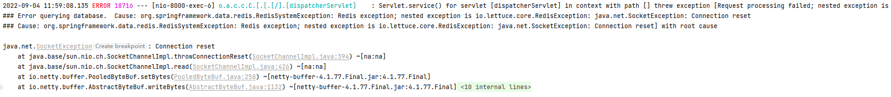

官方文档

https://shiro.apache.org/tutorial.html

[超详细 Spring Boot 整合 Shiro 教程！ - 腾讯云开发者社区-腾讯云 (tencent.com)](https://cloud.tencent.com/developer/article/1643122)

# shiro

Shiro 的架构有 3 个主要概念`Subject`：`SecurityManager`和`Realms`. 下图是这些组件如何交互的高级概述


### Subject

既可以指用户，也可以指第 3 方进程、cron 作业、守护进程。或者说是与软件交互的任何东西


### SecurityManager


### Realm 


充当 Shiro 和应用程序安全数据之间的“桥梁”或“连接器”。


> 配置 Shiro 时，必须指定至少一个 Realm 用于身份验证或授权。可以配置多个Realm ，但`SecurityManager`至少需要一个。

### shiro详细架构图


### `shiro`过滤器

|   过滤器简称   |  对应的java类    |含义|
| ---- | ---- |:---|
|  `anon`  |   `org.apache.shiro.web.filter.authc.AnonymousFilter`   |认证(登录)才能使用|
|   `authc`   |  `org.apache.shiro.web.filter.authc.FormAuthenticationFilter`  |指定rul需要form表单登录，默认会从请求中获取`username`、`password`、`rememberMe`参数并尝试登录。登陆失败会跳转到login的url。可以使用该过滤器做默认的登录逻辑。|
| `authcBasic` |   `org.apache.shiro.web.filter.authc.BasicHttpAuthenticationFilter`   |指定url需要basic登录|
|`user`|`org.apache.shiro.web.filter.authc.UserFilter`|已登录或记住我的用户访问|
|`port`|`org.apache.shiro.web.filter.authz.PortFilter`|指定端口才可以访问|
|`rest`|`org.apache.shiro.web.filter.authz.HttpMethodPermissionFilter`|将请求方法转化成相应的动词来构造一个权限字符串|
|`roles`|`org.apache.shiro.web.filter.authz.RolesAuthorizationFilter`|指定角色访问|
|`ssl`|`org.apache.shiro.web.filter.authz.SslFilter`|https访问|
|`perms`|`org.apache.shiro.web.filter.authz.PermissionsAuthorizationFilter`|指定权限可以访问|
|`logout`|`org.apache.shiro.web.filter.authc.LogoutFilter`|登出过滤器|


anon:例子/admins/**=anon 没有参数，表示可以匿名使用。

authc:例如/admins/user/**=authc表示需要认证(登录)才能使用，FormAuthenticationFilter是表单认证，没有参数

roles：例子/admins/user/=roles[admin],参数可以写多个，多个时必须加上引号，并且参数之间用逗号分割，当有多个参数时，例如admins/user/=roles["admin,guest"],每个参数通过才算通过，相当于hasAllRoles()方法。

perms：例子/admins/user/=perms[user:add:*],参数可以写多个，多个时必须加上引号，并且参数之间用逗号分割，例如/admins/user/=perms["user:add:,user:modify:"]，当有多个参数时必须每个参数都通过才通过，想当于isPermitedAll()方法。

rest：例子/admins/user/=rest[user],根据请求的方法，相当于/admins/user/=perms[user:method] ,其中method为post，get，delete等。

port：例子/admins/user/**=port[8081],当请求的url的端口不是8081是跳转到schemal://serverName:8081?queryString,其中schmal是协议http或https等，serverName是你访问的host,8081是url配置里port的端口，queryString

是你访问的url里的？后面的参数。

authcBasic：例如/admins/user/**=authcBasic没有参数表示httpBasic认证

ssl:例子/admins/user/**=ssl没有参数，表示安全的url请求，协议为https

user:例如/admins/user/**=user没有参数表示必须存在用户, 身份认证通过或通过记住我认证通过的可以访问，当登入操作时不做检查

注：

>  anon，authcBasic，auchc，user是认证过滤器，

>  perms，roles，ssl，rest，port是授权过滤器


## 认证&授权

### 登录

>  //获取用户,其会自动绑定到当前线程 
>
> Subject subject = SecurityUtils.getSubject(); 
>
> //构建待认证token
>
> UsernamePasswordToken token = new UsernamePasswordToken("zhang", "123"); 
>
> //登录，即身份验证 
>
> subject.login(token); 
>
> //判断是否已经认证 
>
> subject.isAuthenticated() 
>
> //登出 subject.logout(token);


### `shiro`过滤器

| 过滤器简称   | 对应的java类                                                 | 含义                                                         |
| ------------ | ------------------------------------------------------------ | :----------------------------------------------------------- |
| `anon`       | `org.apache.shiro.web.filter.authc.AnonymousFilter`          | 认证(登录)才能使用                                           |
| `authc`      | `org.apache.shiro.web.filter.authc.FormAuthenticationFilter` | 指定rul需要form表单登录，默认会从请求中获取`username`、`password`、`rememberMe`参数并尝试登录。登陆失败会跳转到login的url。可以使用该过滤器做默认的登录逻辑。 |
| `authcBasic` | `org.apache.shiro.web.filter.authc.BasicHttpAuthenticationFilter` | 指定url需要basic登录                                         |
| `user`       | `org.apache.shiro.web.filter.authc.UserFilter`               | 已登录或记住我的用户访问                                     |
| `port`       | `org.apache.shiro.web.filter.authz.PortFilter`               | 指定端口才可以访问                                           |
| `rest`       | `org.apache.shiro.web.filter.authz.HttpMethodPermissionFilter` | 将请求方法转化成相应的动词来构造一个权限字符串               |
| `roles`      | `org.apache.shiro.web.filter.authz.RolesAuthorizationFilter` | 指定角色访问                                                 |
| `ssl`        | `org.apache.shiro.web.filter.authz.SslFilter`                | https访问                                                    |
| `perms`      | `org.apache.shiro.web.filter.authz.PermissionsAuthorizationFilter` | 指定权限可以访问                                             |
| `logout`     | `org.apache.shiro.web.filter.authc.LogoutFilter`             | 登出过滤器                                                   |


anon:例子/admins/**=anon 没有参数，表示可以匿名使用。

authc:例如/admins/user/**=authc表示需要认证(登录)才能使用，FormAuthenticationFilter是表单认证，没有参数

roles：例子/admins/user/=roles[admin],参数可以写多个，多个时必须加上引号，并且参数之间用逗号分割，当有多个参数时，例如admins/user/=roles["admin,guest"],每个参数通过才算通过，相当于hasAllRoles()方法。

perms：例子/admins/user/=perms[user:add:*],参数可以写多个，多个时必须加上引号，并且参数之间用逗号分割，例如/admins/user/=perms["user:add:,user:modify:"]，当有多个参数时必须每个参数都通过才通过，想当于isPermitedAll()方法。

rest：例子/admins/user/=rest[user],根据请求的方法，相当于/admins/user/=perms[user:method] ,其中method为post，get，delete等。

port：例子/admins/user/**=port[8081],当请求的url的端口不是8081是跳转到schemal://serverName:8081?queryString,其中schmal是协议http或https等，serverName是你访问的host,8081是url配置里port的端口，queryString

是你访问的url里的？后面的参数。

authcBasic：例如/admins/user/**=authcBasic没有参数表示httpBasic认证

ssl:例子/admins/user/**=ssl没有参数，表示安全的url请求，协议为https

user:例如/admins/user/**=user没有参数表示必须存在用户, 身份认证通过或通过记住我认证通过的可以访问，当登入操作时不做检查

注：

>  anon，authcBasic，auchc，user是认证过滤器，

>  perms，roles，ssl，rest，port是授权过滤器


### DEMO

#### 设计数据库(RBAC模型)

分为5个表，分别是mage_user,mage_role,mage_permission,mage_user_role,mage_role_permission五张表mage_user,mage_role是多对多关系，关联表为mage_user_role。mage_permission,mage_role是多对多关系，关联表为mage_role_permission


数据库中共有两个用户张三、李四

张三是admin角色，拥有`user:add` `user:delete`	 `user:update`  `user:query` 四个权限

李四是consumer角色 拥有 `user:query`权限

#### 

#### 引入依赖

```xml
<dependency>
    <groupId>org.apache.shiro</groupId>
    <artifactId>shiro-spring</artifactId>
</dependency>
```

#### 自定义Realm

```java
package com.mqb.auth.infra.config;

import com.mqb.auth.infra.realm.MageRealm;
import org.apache.shiro.SecurityUtils;
import org.apache.shiro.mgt.SecurityManager;
import org.apache.shiro.spring.security.interceptor.AuthorizationAttributeSourceAdvisor;
import org.apache.shiro.spring.web.ShiroFilterFactoryBean;
import org.apache.shiro.subject.Subject;
import org.apache.shiro.web.mgt.DefaultWebSecurityManager;
import org.apache.shiro.web.session.mgt.DefaultWebSessionManager;
import org.springframework.aop.framework.autoproxy.DefaultAdvisorAutoProxyCreator;
import org.springframework.beans.factory.annotation.Autowired;
import org.springframework.beans.factory.annotation.Qualifier;
import org.springframework.context.annotation.Bean;
import org.springframework.context.annotation.Configuration;

import java.util.HashMap;

/**
 * @author maqingbo
 * @date 2022/8/13 20:42
 */
@Configuration
public class ShiroConfiguration {
    /**
     * 自定义Realm
     * @return
     */
    @Bean
    public MageRealm mageRealm(){
        return new MageRealm();
    }

    /**
     *
     * @param mageRealm 自定义Realm
     * @param sessionManager session管理器  可以去掉shiro登录时url里的JSESSIONID导致404的问题
     * @return SecurityManager 安全管理器
     */
    @Bean
    @Autowired
    public SecurityManager securityManager(MageRealm mageRealm, @Qualifier("sessionManager") DefaultWebSessionManager sessionManager){
        DefaultWebSecurityManager defaultWebSecurityManager = new DefaultWebSecurityManager();
        defaultWebSecurityManager.setSessionManager(sessionManager);
        defaultWebSecurityManager.setRealm(mageRealm);
        return defaultWebSecurityManager;
    }

    /**
     *
     * @param securityManager 安全管理器
     * @return ShiroFilterFactoryBean
     */
    @Bean
    @Autowired
    public ShiroFilterFactoryBean shiroFilterFactoryBean(SecurityManager securityManager){
        ShiroFilterFactoryBean shiroFilterFactoryBean = new ShiroFilterFactoryBean();
        shiroFilterFactoryBean.setSecurityManager(securityManager);
        shiroFilterFactoryBean.setLoginUrl("/toLogin");
        shiroFilterFactoryBean.setUnauthorizedUrl("/unauthor");
        shiroFilterFactoryBean.setSuccessUrl("/home");
        //为url添加权限
        HashMap<String, String> filterChainDefinitionMap = new HashMap<>(16);
        //后面可以从数据库中查询
        //也可以在controller方法上添加
        filterChainDefinitionMap.put("/toLogin","anon");
        filterChainDefinitionMap.put("/user/add","perms[user:add]");  
        filterChainDefinitionMap.put("/user/update","perms[user:update]");
//        filterChainDefinitionMap.put("/user/query","perms[user:query]");//测试使用注解完成权限设置
        filterChainDefinitionMap.put("/user/delete","perms[user:delete]");
        shiroFilterFactoryBean.setFilterChainDefinitionMap(filterChainDefinitionMap);
        return shiroFilterFactoryBean;
    }


    // 去掉shiro登录时url里的JSESSIONID
    @Bean
    public DefaultWebSessionManager sessionManager() {
        DefaultWebSessionManager sessionManager = new DefaultWebSessionManager();
        sessionManager.setSessionIdUrlRewritingEnabled(false);
        return sessionManager;
    }


    /**
     * 开启Shiro的注解(如@RequiresRoles,@RequiresPermissions)
     * @param SecurityManager 安全管理器
     * @return
     */
    @Bean
    public AuthorizationAttributeSourceAdvisor authorizationAttributeSourceAdvisor(@Qualifier("securityManager") SecurityManager SecurityManager) {
        AuthorizationAttributeSourceAdvisor authorizationAttributeSourceAdvisor = new AuthorizationAttributeSourceAdvisor();
        authorizationAttributeSourceAdvisor.setSecurityManager(SecurityManager);
        return authorizationAttributeSourceAdvisor;
    }


    @Bean
    public DefaultAdvisorAutoProxyCreator defaultAdvisorAutoProxyCreator() {
        DefaultAdvisorAutoProxyCreator creator = new DefaultAdvisorAutoProxyCreator();
        creator.setProxyTargetClass(true);
        return creator;
    }

}

```


#### shiro配置类

```java
package com.mqb.auth.infra.config;

import com.mqb.auth.infra.realm.MageRealm;
import org.apache.shiro.SecurityUtils;
import org.apache.shiro.mgt.SecurityManager;
import org.apache.shiro.spring.security.interceptor.AuthorizationAttributeSourceAdvisor;
import org.apache.shiro.spring.web.ShiroFilterFactoryBean;
import org.apache.shiro.subject.Subject;
import org.apache.shiro.web.mgt.DefaultWebSecurityManager;
import org.apache.shiro.web.session.mgt.DefaultWebSessionManager;
import org.springframework.aop.framework.autoproxy.DefaultAdvisorAutoProxyCreator;
import org.springframework.beans.factory.annotation.Autowired;
import org.springframework.beans.factory.annotation.Qualifier;
import org.springframework.context.annotation.Bean;
import org.springframework.context.annotation.Configuration;

import java.util.HashMap;

/**
 * @author maqingbo
 * @date 2022/8/13 20:42
 */
@Configuration
public class ShiroConfiguration {
    /**
     * 自定义Realm
     * @return
     */
    @Bean
    public MageRealm mageRealm(){
        return new MageRealm();
    }

    /**
     *
     * @param mageRealm 自定义Realm
     * @param sessionManager session管理器  可以去掉shiro登录时url里的JSESSIONID导致404的问题
     * @return SecurityManager 安全管理器
     */
    @Bean
    @Autowired
    public SecurityManager securityManager(MageRealm mageRealm, @Qualifier("sessionManager") DefaultWebSessionManager sessionManager){
        DefaultWebSecurityManager defaultWebSecurityManager = new DefaultWebSecurityManager();
        defaultWebSecurityManager.setSessionManager(sessionManager);
        defaultWebSecurityManager.setRealm(mageRealm);
        return defaultWebSecurityManager;
    }

    /**
     *
     * @param securityManager 安全管理器
     * @return ShiroFilterFactoryBean
     */
    @Bean
    @Autowired
    public ShiroFilterFactoryBean shiroFilterFactoryBean(SecurityManager securityManager){
        ShiroFilterFactoryBean shiroFilterFactoryBean = new ShiroFilterFactoryBean();
        shiroFilterFactoryBean.setSecurityManager(securityManager);
        shiroFilterFactoryBean.setLoginUrl("/toLogin");
        shiroFilterFactoryBean.setUnauthorizedUrl("/unauthor");
        shiroFilterFactoryBean.setSuccessUrl("/home");
        //为url添加权限
        HashMap<String, String> filterChainDefinitionMap = new HashMap<>(16);
        //后面可以从数据库中查询
        //也可以在controller方法上添加
        filterChainDefinitionMap.put("/toLogin","anon");
//        filterChainDefinitionMap.put("/user/add","perms[user:add]");  //测试使用注解完成权限设置
        filterChainDefinitionMap.put("/user/update","perms[user:update]");
        filterChainDefinitionMap.put("/user/query","perms[user:query]");
        filterChainDefinitionMap.put("/user/delete","perms[user:delete]");


        shiroFilterFactoryBean.setFilterChainDefinitionMap(filterChainDefinitionMap);
        return shiroFilterFactoryBean;
    }


    // 去掉shiro登录时url里的JSESSIONID
    @Bean
    public DefaultWebSessionManager sessionManager() {
        DefaultWebSessionManager sessionManager = new DefaultWebSessionManager();
        sessionManager.setSessionIdUrlRewritingEnabled(false);
        return sessionManager;
    }

    /**
     * 开启Shiro的注解(如@RequiresRoles,@RequiresPermissions)
     * @param SecurityManager 安全管理器
     * @return
     */
    @Bean
    public AuthorizationAttributeSourceAdvisor authorizationAttributeSourceAdvisor(@Qualifier("securityManager") SecurityManager SecurityManager) {
        AuthorizationAttributeSourceAdvisor authorizationAttributeSourceAdvisor = new AuthorizationAttributeSourceAdvisor();
        authorizationAttributeSourceAdvisor.setSecurityManager(SecurityManager);
        return authorizationAttributeSourceAdvisor;
    }


    @Bean
    public DefaultAdvisorAutoProxyCreator defaultAdvisorAutoProxyCreator() {
        DefaultAdvisorAutoProxyCreator creator = new DefaultAdvisorAutoProxyCreator();
        creator.setProxyTargetClass(true);
        return creator;
    }

}

```

#### Controller

```java
    @PostMapping("/login")
    public String login(UserVo userVo, Model model) {
        UsernamePasswordToken token = new UsernamePasswordToken(userVo.getUsername(), userVo.getPassword());
        //获取当前用户
        Subject subject = SecurityUtils.getSubject();
        try {
        subject.login(token);
            model.addAttribute("msg","登陆成功");
            return "index";
        }catch (UnknownAccountException e){
            log.error(e.getMessage());
//            model.addAttribute("msg","用户名不存在");
            model.addAttribute("msg",e.getMessage());
            return "login";
        }catch (IncorrectCredentialsException e ){
            log.error("密码错误");
            model.addAttribute("msg","密码错误");
            return "login";
        }catch (LockedAccountException e){
            log.error("账户被封禁");
            model.addAttribute("msg","账户被封禁");
            return "login";
        }
```

几个页面的controller

```java
@GetMapping("/user/add")
public String add(){
    return "user/add";
}
@GetMapping("/user/update")
public String update(){
    return "user/update";
}
@GetMapping("/user/delete")
public String delete(){
    return "/user/delete";
}
//要求当前用户拥有consumer角色身份才可以，并且该身份拥有user:query才可以访问query
@RequiresPermissions("user:query")
@RequiresRoles("consumer")
@GetMapping("/user/query")
public String query(){
    return "/user/query";
}
```

启动项目使用`张三`登录

发现除了`/user/query` 其他的url都可以访问。原因是 张三虽然拥有`user:query`权限，但是他没有`consumer`角色的身份。

使用`李四进行 `登录

发现除了`/user/query`能访问之外其他的都无权访问。原因是 李四是`consumer`角色，仅仅拥有`/user/query`的权限


## 缓存管理

1. 配置Redis序例化方式
2. 实现shiro的Cache接口
3. 实现shiro的CacheManager接口

4. 自定义Realm中设置CacheManager

### 配置序例化方式

```java
    @Bean
    public RedisConnectionFactory connectionFactory(){
        RedisStandaloneConfiguration redisStandaloneConfiguration = new RedisStandaloneConfiguration();
        redisStandaloneConfiguration.setPort(port);
        redisStandaloneConfiguration.setHostName(host);
        return new JedisConnectionFactory(redisStandaloneConfiguration);
    }
    @Bean
    public RedisTemplate<String, Object> redisTemplate( RedisConnectionFactory connectionFactory) {
        RedisTemplate<String, Object> redisTemplate = new RedisTemplate<>();
        redisTemplate.setConnectionFactory(connectionFactory);

        //使用jackson序列化工具(default JDK serialization)序例化value
        Jackson2JsonRedisSerializer<Object> jackson2JsonRedisSerializer = new Jackson2JsonRedisSerializer<Object>(Object.class);
        ObjectMapper objectMapper = new ObjectMapper();
        //设置任何属性可见
        objectMapper.setVisibility(PropertyAccessor.ALL, JsonAutoDetect.Visibility.ANY);
        //序列化的时候将类名称序列化到json串中
        objectMapper.activateDefaultTyping(LaissezFaireSubTypeValidator.instance, ObjectMapper.DefaultTyping.NON_FINAL);
        //设置输入时忽略JSON字符串中存在而Java对象实际没有的属性
        objectMapper.configure(DeserializationFeature.FAIL_ON_UNKNOWN_PROPERTIES, false);
        jackson2JsonRedisSerializer.setObjectMapper(objectMapper);

        //使用redis自带的字符串序列化工具序列化key
        RedisSerializer<String> redisSerializer = new StringRedisSerializer();
        //key
        redisTemplate.setKeySerializer(redisSerializer);
        redisTemplate.setHashKeySerializer(redisSerializer);
        //value
        redisTemplate.setValueSerializer(jackson2JsonRedisSerializer);
        redisTemplate.setHashValueSerializer(jackson2JsonRedisSerializer);
        //初始化redisTemplate
        redisTemplate.afterPropertiesSet();
        return redisTemplate;
    }
```

### 实现cache接口

```java
package com.mqb.auth.infra.config.cache;

import lombok.Getter;
import lombok.Setter;
import org.apache.shiro.cache.Cache;
import org.apache.shiro.cache.CacheException;
import org.springframework.data.redis.core.RedisTemplate;
import org.springframework.stereotype.Component;

import javax.annotation.Resource;
import java.util.Collection;
import java.util.Set;

/**
 * @author maqingbo
 * @date 2022/9/5 23:39
 */
@Setter
@Getter
@Component
public class RedisCache<K, V> implements Cache<K, V> {
    @Resource(name = "redisTemplate")
    private RedisTemplate<String, Object> redisTemplate;
    private String cacheName;

    @Override
    public V get(K k) throws CacheException {

        return (V) redisTemplate.opsForHash().get(cacheName, k.toString());
    }

    @Override
    public V put(K k, V v) throws CacheException {
        redisTemplate.opsForHash().put(cacheName, k.toString(), v);
        return v;
    }

    @Override
    public V remove(K k) throws CacheException {
        V value = (V) redisTemplate.opsForHash().get(cacheName, k.toString());
        redisTemplate.opsForHash().delete(cacheName, k.toString());
        return value;
    }

    @Override
    public void clear() throws CacheException {
        redisTemplate.delete(cacheName);
    }

    @Override
    public int size() {
        return redisTemplate.opsForHash().size(cacheName).intValue();
    }

    @Override
    public Set<K> keys() {
        return (Set<K>)  redisTemplate.opsForHash().keys(cacheName);

    }

    @Override
    public Collection<V> values() {

        return (Collection<V>) redisTemplate.opsForHash().values(cacheName);
    }
}
```

### 实现cacheManager接口

```java
package com.mqb.auth.infra.config.cache;

import org.apache.shiro.cache.Cache;
import org.apache.shiro.cache.CacheException;
import org.apache.shiro.cache.CacheManager;
import org.springframework.beans.factory.annotation.Autowired;
import org.springframework.stereotype.Component;

import javax.annotation.Resource;

/**
 * @author maqingbo
 * @date 2022/9/5 23:53
 */
@Component
public class RedisCacheManager<K,V>  implements CacheManager{
//    @Autowired
    @Resource
    private RedisCache<K, V> redisCache;
    @Override
    public <K, V> Cache<K, V> getCache(String s) throws CacheException {
        redisCache.setCacheName(s);
        return (Cache<K, V>) redisCache;
    }

}
```

### 自定义Realm中设置CacheManager

在ShiroConfig中配置cacheManager

```java
  @Autowired
    CacheManager cacheManager;

    @Bean
    public CustomRealm customRealm(){
        CustomRealm customRealm = new CustomRealm();
        // 配置加密方式
        HashedCredentialsMatcher credentialsMatcher = new HashedCredentialsMatcher();
        credentialsMatcher.setHashAlgorithmName(MessageDigestAlgorithms.MD5);
        // 加密迭代次数,md5加密次数
        credentialsMatcher.setHashIterations(Constant.Encypt.HASH_ITERATIONS);
        customRealm.setCredentialsMatcher(credentialsMatcher);

        //设置缓存管理器
        customRealm.setCacheManager(cacheManager);
        //开启授权缓存
        customRealm.setAuthorizationCachingEnabled(Boolean.TRUE);
        //开启认证缓存(不用开。不然会报错)
//        customRealm.setAuthenticationCachingEnabled(Boolean.TRUE);
        customRealm.setAuthorizationCacheName("授权");
        customRealm.setAuthenticationCacheName("认证");
        return customRealm;
    }
```


## 会话管理

Shiro 提供了完整的企业级会话管理功能，不依赖于底层容器（如 web 容器 tomcat），不管 JavaSE 还是 JavaEE 环境都可以使用，提供了会话管理、会话事件监听、会话存储 / 持久化、容器无关的集群、失效 / 过期支持、对 Web 的透明支持、SSO 单点登录的支持等特性。即直接使用 Shiro 的会话管理可以直接替换如 Web 容器的会话管理。


客户端向服务器发送请求，shiro检查是否携带sessionId，如果携带sessionId那么与缓存中的sessionId比对，比对成功则通过，比对不成功或者没有携带sessionId那么shiro将生成session，并将sessionId返回给浏览器，并存储到浏览器的cookie中，之后浏览器的每次请求都会携带sessionId。


### SessionManager

会话管理器管理着应用中所有Subject的会话的创建、维护、删除、失效、验证等工作。是Shiro的核心组件，顶层组件SecurityManager直接继承了SessionManager，且提供了SessionsSecurityManager实现直接把会话管理委托给相应的SessionManager。


Shiro提供了两个实现：DefaultSecurityManager及DefaultWebSecurityManager。


### SessionDao

session有两个实现MemorySessionDAO和EnterpriseCacheSessionDAO

- MemorySessionDAO直接在内存中进行会话维护
- EnterpriseCacheSessionDAO：提供了缓存功能的会话维护，默认情况下使用MapCache实现，内部使用ConcurrentHashMap保存缓存的会话。


### DEMO

更换shiro的依赖

```
<dependency>
            <groupId>org.crazycake</groupId>
            <artifactId>shiro-redis</artifactId>
            <version>3.0.0</version>
</dependency>
```

1. 重写DefaultWebSessionManager的getSessionId()方法

```
@Component
public class CustomWebSessionManager extends DefaultWebSessionManager {

    private static final String HEADER = "Authorization";
    @Override
    protected Serializable getSessionId(ServletRequest request, ServletResponse response) {

        String token = request.getParameter(HEADER);
        if (!ObjectUtils.isEmpty(token)) {
            request.setAttribute(ShiroHttpServletRequest.REFERENCED_SESSION_ID_SOURCE, "url");
            request.setAttribute(ShiroHttpServletRequest.REFERENCED_SESSION_ID, token);
            request.setAttribute(ShiroHttpServletRequest.REFERENCED_SESSION_ID_IS_VALID, Boolean.TRUE);
            //禁止在url上拼接SessionId
            request.setAttribute(ShiroHttpServletRequest.SESSION_ID_URL_REWRITING_ENABLED, this.isSessionIdUrlRewritingEnabled());

            return token;
        }else{
            return super.getSessionId(request, response);
        }
    }
}
```

2. 实现SessionListener接口用于监听

```java
import com.mqb.auth.domain.vo.UserVo;
import lombok.extern.slf4j.Slf4j;
import org.apache.shiro.session.Session;
import org.apache.shiro.session.SessionListener;
import org.apache.shiro.subject.PrincipalCollection;
import org.apache.shiro.subject.support.DefaultSubjectContext;
import org.springframework.context.annotation.Primary;
import org.springframework.stereotype.Component;

import java.util.Objects;
import java.util.concurrent.CopyOnWriteArrayList;

/**
 * @Description:
 * @Author: maqingbo
 * @Email: qingbo.ma@hand-china.com
 * @Date: 2022/9/10:14:27
 */
@Component
@Primary
@Slf4j
public class CustomSessionListener implements SessionListener {

    private static CopyOnWriteArrayList<Session> sessions = new CopyOnWriteArrayList<>();

    public static CopyOnWriteArrayList<Session> getSessions() {
        return sessions;
    }

    // 拥有身份，创建session
    @Override
    public void onStart(Session session) {
        log.debug("开始创建session");
        sessions.add(session);
    }


    // 检测session valid
    @Override
    public void onStop(Session session) {
        log.debug("检测session valid");
        sessions.removeIf(s -> {
            boolean flag = Objects.equals(session.getId(), s.getId());
            Object principals = session.getAttribute(DefaultSubjectContext.PRINCIPALS_SESSION_KEY);
            if (principals != null) {
                Object primaryPrincipal = ((PrincipalCollection) principals).getPrimaryPrincipal();
                UserVo user = (UserVo) primaryPrincipal;
                System.out.println(user.getPhoneNumber() + " 账号已被停用");
            }
            return flag;
        });
    }

    // 检测session过期
    @Override
    public void onExpiration(Session session) {
        log.debug("检测session过期");
        sessions.removeIf(s -> {
            boolean flag = Objects.equals(session.getId(), s.getId());
            Object principals = session.getAttribute(DefaultSubjectContext.PRINCIPALS_SESSION_KEY);
            if (principals != null) {
                Object primaryPrincipal = ((PrincipalCollection) principals).getPrimaryPrincipal();
                UserVo user = (UserVo) primaryPrincipal;
                System.out.println(user.getPhoneNumber()+ " 账号已过期");
            }
            return flag;
        });
    }
}
```


3. ShiroConfig中配置SessionDAO和SessionManager

SessionDAO中要用到redis存储sessionId

```java
@Bean
public IRedisManager redisManager() {
    RedisManager redisManager = new RedisManager();
    redisManager.setHost(host);
    redisManager.setPort(port);
    return redisManager;
}
```

```java
@Bean
@Primary
public RedisSessionDAO redisSessionDAO(IRedisManager redisManager) {
    RedisSessionDAO redisSessionDAO = new RedisSessionDAO();
    redisSessionDAO.setExpire(5*60);
    redisSessionDAO.setRedisManager(redisManager);
    // redisSessionDAO.setValueSerializer();
    return redisSessionDAO;
}
```

```java

    @Bean("sessionManager")
    public SessionManager sessionManager(@Autowired RedisSessionDAO redisSessionDAO,
                                         @Autowired(required = false) SessionListener sessionListener) {
        DefaultWebSessionManager sessionManager = new CustomWebSessionManager();
        // 设置sessionDao
        sessionManager.setSessionDAO(redisSessionDAO);
        // 每隔半分钟检测一次session
        sessionManager.setSessionValidationInterval(30000);
        // 设置自定义的对应的会话监听器
        sessionManager.setSessionListeners(Arrays.asList(sessionListener));
        return sessionManager;
    }
```

当用户登录后，每一个用户都会有一个sessionId，sessionId存在于Cookie中，每次请求都会携带Cookie，shiro拿到sessionId与redis中的对比，存在则正常访问，否则重新登陆。


## 加密

### MD5加密

注册用户

```java
    /**
     * 用户注册
     */
    @ApiOperation("用户注册")
    @PostMapping("/register")
    @ResponseBody
    public String addUser(@RequestBody UserVo userVo) {
        String password = userVo.getPassword();
        String salt = new SecureRandomNumberGenerator().nextBytes().toHex();
        userVo.setSalt(salt);
        Md5Hash md5Hash = new Md5Hash(password, salt, Constant.Encypt.HASH_ITERATIONS);
        userVo.setPassword(md5Hash.toString());
        return mageFeign.addUser(userVo);
    }
```

> Constant.Encypt.HASH_ITERATIONS = 1024

1. 使用Md5Hash类对用户输入的密码进行加密，使用下面的有参构造，第一个参数位用户输入密码，第二个参数为盐值，第三个参数为加密迭代次数。


2. 在自定义Realm中的认证返回下面的有参构造构造的对象。分别是`用户对象`(可以在授权方法取到)、数据库查询出的密码、ByteSource类型的盐值、以及自定义的realmName

   

```java
@Override
protected AuthenticationInfo doGetAuthenticationInfo(AuthenticationToken authenticationToken)
        throws AuthenticationException {
    UsernamePasswordToken token = (UsernamePasswordToken) authenticationToken;
    String phone = token.getUsername();
    UserVo userVo = mageFeign.queryUserByPhone(phone);
    if (userVo == null) {
        //没找到帐号
        throw new UnknownAccountException();
    }
    if (userVo.getLocked() == 1) {
        //帐号锁定
        throw new LockedAccountException();
    }

    String dbPassword = userVo.getPassword();
    String salt = userVo.getSalt();
    //交给AuthenticatingRealm使用CredentialsMatcher进行密码匹配，如果觉得人家的不好可以自定义实现
    return new SimpleAuthenticationInfo(userVo, dbPassword, ByteSource.Util.bytes(salt), getName());

}
```

3. 在shiroConfig中配置自定义的Realm，设置密码匹配器是`MD5`，并指定迭代次数为1024次

```java
@Bean
public CustomRealm customRealm(){
    CustomRealm customRealm = new CustomRealm();
    // 配置加密方式
    HashedCredentialsMatcher credentialsMatcher = new HashedCredentialsMatcher();
    credentialsMatcher.setHashAlgorithmName(MessageDigestAlgorithms.MD5);
    // 加密迭代次数,md5加密次数
    credentialsMatcher.setHashIterations(Constant.Encypt.HASH_ITERATIONS);
    customRealm.setCredentialsMatcher(credentialsMatcher);
    return customRealm;

}
```

## 使用Springboot+JWT+Shiro+redis完成认证授权

自定义的缓存管理器和上面的一样 这里就不写了(RedisCache和RedisCacheManager) 

### 1.定义JwtToken实现`AuthenticationToken`接口

```java
package com.mqb.auth.infra.shiro;

import org.apache.shiro.authc.AuthenticationToken;

/**
 * @Description:
 * @Author: maqingbo
 * @Email: qingbo.ma@hand-china.com
 * @Date: 2022/9/16:21:52
 */
public class JwtToken implements AuthenticationToken {
    private String token;

    public JwtToken(String token) {
        this.token = token;
    }

    @Override
    public Object getPrincipal() {
        return token;
    }

    @Override
    public Object getCredentials() {
        return token;
    }
}
```

### 2.配置jedis

```java
 @Value("${spring.redis.host}")
//    @Value("127.0.0.1")
    private String host;
    @Value("${spring.redis.port}")
//    @Value("6379")
    private int port;


    @Value("0")
    private int database;
    /**
     * 连接超时时间
     */
    @Value("10000")
    private int timeout;

    @Bean
    public JedisPool redisPoolFactory() {
        try {
            JedisPoolConfig jedisPoolConfig = new JedisPoolConfig();
            JedisPool jedisPool = new JedisPool(jedisPoolConfig, host, port, timeout, null);
            log.info("初始化Redis连接池JedisPool成功!地址: {}:{}", host, port);
            return jedisPool;
        } catch (Exception e) {
            log.error("初始化Redis连接池JedisPool异常:{}", e.getMessage());
        }
        return null;
    }
```

### 3.jedis的工具类

```java
package com.mqb.auth.infra.utils;

import com.mqb.auth.infra.exception.CustomException;
import org.springframework.beans.factory.annotation.Autowired;
import org.springframework.stereotype.Component;
import redis.clients.jedis.Jedis;
import redis.clients.jedis.JedisPool;

import java.util.Set;

/**
 * JedisUtil(推荐存Byte数组，存Json字符串效率更慢)
 */
@Component
public class JedisUtil {

    /**
     * 静态注入JedisPool连接池
     * 本来是正常注入JedisUtil，可以在Controller和Service层使用，但是重写Shiro的CustomCache无法注入JedisUtil
     * 现在改为静态注入JedisPool连接池，JedisUtil直接调用静态方法即可
     */
    private static JedisPool jedisPool;

    @Autowired
    public void setJedisPool(JedisPool jedisPool) {
        JedisUtil.jedisPool = jedisPool;
    }

    /**
     * 获取Jedis实例
     */
    public static synchronized Jedis getJedis() {
        try {
            if (jedisPool != null) {
                return jedisPool.getResource();
            } else {
                return null;
            }
        } catch (Exception e) {
            throw new CustomException("获取Jedis资源异常:" + e.getMessage());
        }
    }

    /**
     * 释放Jedis资源
     */
    public static void closePool() {
        try {
            jedisPool.close();
        } catch (Exception e) {
            throw new CustomException("释放Jedis资源异常:" + e.getMessage());
        }
    }

    /**
     * 获取redis键值-object
     */
    public static Object getObject(String key) {
        try (Jedis jedis = jedisPool.getResource()) {
            byte[] bytes = jedis.get(key.getBytes());
            if (!(bytes == null || bytes.length == 0)) {
                return SerializableUtil.unserializable(bytes);
            }
        } catch (Exception e) {
            throw new CustomException("获取Redis键值getObject方法异常:key=" + key + " cause=" + e.getMessage());
        }
        return null;
    }

    /**
     * 设置redis键值-object
     */
    public static String setObject(String key, Object value) {
        try (Jedis jedis = jedisPool.getResource()) {
            return jedis.set(key.getBytes(), SerializableUtil.serializable(value));
        } catch (Exception e) {
            throw new CustomException("设置Redis键值setObject方法异常:key=" + key + " value=" + value + " cause=" + e.getMessage());
        }
    }

    /**
     * 设置redis键值-object-expiretime
     */
    public static String setObject(String key, Object value, int expiretime) {
        String result;
        try (Jedis jedis = jedisPool.getResource()) {
            result = jedis.set(key.getBytes(), SerializableUtil.serializable(value));
            if ("OK".equals(result)) {
                jedis.expire(key.getBytes(), expiretime);
            }
            return result;
        } catch (Exception e) {
            throw new CustomException("设置Redis键值setObject方法异常:key=" + key + " value=" + value + " cause=" + e.getMessage());
        }
    }

    /**
     * 获取redis键值-Json
     */
    public static String getJson(String key) {
        try (Jedis jedis = jedisPool.getResource()) {
            return jedis.get(key);
        } catch (Exception e) {
            throw new CustomException("获取Redis键值getJson方法异常:key=" + key + " cause=" + e.getMessage());
        }
    }

    /**
     * 设置redis键值-Json
     */
    public static String setJson(String key, String value) {
        try (Jedis jedis = jedisPool.getResource()) {
            return jedis.set(key, value);
        } catch (Exception e) {
            throw new CustomException("设置Redis键值setJson方法异常:key=" + key + " value=" + value + " cause=" + e.getMessage());
        }
    }

    /**
     * 设置redis键值-Json-expiretime
     */
    public static String setJson(String key, String value, int expiretime) {
        String result;
        try (Jedis jedis = jedisPool.getResource()) {
            result = jedis.set(key, value);
            if ("OK".equals(result)) {
                jedis.expire(key, expiretime);
            }
            return result;
        } catch (Exception e) {
            throw new CustomException("设置Redis键值setJson方法异常:key=" + key + " value=" + value + " cause=" + e.getMessage());
        }
    }

    /**
     * 删除key
     */
    public static Long delKey(String key) {
        try (Jedis jedis = jedisPool.getResource()) {
            return jedis.del(key.getBytes());
        } catch (Exception e) {
            throw new CustomException("删除Redis的键delKey方法异常:key=" + key + " cause=" + e.getMessage());
        }
    }

    /**
     * key是否存在
     */
    public static Boolean exists(String key) {
        try (Jedis jedis = jedisPool.getResource()) {
            return jedis.exists(key.getBytes());
        } catch (Exception e) {
            throw new CustomException("查询Redis的键是否存在exists方法异常:key=" + key + " cause=" + e.getMessage());
        }
    }

    /**
     * 模糊查询获取key集合(keys的速度非常快，但在一个大的数据库中使用它仍然可能造成性能问题，生产不推荐使用)
     */
    public static Set<String> keysS(String key) {
        try (Jedis jedis = jedisPool.getResource()) {
            return jedis.keys(key);
        } catch (Exception e) {
            throw new CustomException("模糊查询Redis的键集合keysS方法异常:key=" + key + " cause=" + e.getMessage());
        }
    }

    /**
     * 模糊查询获取key集合(keys的速度非常快，但在一个大的数据库中使用它仍然可能造成性能问题，生产不推荐使用)
     */
    public static Set<byte[]> keysB(String key) {
        try (Jedis jedis = jedisPool.getResource()) {
            return jedis.keys(key.getBytes());
        } catch (Exception e) {
            throw new CustomException("模糊查询Redis的键集合keysB方法异常:key=" + key + " cause=" + e.getMessage());
        }
    }

    /**
     * 获取过期剩余时间
     */
    public static Long ttl(String key) {
        Long result = -2L;
        try (Jedis jedis = jedisPool.getResource()) {
            result = jedis.ttl(key);
            return result;
        } catch (Exception e) {
            throw new CustomException("获取Redis键过期剩余时间ttl方法异常:key=" + key + " cause=" + e.getMessage());
        }
    }
}
```


### 4.自定义序例化工具

```java
package com.mqb.auth.infra.utils;

import com.mqb.auth.infra.exception.CustomException;
import lombok.extern.slf4j.Slf4j;
import org.springframework.util.Assert;

import java.io.*;

/**
 * @Description:
 * @Author: maqingbo
 * @Email: qingbo.ma@hand-china.com
 * @Date: 2022/9/16:20:17
 */
@Slf4j
public class SerializableUtil {

    /**
     * 序例化
     */
    public static byte[] serializable(Object o) {
//字节输出流
        ByteArrayOutputStream byteArrayOutputStream = null;
//        对象输出流
        ObjectOutputStream objectOutputStream = null;
        try {
            byteArrayOutputStream = new ByteArrayOutputStream();
            objectOutputStream = new ObjectOutputStream(byteArrayOutputStream);
            objectOutputStream.writeObject(o);
            return byteArrayOutputStream.toByteArray();
        } catch (IOException e) {
            log.error("SerializableUtil工具类序列化出现IOException异常:{}", e.getMessage());
            throw new CustomException("SerializableUtil工具类序列化出现IOException异常:" + e.getMessage());
        } finally {
            Assert.notNull(byteArrayOutputStream,"资源关闭异常");
            Assert.notNull(objectOutputStream,"资源关闭异常");
            try {
                byteArrayOutputStream.close();
                objectOutputStream.close();
            } catch (IOException e) {
                log.error("资源关闭异常");
                throw new CustomException("SerializableUtil工具类反序列化，资源关闭异常:" + e.getMessage());

            }
        }

    }

    /**
     * 反序例化
     */
    public static Object unserializable(byte[] bytes) {
        ByteArrayInputStream byteArrayInputStream = null;
        ObjectInputStream objectInputStream = null;
        try {
            byteArrayInputStream = new ByteArrayInputStream(bytes);
            objectInputStream = new ObjectInputStream(byteArrayInputStream);
            return objectInputStream.readObject();

        } catch (ClassNotFoundException e) {
            log.error("SerializableUtil工具类反序列化出现ClassNotFoundException异常:{}", e.getMessage());
            throw new CustomException("SerializableUtil工具类反序列化出现ClassNotFoundException异常:" + e.getMessage());
        } catch (IOException e) {
            log.error("SerializableUtil工具类反序列化出现IOException异常:{}", e.getMessage());
            throw new CustomException("SerializableUtil工具类反序列化出现IOException异常:" + e.getMessage());
        } finally {
            Assert.notNull(objectInputStream,"资源关闭异常");
            Assert.notNull(byteArrayInputStream,"资源关闭异常");
            try {
                    objectInputStream.close();
                    byteArrayInputStream.close();
            } catch (IOException e) {
                log.error("SerializableUtil工具类反序列化出现资源关闭异常");
                throw new CustomException("SerializableUtil工具类反序列化出现资源关闭异常");
            }
        }

    }
}
```


### 5.定义Jwt工具类

```java
package com.mqb.auth.infra.utils;

import com.auth0.jwt.JWT;
import com.auth0.jwt.JWTVerifier;
import com.auth0.jwt.algorithms.Algorithm;
import com.auth0.jwt.exceptions.JWTDecodeException;
import com.auth0.jwt.interfaces.DecodedJWT;
import com.mqb.auth.infra.exception.CustomException;
import lombok.extern.slf4j.Slf4j;
import org.springframework.beans.factory.annotation.Value;

import java.util.Calendar;
import java.util.Date;
import java.util.GregorianCalendar;

/**
 * @Description:
 * @Author: maqingbo
 * @Email: qingbo.ma@hand-china.com
 * @Date: 2022/9/16:19:52
 */
@Slf4j
public class JwtUtil {
    /**
     * JWT认证加密私钥(Base64加密)
     */
    private static String secret = "mcdaps2=1@!";

    /**
     * 生成签名token
     *
     * @param phoneNumber       帐号
     * @param currentTimeMillis 当前时间戳
     * @return java.lang.String 返回加密的Token
     */
    public static String generateToken(String phoneNumber, String currentTimeMillis) {
        try {
            Calendar instance = Calendar.getInstance();
            //1天后过期
            instance.add(Calendar.DATE,1);
            Algorithm algorithm = Algorithm.HMAC256(secret);
            return JWT.create()
                    .withClaim("phoneNumber", phoneNumber)
                    .withClaim("currentTimeMillis", currentTimeMillis)
                    .withExpiresAt(instance.getTime())
                    .sign(algorithm);
        } catch (Exception e) {
            log.error("JWTToken加密出现UnsupportedEncodingException异常:{}", e.getMessage());
            throw new CustomException("JWTToken加密出现UnsupportedEncodingException异常:" + e.getMessage());
        }
    }

    /**
     * @param token 验证签名token
     */
    public static boolean verify(String token) {
        try {

            Algorithm algorithm = Algorithm.HMAC256(secret);
            JWTVerifier verifier = JWT.require(algorithm).build();
            verifier.verify(token);
            return true;
        } catch (Exception e) {
            log.error("JWTToken认证解密出现UnsupportedEncodingException异常:{}", e.getMessage());
            throw new CustomException("JWTToken认证解密出现UnsupportedEncodingException异常:" + e.getMessage());
        }

    }

    /**
     * 获得Token中的信息无需secret解密也能获得
     */
    public static String getClaim(String token, String claim) {
        try {
            DecodedJWT decode = JWT.decode(token);
            return decode.getClaim(claim).asString();
        } catch (JWTDecodeException e) {
            log.error("解密Token中的公共信息出现JWTDecodeException异常:{}", e.getMessage());
            throw new CustomException("解密Token中的公共信息出现JWTDecodeException异常:" + e.getMessage());
        }
    }


}

```

### 6.自定义过滤器JwtFilter


isAccessAllowed总是返回true的原因

>      例如我们提供一个地址 GET /article
>       登入用户和游客看到的内容是不同的
>       如果在这里返回了false，请求会被直接拦截，用户看不到任何东西
>       所以我们在这里返回true，Controller中可以通过 subject.isAuthenticated() 来判断用户是否登入
>       如果有些资源只有登入用户才能访问，我们只需要在方法上面加上 @RequiresAuthentication 注解即可
>      但是这样做有一个缺点，就是不能够对GET,POST等请求进行分别过滤鉴权(因为我们重写了官方的方法)，但实际上对应用影响不大

```java
/**
 * @Description:
 * @Author: maqingbo
 * @Email: qingbo.ma@hand-china.com
 * @Date: 2022/9/16:22:25
 */
@Slf4j
public class JwtFilter extends BasicHttpAuthenticationFilter {
/**
 * @Description:总是返回true，原因是让未登录的也能看到数据，但是和已经登陆的用户看到的不一样
 */
    @Override
    protected boolean isAccessAllowed(ServletRequest request, ServletResponse response, Object mappedValue) {
        boolean loginAttempt = this.isLoginAttempt(request, response);
//        如果是尝试登录
        if (loginAttempt) {
            try {
                // 进行Shiro的登录UserRealm
                this.executeLogin(request, response);
            } catch (Exception e) {
                String message = e.getMessage();
                Throwable cause = e.getCause();
                if (cause instanceof SignatureVerificationException) {
                    message = "Token或者密钥不正确(" + cause.getMessage() + ")";
                } else if (cause instanceof TokenExpiredException) {
                    if (this.refreshToken(request, response)) {
                        return true;
                    } else {
                        message = "Token已过期(" + cause.getMessage() + ")";
                    }
                } else {

                    // 应用异常不为空
                    if (cause != null) {
                        // 获取应用异常msg
                        message = cause.getMessage();
                    }
                }
                this.response401(response, message);
                return false;
            }
        } else {
            //不是尝试登录，没有携带token
            HttpServletRequest httpServletRequest = WebUtils.toHttp(request);
            String method = httpServletRequest.getMethod();
            String requestURI = httpServletRequest.getRequestURI();
            log.info("当前请求 {} Authorization属性(Token)为空 请求类型 {}", requestURI, method);
        }


        return true;
    }
    /**
     * 为什么重写
     * 可以对比父类方法，只是将executeLogin方法调用去除了
     * 如果没有去除将会循环调用doGetAuthenticationInfo方法
     */
    @Override
    protected boolean onAccessDenied(ServletRequest request, ServletResponse response) throws Exception {
        this.sendChallenge(request, response);
        return false;
    }
    /**
     * 检测Header里面是否包含Authorization字段，有就进行Token登录认证授权
     */
    @Override
    protected boolean isLoginAttempt(ServletRequest request, ServletResponse response) {
        // 拿到当前Header中Authorization的AccessToken(Shiro中getAuthzHeader方法已经实现)
        String token = this.getAuthzHeader(request);
        return token != null;
    }

    /**
     * 进行AccessToken登录认证授权
     */
    @Override
    protected boolean executeLogin(ServletRequest request, ServletResponse response) throws Exception {
        // 拿到当前Header中Authorization的AccessToken(Shiro中getAuthzHeader方法已经实现)
        JwtToken token = new JwtToken(this.getAuthzHeader(request));
        // 提交给UserRealm进行认证，如果错误他会抛出异常并被捕获
        this.getSubject(request, response).login(token);
        // 如果没有抛出异常则代表登入成功，返回true
        return true;
    }

    /**
     * 对跨域提供支持
     */
    @Override
    protected boolean preHandle(ServletRequest request, ServletResponse response) throws Exception {

        return super.preHandle(request, response);
    }

    /**
     * 此处为AccessToken刷新，进行判断RefreshToken是否过期，未过期就返回新的AccessToken且继续正常访问
     */
    private boolean refreshToken(ServletRequest request, ServletResponse response) {
        // 拿到当前Header中Authorization的AccessToken(Shiro中getAuthzHeader方法已经实现)
        String token = this.getAuthzHeader(request);
        // 获取当前Token的帐号信息
        String phoneNumber = JwtUtil.getClaim(token, "phoneNumber");
        // 判断Redis中RefreshToken是否存在
        if (JedisUtil.exists(Constant.Shiro.PREFIX_SHIRO_REFRESH_TOKEN + phoneNumber)) {
            // Redis中RefreshToken还存在，获取RefreshToken的时间戳
            String currentTimeMillisRedis = JedisUtil.getObject(Constant.Shiro.PREFIX_SHIRO_REFRESH_TOKEN + phoneNumber).toString();

            // 获取当前AccessToken中的时间戳，与RefreshToken的时间戳对比，如果当前时间戳一致，进行AccessToken刷新
            if (JwtUtil.getClaim(token, "currentTimeMillis").equals(currentTimeMillisRedis)) {
                // 获取当前最新时间戳
                String currentTimeMillis = String.valueOf(System.currentTimeMillis());

                // 设置RefreshToken中的时间戳为当前最新时间戳，且刷新过期时间重新为30分钟过期(配置文件可配置refreshTokenExpireTime属性)
                JedisUtil.setObject(Constant.Shiro.PREFIX_SHIRO_REFRESH_TOKEN + phoneNumber, currentTimeMillis, Constant.Shiro.REFRESH_TOKEN_EXPIRE_TIME);
                // 刷新AccessToken，设置时间戳为当前最新时间戳
                token = JwtUtil.generateToken(phoneNumber, currentTimeMillis);
                // 将新刷新的AccessToken再次进行Shiro的登录
                JwtToken jwtToken = new JwtToken(token);
                // 提交给UserRealm进行认证，如果错误他会抛出异常并被捕获，如果没有抛出异常则代表登入成功，返回true
                this.getSubject(request, response).login(jwtToken);
                // 最后将刷新的AccessToken存放在Response的Header中的Authorization字段返回
                HttpServletResponse httpServletResponse = WebUtils.toHttp(response);
                httpServletResponse.setHeader("Authorization", token);
                httpServletResponse.setHeader("Access-Control-Expose-Headers", "Authorization");
                return true;
            }
        }
        return false;
    }

    /**
     * 无需转发，直接返回Response信息
     */
    private void response401(ServletResponse response, String msg) {
        HttpServletResponse httpServletResponse = WebUtils.toHttp(response);
        httpServletResponse.setStatus(HttpStatus.UNAUTHORIZED.value());
        httpServletResponse.setCharacterEncoding("UTF-8");
        httpServletResponse.setContentType("application/json; charset=utf-8");
        try (PrintWriter out = httpServletResponse.getWriter()) {
            String data = JSON.toJSONString(new ResponseBean(HttpStatus.UNAUTHORIZED.value(),
                    "无权访问(Unauthorized):" + msg, null));
            out.append(data);
        } catch (IOException e) {
            log.error("直接返回Response信息出现IOException异常:{}", e.getMessage());
            throw new CustomException("直接返回Response信息出现IOException异常:" + e.getMessage());
        }
    }

}

```

### 7.自定义realm

```java
package com.mqb.auth.infra.shiro;

import com.mqb.auth.app.feign.MageFeign;
import com.mqb.auth.domain.Permission;
import com.mqb.auth.domain.Role;
import com.mqb.auth.domain.vo.UserVo;
import com.mqb.auth.infra.exception.CustomException;
import com.mqb.auth.infra.utils.JedisUtil;
import com.mqb.auth.infra.utils.JwtUtil;
import com.mqb.infra.Constant;
import org.apache.commons.lang3.StringUtils;
import org.apache.shiro.authc.*;
import org.apache.shiro.authz.AuthorizationInfo;
import org.apache.shiro.authz.SimpleAuthorizationInfo;
import org.apache.shiro.realm.AuthorizingRealm;
import org.apache.shiro.subject.PrincipalCollection;
import org.springframework.beans.factory.annotation.Autowired;
import org.springframework.util.Assert;

import javax.annotation.Resource;
import java.util.List;
import java.util.stream.Collectors;

/**
 * @Description:
 * @Author: maqingbo
 * @Email: qingbo.ma@hand-china.com
 * @Date: 2022/9/16:21:49
 */
public class UserRealm extends AuthorizingRealm {
    @Resource
    private MageFeign mageFeign;

    /**
     * 授权
     *
     * @param principalCollection
     * @return
     */
    @Override
    protected AuthorizationInfo doGetAuthorizationInfo(PrincipalCollection principalCollection) {
        SimpleAuthorizationInfo simpleAuthorizationInfo = new SimpleAuthorizationInfo();
        String phoneNumber = (String) principalCollection.getPrimaryPrincipal();

        List<Permission> permissions = mageFeign.queryPermsByPhone(phoneNumber);
        List<Role> roles = mageFeign.queryRolesByPhone(phoneNumber);
        simpleAuthorizationInfo.setRoles(roles.stream().map(Role::getRoleName).collect(Collectors.toSet()));
        simpleAuthorizationInfo.setStringPermissions(permissions.stream().map(Permission::getResourcePath).collect(Collectors.toSet()));
        return simpleAuthorizationInfo;
    }


    /**
     * 认证
     *
     * @param authenticationToken
     * @return
     * @throws AuthenticationException
     */
    @Override
    protected AuthenticationInfo doGetAuthenticationInfo(AuthenticationToken authenticationToken) throws AuthenticationException {
        JwtToken jwt = (JwtToken) authenticationToken;
        String token = (String) jwt.getPrincipal();
        String phoneNumber = JwtUtil.getClaim(token, "phoneNumber");
        if (StringUtils.isEmpty(phoneNumber)) {
            throw new UnknownAccountException();
        }

        UserVo user = mageFeign.queryUserByPhone(phoneNumber);
        if (user == null) {
            throw new UnknownAccountException("账号不存在");
        }

        boolean verify = JwtUtil.verify(token);
        Boolean exists = JedisUtil.exists(Constant.Shiro.PREFIX_SHIRO_REFRESH_TOKEN + phoneNumber);

        // 开始认证，Token认证通过，且Redis中存在RefreshToken，且两个Token时间戳一致
        if (verify && exists) {
            // 获取RefreshToken的时间戳
            Object object = JedisUtil.getObject(Constant.Shiro.PREFIX_SHIRO_REFRESH_TOKEN + phoneNumber);
            Assert.notNull(object, "");
            String currentTimeMillisRedis = object.toString();
            // 获取AccessToken时间戳，与RefreshToken的时间戳对比
            if (JwtUtil.getClaim(token, "currentTimeMillis").equals(currentTimeMillisRedis)) {
                //如果一直就正常返回
                return new SimpleAuthenticationInfo(phoneNumber, token, "userRealm");
            }
        }
        throw new AuthenticationException("Token已过期");
    }
}
```

### 8.ShiroConfig

```java
package com.mqb.auth.infra.shiro;

import com.mqb.auth.infra.shiro.cache.CustomCacheManager;
import org.apache.shiro.mgt.DefaultSessionStorageEvaluator;
import org.apache.shiro.mgt.DefaultSubjectDAO;
import org.apache.shiro.mgt.SecurityManager;
import org.apache.shiro.spring.LifecycleBeanPostProcessor;
import org.apache.shiro.spring.security.interceptor.AuthorizationAttributeSourceAdvisor;
import org.apache.shiro.spring.web.ShiroFilterFactoryBean;
import org.apache.shiro.web.mgt.DefaultWebSecurityManager;
import org.springframework.aop.framework.autoproxy.DefaultAdvisorAutoProxyCreator;
import org.springframework.context.annotation.Bean;
import org.springframework.context.annotation.Configuration;
import org.springframework.context.annotation.DependsOn;

import javax.servlet.Filter;
import java.util.HashMap;
import java.util.LinkedHashMap;
import java.util.Map;

/**
 * @Description:
 * @Author: maqingbo
 * @Email: qingbo.ma@hand-china.com
 * @Date: 2022/9/16:22:13
 */
@Configuration
public class ShiroConfig {
    @Bean
    public UserRealm userRealm() {
        UserRealm userRealm = new UserRealm();
        userRealm.setAuthenticationTokenClass(JwtToken.class);
        return userRealm;
    }

    @Bean
    public SecurityManager securityManager() {
        DefaultWebSecurityManager securityManager = new DefaultWebSecurityManager();
        // 关闭Shiro自带的session
        DefaultSubjectDAO subjectDAO = new DefaultSubjectDAO();
        DefaultSessionStorageEvaluator defaultSessionStorageEvaluator = new DefaultSessionStorageEvaluator();
        defaultSessionStorageEvaluator.setSessionStorageEnabled(false);
        subjectDAO.setSessionStorageEvaluator(defaultSessionStorageEvaluator);
        securityManager.setSubjectDAO(subjectDAO);
        // 设置自定义Cache缓存
        securityManager.setCacheManager(new CustomCacheManager());
        securityManager.setRealm(userRealm());
        return securityManager;
    }

    /**
     * 添加自己的过滤器，自定义url规则
      */
    @Bean
    public ShiroFilterFactoryBean shiroFilterFactoryBean() {
        ShiroFilterFactoryBean shiroFilterFactoryBean = new ShiroFilterFactoryBean();
        shiroFilterFactoryBean.setSecurityManager(securityManager());
        shiroFilterFactoryBean.setLoginUrl("/user/toLogin");
        //设置jwt过滤器
        Map<String, Filter> filterMap = new HashMap<>(16);
        filterMap.put("jwt", new JwtFilter());
        shiroFilterFactoryBean.setFilters(filterMap);

        LinkedHashMap<String, String> map = new LinkedHashMap<>();
        //用户登录不需要验证
        map.put("/user/login", "anon");
        map.put("/user/register", "anon");
        //对于/shiro/**下的所有资源都需要jwt并验证对于权限才可访问
        map.put("/shiro/**", "jwt");
        shiroFilterFactoryBean.setFilterChainDefinitionMap(map);


        return shiroFilterFactoryBean;
    }

    /**
     * 添加注解支持
     */
    @Bean
    @DependsOn("lifecycleBeanPostProcessor")
    public DefaultAdvisorAutoProxyCreator defaultAdvisorAutoProxyCreator() {
        DefaultAdvisorAutoProxyCreator defaultAdvisorAutoProxyCreator = new DefaultAdvisorAutoProxyCreator();
        // 强制使用cglib，防止重复代理和可能引起代理出错的问题
        defaultAdvisorAutoProxyCreator.setProxyTargetClass(true);
        return defaultAdvisorAutoProxyCreator;
    }

    @Bean
    public LifecycleBeanPostProcessor lifecycleBeanPostProcessor() {
        return new LifecycleBeanPostProcessor();
    }

    @Bean
    public AuthorizationAttributeSourceAdvisor authorizationAttributeSourceAdvisor(SecurityManager securityManager) {
        AuthorizationAttributeSourceAdvisor advisor = new AuthorizationAttributeSourceAdvisor();
        advisor.setSecurityManager(securityManager);
        return advisor;
    }
}
```


### 测试

#### 1、登录逻辑


当用户登录成功，jwtToken会通过HttpServletResponse进行返回


之后用户的每次请求都会在请求头中携带token。


#### 2、测试登录

不携带token访问两个controller


访问localhost:8080/user/article2，需要登录才可

访问localhost:8080/user/article  显示游客访问的是数据


带上token再次访问

访问localhost:8080/user/article2和localhost:8080/user/article


# 遇到的问题

## 1、Shiro跳转登录url后面会加上JSESSIONID导致报错


想要去掉JSESSIONID就需要重写会话管理器`DefaultWebSessionManager`，然后注入到`securityManager`中。


```java
    @Bean
    public DefaultWebSessionManager sessionManager() {
        DefaultWebSessionManager sessionManager = new DefaultWebSessionManager();
        // 去掉shiro登录时url里的JSESSIONID
        sessionManager.setSessionIdUrlRewritingEnabled(false);
        return sessionManager;
    }
```


之后在`SecurityManager`的bean中去将`SessionManager`设置为上面的`sessionManager`

```
@Bean
@Autowired
public DefaultWebSecurityManager defaultWebSecurityManager(MageRealm mageRealm,@Qualifier("sessionManager") DefaultWebSessionManager sessionManager){
    DefaultWebSecurityManager defaultWebSecurityManager = new DefaultWebSecurityManager();
    defaultWebSecurityManager.setSessionManager(sessionManager);
    defaultWebSecurityManager.setRealm(mageRealm);
    return defaultWebSecurityManager;
}
```

## 2、当使用注解配置权限或角色时，如果没有匹配，那么会报500错误

配置全局异常

```
@Slf4j
@RestControllerAdvice
public class GlobalException {

    @ExceptionHandler(AuthorizationException.class)
    public Object handler() {
//        return ResponseData.error(ResponseCode.NO_AUTH);
        return "无权访问";
    }
}
```

## 3、当第一次登录时，mage服务总是报错`Connection reset`



解决方法：


[[261\]Connection reset by peer的常见原因及解决办法_周小董的博客-CSDN博客_connection peer](https://blog.csdn.net/xc_zhou/article/details/80950753)

## 4、某些路径拦截不了

部分路径无法进行拦截，时有时无；因为使用的是hashmap, 无序的，应该改为LinkedHashMap


## 5、缓存更新的问题

[细说shiro之七：缓存 - nuccch - 博客园 (cnblogs.com)](https://www.cnblogs.com/nuccch/p/8044226.html)

## 6、第二次登录报错SerializationException

问题描述：当第一次登录成功后，redis中缓存了认证信息。退出，再重新登录就会出现序例化异常

`Could not read JSON: Problem deserializing 'setterless' property ("realmNames"): no way to handle typed deser with setterless yet`


[shiro的session信息放redis反序列化异常解决 - 知乎 (zhihu.com)](https://zhuanlan.zhihu.com/p/384238739)


### 场景复原

第一次登录，能正常登陆成功，并且等根据权限对按钮授权


redis中存的数据


点击退出之后重新登陆


### 分析


对比redis中存的数据查看shiro源码发现，shiro会将redis中存储的数据反序例化为`SimpleAuthenticationInfo`类，该类实现了`MutablePrincipalCollection`接口，里面有个`realmNames`字段，但是只有`getRealmNames()`方法，并没有setRealmNames()方法，导致反序例化时不能将`realmNames`正确的赋值，就产生了`SerializationException`.


并告诉我们`Could not read JSON: Problem deserializing 'setterless' property ("realmNames"): no way to handle typed deser with setterless yet`


就是shiro的SimplePrincipalCollection类中realmNames字段没有setter方法，没办法反序列化。


为一探究竟，查找源码发现`SimpleAuthenticationInfo`以及他的父类并没有realmNames字段。只有`getRealmNames()`方法，发现realmNames是由其他字段动态生成的


### 解决思路:


尝试设置`objectMapper.configure(DeserializationFeature.FAIL_ON_UNKNOWN_PROPERTIES, false)`，但是跟踪了一圈源码之后，发现因为有getter，这个字段已经不算未知字段了。。。

后来研究发现这个realmNames并没有实际的意义，那么就可以在序例化的时候不序例化该字段，只需要在`realmNames`属性上面加注解@JsonIgnore就可以解决。但是这个类是框架jar包的类无法修改。


所以需要使用不一样的方式

1. 更改ObjectMapper配置

```java
ObjectMapper objectMapper = new ObjectMapper();
objectMapper.setVisibility(PropertyAccessor.ALL, JsonAutoDetect.Visibility.ANY);
//objectMapper.configure(MapperFeature.USE_ANNOTATIONS, false);
objectMapper.configure(DeserializationFeature.FAIL_ON_UNKNOWN_PROPERTIES, false);
objectMapper.configure(SerializationFeature.FAIL_ON_EMPTY_BEANS, false);

//只序列化必要shiro字段
String [] needSerialize = {
    "realmPrincipals"};
objectMapper.addMixIn(SimplePrincipalCollection.class, IncludShiroFields.class);
objectMapper.setFilters(new SimpleFilterProvider().addFilter("shiroFilter", SimpleBeanPropertyFilter.filterOutAllExcept(needSerialize)));
// 此项必须配置，否则会报java.lang.ClassCastException: java.util.LinkedHashMap cannot be cast to XXX
objectMapper.enableDefaultTyping(ObjectMapper.DefaultTyping.NON_FINAL, JsonTypeInfo.As.PROPERTY);
objectMapper.setSerializationInclusion(JsonInclude.Include.NON_NULL);
```

核心就是objectMapper.addMixIn()和objectMapper.setFilters()两个方法
SimplePrincipalCollection是需要处理的类，IncludShiroFields就是一个简单的接口，如下：

```java
@JsonFilter("shiroFilter")
public interface IncludShiroFields {
    
}
```

通过上面的配置间接控制SimplePrincipalCollection类中必要字段的序列化，从而解决了问题。
**ps**：因为使用了注解，一定要去掉objectMapper.configure(MapperFeature.USE_ANNOTATIONS, false)，不然配置不生效。


2. 利用双亲委派机制重写源码


3. **关闭认证缓存**（最终解决）


   


7. JWT 报不支持的异常

> 
>  "Realm [" + realm + "] does not support authentication token [" + token + "].  Please ensure that the appropriate Realm implementation is configured correctly or that the realm accepts AuthenticationTokens of this type.";
> 

解决方法

需要实现AuthorizingRealm的supports()方法


# 参考文章

https://www.i4k.xyz/article/weixin_48352162/118251337

