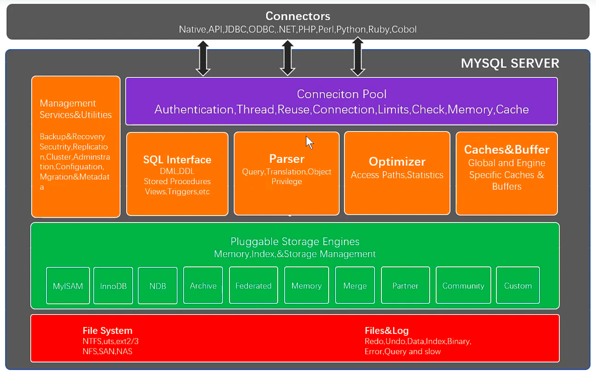
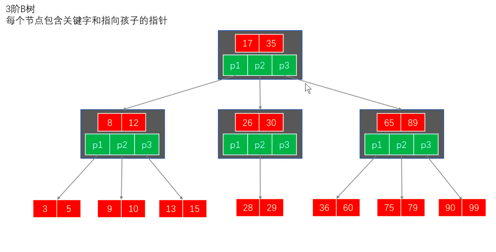
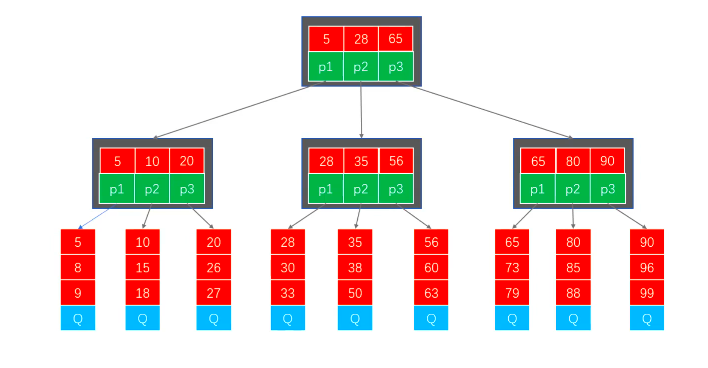

连接层--服务层--引擎层--存储层



## 数据结构

1. 二叉排序树


2. B-树，B树，平衡多路查找树



3. B+树



# 优化大纲：

- 通过**explain** 语句帮助选择更好的索引和写出更优化的查询语句。
- SQL语句中的**IN**包含的值不应该过多。
- 当只需要一条数据的时候，使用**limit** 1。
- 如果限制条件中其他字段没有索引，尽量少用or。
- 尽量用union all代替union。
- 不使用**ORDER BY RAND()**。
- 区分in和exists、not in和not exists。
- 使用合理的分页方式以提高分页的效率。
- 查询的数据过大，可以考虑使用分段来进行查询。
- 避免在where子句中对字段进行null值判断。
- 避免在where子句中对字段进行表达式操作。
- 必要时可以使用force index来强制查询走某个索引。
- 注意查询范围，between、>、<等条件会造成后面的索引字段失效。
- 关于JOIN优化。

# 优化使用

## **1、mysql explane 用法**

　　explane显示了mysql如何使用索引来处理select语句以及连接表。可以帮助更好的索引和写出更优化的查询语句。

```
EXPLAIN SELECT * FROM l_line WHERE `status` = 1 and create_at > '2019-04-11';
```

**explain字段列说明**

**table**：显示这一行的数据是关于哪张表的

**type：**这是重要的列，显示连接使用了何种类型。从最好到最差的连接类型为system、const、eq_reg、ref、range、index和all

**possible_keys：**显示可能应用在这张表中的索引。如果为空，没有可能的索引。可以为相关的域从where语句中选择一个合适的语句

**key：** 实际使用的索引。如果为null，则没有使用索引。很少的情况下，mysql会选择优化不足的索引。这种情况下，可以在select语句中使用use index（indexname）来强制使用一个索引或者用ignore index（indexname）来强制mysql忽略索引

**key_len：**使用的索引的长度。在不损失精确性的情况下，长度越短越好

**ref：**显示索引的哪一列被使用了，如果可能的话，是一个常数

**rows：**mysql认为必须检查的用来返回请求数据的行数

**extra：**关于mysql如何解析查询的额外信息。但这里可以看到的坏的例子是using temporary和using filesort，意思mysql根本不能使用索引，结果是检索会很慢

**`extra`列返回的说明**

**distinct:** 一旦mysql找到了与行相联合匹配的行，就不在搜索了。

**not exists:** mysql优化了left join,一旦找到了匹配left join标准的行，就不在搜索了。

**range checked for each record(index map:#):** 没有找到理想的索引，因此对于从前面表中来的每一个行组合，mysql检查使用哪个索引，并用它来从表中返回行。这是使用索引的最慢的连接之一。

**using filesort:** 看到这个的时候，查询就需要优化了。mysql需要行额外的步骤来发现如何对返回的行排序。它根据连接类型以及存储排序键值和匹配条件的全部行的行指针来排序全部行。

**using index:** 列数据是从仅仅使用了索引中的信息而没有读取实际的行动的表返回的，这发生在对表的全部的请求列都是同一个索引的部分的时候。

**using temporary :** 看到这个的时候，查询需要优化了。这里，mysql需要创建一个临时表来存储结果，这通常发生在对不同的列集进行order by上，而不是group by上。

**where used:** 使用了where从句来限制哪些行将与下一张表匹配或者是返回给用户。如果不想返回表中的全部行，并且连接类型all或index，这就会发生，或者是查询有问题不同连接类型的解释（按照效率高低的顺序排序）。

**system 表只有一行：** 表中只有一条记录 ( 等于系统表 ) ，这是const类型的特例，平时不会出现，这个可以忽略不计。system表。这是const连接类型的特殊情况。

**const：**表示通过索引一次找到了，const用于primary key 或者 unique 索引。因为只匹配一行数据，所以很快，将主键置于where列表中，mysql 就能将该查询转换成一个常量。

**eq_ref：** 唯一性索引扫描，对于每个索引键，表中只有一条记录于之匹配。常见于主键和唯一索引扫描。

**ref：** 这个连接类型只有在查询使用了不是惟一或主键的键或者是这些类型的部分（比如，利用最左边前缀）时发生。对于之前的表的每一个行联合，全部记录都将从表中读出。这个类型严重依赖于根据索引匹配的记录多少      越少越好。

**range：**  只检索给定范围的行，使用一个索引来选择行。keyl列显示使用了哪个索引，一般就是在你的where 语句中出现了between、< 、> 、in 等的查询。这种范围扫描比全表扫描要好，因为它只需要开始于索引的某一点，二结束于另一点，不用扫描全部的索引。

**index：**Full index scan , index 与All 区别为index类型只遍历索引树。这通常比All 快，因为索引文件通常比数据文件小。（也就是说虽然All 和 index 都是读全表，但是index 是从索引中读取的，而all 是从硬盘中读取的）。

**all:** 这个连接类型对于前面的每一个记录联合进行完全扫描，这一般比较糟糕，应该尽量避免。

## **2、SQL语句中IN包含的值不应过多**

　　MySQL对于IN做了相应的优化，即将IN中的常量全部存储在一个数组里面，而且这个数组是排好序的。但是如果数值较多，产生的消耗也是比较大的。再例如：select id from t where num in(1,2,3) 对于连续的数值，能用between就不要用in了；再或者使用连接来替换。

## **3、当只需要一条数据的时候，使用 limit 1**

　　这是为了使用索引查询数据时能够使`EXPLAIN`中type列达到const类型。

## **4、如果限制条件中其他字段没有索引，尽量少用or**

　　or两边的字段中，如果有一个不是索引字段，而其他条件也不是索引字段，会造成该查询不走索引的情况。很多时候使用union all或者是union（必要的时候）的方式来代替“or”会得到更好的效果。

## **5、尽量用union all代替union**

　　union和union all的差异主要是前者需要将结果集合并后再进行唯一性过滤操作，这就会涉及到排序，增加大量的CPU运算，加大资源消耗及延迟。当然，union all的前提条件是两个结果集没有重复数据。

## **6、 不适用ORDER BY RAND()**

```
select id from `dynamic` order by rand() limit 1000;
```

上面的SQL语句，可优化为：

```
select id from `dynamic` t1 join (select rand() * (select max(id) from `dynamic`) as nid) t2 on t1.id > t2.nidlimit 1000;
```

## **7、 区分in和exists、not in 和not exists**

　　总结： exists适用于外表小而内表大的情况。

```
select * from 表A where id in (select id from 表B);
```

上面SQL语句相当于:

```
select * from 表A where exists(select * from 表B where 表B.id=表A.id);
```

　　区分in和exists主要是造成了驱动顺序的改变（这是性能变化的关键），如果是exists，那么以外层表为驱动表，先被访问，如果是IN，那么先执行子查询。所以IN适合于外表大而内表小的情况；EXISTS适合于外表小而内表大的情况。

关于not in和not exists，推荐使用not exists，不仅仅是效率问题，not in可能存在逻辑问题。如何高效的写出一个替代not exists的SQL语句？

原SQL语句：

```
select colname … from A表 where a.id not in (select b.id from B表);
```

高效的SQL语句：

```
select colname … from A表 Left join B表 on where a.id = b.id and b.id is null
```

## **8、 使用合理的分页方式以提高分页的效率**

```
select id,name from product limit 866613, 20;
```

　　使用上述SQL语句做分页的时候，可能有人会发现，随着表数据量的增加，直接使用limit分页查询会越来越慢。

优化的方法如下：可以取前一页的最大行数的id，然后根据这个最大的id来限制下一页的起点。比如此列中，上一页最大的id是866612。SQL可以采用如下的写法：

```
select id,name from product where id> 866612 limit 20;
```

## **9、 查询的数据过大，可以考虑使用分段来进行查询**

　　在一些用户选择页面中，可能一些用户选择的时间范围过大，造成查询缓慢。主要的原因是扫描行数过多。这个时候可以通过程序，分段进行查询，循环遍历，将结果合并处理进行展示。

## **10、 避免在where子句中对字段进行null值判断**

　  对于null的判断会导致引擎放弃使用索引而进行全表扫描。

## **11、避免在where子句中对字段进行表达式操作**

比如：

```
select user_id,user_project from user_base where age*2=36；
```

中对字段就行了算术运算，这会造成引擎放弃使用索引，建议改成：

```
select user_id,user_project from user_base where age=36/2;
```

## **12、必要时可以使用force index来强制查询走某个索引**

　　有的时候MySQL优化器采取它认为合适的索引来检索SQL语句，但是可能它所采用的索引并不是我们想要的。这时就可以采用forceindex来强制优化器使用我们制定的索引。

## **13、注意查询范围，between、>、<等条件会造成后面的索引字段失效。**

　　对于联合索引来说，如果存在范围查询，比如between、>、<等条件时，会造成后面的索引字段失效。

## **14、 关于JOIN优化**

　　LEFT JOIN A表为驱动表，INNER JOIN MySQL会自动找出那个数据少的表作用驱动表，RIGHT JOIN B表为驱动表。

注意：

### **1）MySQL中没有full join，可以用以下方式来解决：**

```
select * from A left join B on B.name = A.namewhere B.name is null union all select * from B;
```

### **2）尽量使用inner join，避免left join：**

　　参与联合查询的表至少为2张表，一般都存在大小之分。如果连接方式是inner join，在没有其他过滤条件的情况下MySQL会自动选择小表作为驱动表，但是left join在驱动表的选择上遵循的是左边驱动右边的原则，即left join左边的表名为驱动表。

### **3）合理利用索引：**

　　被驱动表的索引字段作为on的限制字段。

### **4）利用小表去驱动大表**：

　　从小表去驱动大表，可以有效减少嵌套循环中的循环次数，已减少I/O总量以及CPU运算的次数。

### **5）巧用STRAIGHT_JOIN：**

　　inner join是由MySQL选择驱动表，但是有些特殊情况需要选择另个表作为驱动表，比如有group by、order by等「Using filesort」、「Using temporary」时。STRAIGHT_JOIN来强制连接顺序，在STRAIGHT_JOIN左边的表名就是驱动表，右边则是被驱动表。在使用STRAIGHT_JOIN有个前提条件是该查询是内连接，也就是inner join。其他链接不推荐使用STRAIGHT_JOIN，否则可能造成查询结果不准确。

是有些特殊情况需要选择另个表作为驱动表，比如有group by、order by等「Using filesort」、「Using temporary」时。STRAIGHT_JOIN来强制连接顺序，在STRAIGHT_JOIN左边的表名就是驱动表，右边则是被驱动表。在使用STRAIGHT_JOIN有个前提条件是该查询是内连接，也就是inner join。其他链接不推荐使用STRAIGHT_JOIN，否则可能造成查询结果不准确。

# 优化总结

## 1.对查询进行优化，应尽量避免全表扫描，首先应考虑在 **where 及 order by 涉及的列**上建立索引。

## 2.应尽量避免在 where 子句中对字段进行 null 值判断，否则将导致引擎放弃使用索引而进行全表扫描，如：

```
select id from t where num is null
```

　　可以在num上设置默认值0，确保表中num列没有null值，然后这样查询：

```
select id from t where num=0
```

## **3.**应尽量避免在 where 子句中使用!=或<>操作符，否则将引擎放弃使用索引而进行全表扫描。

## **4.**应尽量避免在 where 子句中使用 or 来连接条件，否则将导致引擎放弃使用索引而进行全表扫描，如：

```
select id from t where num=10 or num=20
```

　　可以这样查询：

```
select id from t where num=10    
union all    
select id from t where num=20    
```

## **5. **in 和 not in 也要慎用，否则会导致全表扫描，如：

```
select id from t where num in(1,2,3)
```

　　对于连续的数值，能用 between 就不要用 in 了：

```
select id from t where num between 1 and 3
```

## **6.**下面的查询也将导致全表扫描：

```
select id from t where name like '%abc%'
```

## **7.**应尽量避免在 where 子句中对字段进行表达式操作，这将导致引擎放弃使用索引而进行全表扫描。如：

```
select id from t where num/2=100
```

　　应改为:

```
select id from t where num=100*2
```

## **8**.应尽量避免在where子句中对字段进行函数操作，这将导致引擎放弃使用索引而进行全表扫描。如：

```
select id from t where substring(name,1,3)='abc'--name以abc开头的id
```

　　应改为:

```
select id from t where name like 'abc%'
```

## **9.**不要在 where 子句中的“=”左边进行函数、算术运算或其他表达式运算，否则系统将可能无法正确使用索引。

## **10.**在使用索引字段作为条件时，如果该索引是复合索引，那么必须使用到该索引中的第一个字段作为条件时才能保证系统使用该索引，

否则该索引将不会被使用，并且应尽可能的让字段顺序与索引顺序相一致。

## **11.**不要写一些没有意义的查询，如需要生成一个空表结构：

```
select col1,col2 into #t from t where 1=0
```

这类代码不会返回任何结果集，但是会消耗系统资源的，应改成这样：

```
create table #t(...)
```

## **12**.很多时候用 exists 代替 in 是一个好的选择：

```
select num from a where num in(select num from b)
```

用下面的语句替换：

```
select num from a where exists(select 1 from b where num=a.num)   
```

注意：IN适合于外表大而内表小的情况；`EXISTS适合于外表小而内表大的情况`

## **13**.并不是所有索引对查询都有效

​		SQL是根据表中数据来进行查询优化的，当索引列有大量数据重复时，SQL查询可能不会去利用索引， 如一表中有字段sex，male、female几乎各一半，那么即使在sex上建了索引也对查询效率起不了作用。

## **14**.索引并不是越多越好

索引固然可以提高相应的 select 的效率，但同时也降低了 insert 及 update 的效率，
　　因为 insert 或 update 时有可能会重建索引，所以怎样建索引需要慎重考虑，视具体情况而定。
　　一个表的索引数最好不要超过6个，若太多则应考虑一些不常使用到的列上建的索引是否有必要。

## **15**.尽量使用数字型字段

若只含数值信息的字段尽量不要设计为字符型，这会降低查询和连接的性能，并会增加存储开销。
　　这是因为引擎在处理查询和连接时会逐个比较字符串中每一个字符，而对于数字型而言只需要比较一次就够了。

## **16.**尽可能的使用 varchar 代替 char 

因为首先变长字段存储空间小，可以节省存储空间，
　　其次对于查询来说，在一个相对较小的字段内搜索效率显然要高些。

## **17**.任何地方都不要使用 select * from t 

​	用具体的字段列表代替“*”，不要返回用不到的任何字段。

## **18.**避免频繁创建和删除临时表，以减少系统表资源的消耗。

## **19**.临时表并不是不可使用，适当地使用它们可以使某些例程更有效

​	例如，当需要重复引用大型表或常用表中的某个数据集时。但是，对于一次性事件，最好使用导出表。 

## **20.**在新建临时表时，如果一次性插入数据量很大，那么可以使用 select into 代替 create table，避免造成大量 log ，以提高速度；如果数据量不大，为了缓和系统表的资源，应先create table，然后insert。

## **21.**如果使用到了临时表，在存储过程的最后务必将所有的临时表显式删除，先 truncate table ，然后 drop table ，这样可以避免系统表的较长时间锁定。

## **22**.尽量避免使用游标，因为游标的效率较差，如果游标操作的数据超过1万行，那么就应该考虑改写。

## **23**.使用基于游标的方法或临时表方法之前，应先寻找基于集的解决方案来解决问题，基于集的方法通常更有效。

## **24.**与临时表一样，游标并不是不可使用。对小型数据集使用 FAST_FORWARD 游标通常要优于其他逐行处理方法，尤其是在必须引用几个表才能获得所需的数据时。

​	在结果集中包括“合计”的例程通常要比使用游标执行的速度快。如果开发时间允许，基于游标的方法和基于集的方法都可以尝试一下，看哪一种方法的效果更好。

## **25**.尽量避免大事务操作，提高系统并发能力。

## **26.**尽量避免向客户端返回大数据量，若数据量过大，应该考虑相应需求是否合理。

# MySQL索引实现

## MyISAM索引

基于B+树实现，存放在叶子节点的数据为记录的地址


## InnoDB索引

基于B+树实现，和MyISAM区别在于，

- 叶子节点存储的并不是数据的地址，而是真实数据。这个索引的key就是该记录的主键，说明InnoDB必须要有主键，如果没有指定，那么mysql会自动为InnoDB表生成一个隐藏字段作为主键，长度为6字节，长整型，索引建表的时候做好指定一个主键字段

- 辅助索引（普通索引）的叶子节点存储的不是数据，而是数据的主键，当通过普通索引查询数据，会先去查询该数据的主键，然后通过主键索引查询最终数据，这个过程就是**回表**


# 索引失效的情况

[(5条消息) 索引失效的 10 种场景_狂奔的蜗牛Evan的博客-CSDN博客_索引失效的场景](https://blog.csdn.net/lisheng19870305/article/details/123336799)

### 违反最左前缀

user表复合索引(联合索引)顺序为code、age和name，顺序不对就会索引失效

如`select name from user where code ='1' and name='1'`

# 参考资料

[(4条消息) 数据库索引原理及优化_Star_Li_92的博客-CSDN博客_索引优化](https://blog.csdn.net/yangxingpa/article/details/81477607?spm=1001.2101.3001.6650.4&utm_medium=distribute.pc_relevant.none-task-blog-2~default~CTRLIST~Rate-4-81477607-blog-107745821.pc_relevant_multi_platform_whitelistv3&depth_1-utm_source=distribute.pc_relevant.none-task-blog-2~default~CTRLIST~Rate-4-81477607-blog-107745821.pc_relevant_multi_platform_whitelistv3&utm_relevant_index=9)

