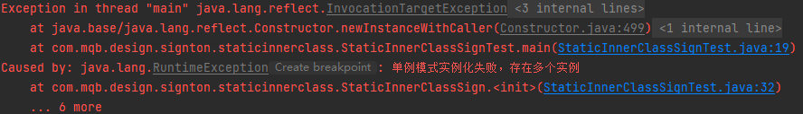
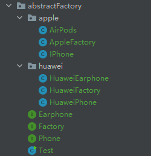

设计模式是软件开发中解决一类问题的通用方法。

使用设计模式能让你写出更优雅、可维护的代码，也正因如此，很多框架源码都用到了设计模式，你不学很难看懂。

#### 知识

- 创建型模式：对象实例化的模式，创建型模式用于解耦对象的实例化过程
  - 单例模式
  - 工厂方法模式
  - 抽象工厂
  - 建造者模式
  - 原型模式
- 结构型模式：把类或对象结合在一起形成一个更大的结构
  - 适配器模式
  - 组合模式
  - 装饰器模式
  - 代理模式
  - 享元模式
  - 外观模式
  - 桥接模式
- 行为型模式：类和对象如何交互，及划分责任和算法
  - 迭代器模式
  - 模板方法模式
  - 策略模式
  - 命令模式
  - 状态模式
  - 责任链模式
  - 备忘录模式
  - 观察者模式
  - 访问者模式
  - 中介者模式
  - 解释器模式

#### 学习建议

先理解概念，了解每个设计模式的特点和应用场景，再多加练习，运用到实际项目。

#### 经典面试题

1. 单例模式有哪些实现方式？有哪些优缺点？请手写其中一种
2. 你用过哪些设计模式，为什么用它？

#### 资源

- 书籍
  - ⭐《图解设计模式》（强烈推荐这本书，正是用 Java 语言实现，图多、有示例代码、有习题和答案，很不错）
  - 《Head First 设计模式》
  - 《大话设计模式》
  - 《设计模式：可复用面向对象软件的基础》（大黑书，有能力的话也可以去读）
- 视频
  - 尚硅谷图解 Java 设计模式：[https://www.bilibili.com/video/BV1G4411c7N4](https://gitee.com/link?target=https%3A%2F%2Fwww.bilibili.com%2Fvideo%2FBV1G4411c7N4)
- 文档
  - 菜鸟教程：[https://www.runoob.com/design-pattern/design-pattern-tutorial.html](https://gitee.com/link?target=https%3A%2F%2Fwww.runoob.com%2Fdesign-pattern%2Fdesign-pattern-tutorial.html)
  - 图说设计模式：[https://design-patterns.readthedocs.io/zh_CN/latest/](https://gitee.com/link?target=https%3A%2F%2Fdesign-patterns.readthedocs.io%2Fzh_CN%2Flatest%2F)

# 创建型模式

**创建型模式（Creational Pattern）：**对类的实例化过程进行了抽象，能够将软件模块中**对象的创建**和对象的使用分离。

（5种）单例模式、工厂模式、抽象工厂模式、建造者模式、原型模式

## 单例模式

### 懒汉式

```java
package com.mqb.design.signton.lazy;

/**
 * @author maqingbo
 * @date 2023/2/20 19:51
 * @email qingbo.my@gmail.com
 */
public class LazySigntonTest {

    public static void main(String[] args) {
        //单线程
       LazySignton instance = LazySignton.getInstance();
       LazySignton instance1 = LazySignton.getInstance();
       System.out.println(instance1==instance);
    }
}

class LazySignton {
    private static LazySignton lazySignton;

    private LazySignton() {

    }

    public  static LazySignton getInstance() {

        if (lazySignton == null) {
            lazySignton = new LazySignton();
        }
        return lazySignton;
    }

}

```

上面这种方法在多线程的情况下会出现多个实例，解决方法是在`getInstance`方法上添加`synchronized`

```java
  public synchronized static LazySignton getInstance() {

        if (lazySignton == null) {
            lazySignton = new LazySignton();
        }
        return lazySignton;
    }
```

但是加锁会造成性能问题,优化点，当lazySignton为空的时候加锁，不为空的时候直接取用

```java
   public  static LazySignton getInstance() {

        if (lazySignton == null) {
            //防止多线程同时对该类加锁
            synchronized(LazySignton.class){
                //双重检查
                if (lazySignton == null){
                lazySignton = new LazySignton();
                }
            }
        }
        return lazySignton;
    }
```

在字节码成面看，上面的方法同样会有问题，可能会出现一个空指针的问题

当t1线程进行 分配空间->引用复制但是还没有进行初始化的时候，

t2线程发现instance有值了，直接返回instance，这时候再去调用就可能会出现NPE的问题

解决方法（使用volatile，`防止指令重排`(在字节码成面，就会按照：分配空间->初始化->引用赋值的顺序执行)，volatile的另外两点：保证多线程间的可见性。不保证原子性）

```java

class LazySignton {
    private volatile static LazySignton lazySignton;

    private LazySignton() {
    }
    public  static LazySignton getInstance() {

        if (lazySignton == null) {
            synchronized(LazySignton.class){
                if (lazySignton == null){
                lazySignton = new LazySignton();
                }
            }
        }
        return lazySignton;
    }
}
```

### 饿汉式

```java

class HungrySignton {
    private static HungrySignton instance = new HungrySignton();

    private HungrySignton() {
    }

    public static HungrySignton getInstance() {
        return instance;
    }
}

```

基于JVM的类加载机制保证线程的安全

类加载(真正时候这个类的时候触发)的步骤，

1. 将二进制文件加载内存并生成class数据结构
2. 连接： 验证、准备(给类的静态成员变量赋默认值，0,null...)、解析
3. 初始化：给类的静态变量赋值

### 静态内部类

```java
class StaticInnerClassSign {
    private static class StaticInner {
        private static StaticInnerClassSign instance = new StaticInnerClassSign();
    }
    private StaticInnerClassSign(){}
    
    public StaticInnerClassSign getInstance(){
        return StaticInner.instance;
    }
}
```

也是基于JVM的类加载机制实现

注意：通过反射可以获取多个实例，可以在静态内部类处理

修改静态内部类

```java
class StaticInnerClassSign {
    private static class StaticInner {
        private static StaticInnerClassSign instance = new StaticInnerClassSign();
    }
    private StaticInnerClassSign(){
        if (StaticInner.instance!=null){
            throw new RuntimeException("单例模式实例化失败，存在多个实例");
        }
    }
    public StaticInnerClassSign getInstance(){
        return StaticInner.instance;
    }
}
```

利用反射获取实例

```java
   @SneakyThrows
    public static void main(String[] args) {
        Class<StaticInnerClassSign> staticInnerClassSignClass = StaticInnerClassSign.class;
        Constructor<StaticInnerClassSign> declaredConstructor = staticInnerClassSignClass.getDeclaredConstructor();
        declaredConstructor.setAccessible(true);
        StaticInnerClassSign staticInnerClassSign = declaredConstructor.newInstance();
        StaticInnerClassSign instance = StaticInnerClassSign.getInstance();
        System.out.println(staticInnerClassSign==instance);

    }
```




## 工厂模式

### 简单工厂模式

```java
package com.mqb.design.factory.simpleFactory;
public abstract class Product{
    public abstract void Show();
}
```

实现类

```java

//具体产品类A
class  ProductA extends  Product{

    @Override
    public void Show() {
        System.out.println("生产出了产品A");
    }
}

//具体产品类B
class  ProductB extends  Product{

    @Override
    public void Show() {
        System.out.println("生产出了产品B");
    }
}

//具体产品类C
class  ProductC extends  Product{

    @Override
    public void Show() {
        System.out.println("生产出了产品C");
    }
}

```


```java
class  Factory {
    public  Product manufacture(String productName){
    //工厂类里用switch语句控制生产哪种商品；
    //使用者只需要调用工厂类的静态方法就可以实现产品类的实例化。
        return switch (productName) {
            case "A" -> new ProductA();
            case "B" -> new ProductB();
            case "C" -> new ProductC();
            default -> null;
        };
    }
}

```


使用

```java
package com.mqb.design.factory.simpleFactory;

/**
 * 简单工厂模式
 *
 * @author maqingbo
 * @date 2023/2/25 13:51
 * @email qingbo.my@gmail.com
 */
public class SimpleFactory {
    public static void main(String[] args) {
        Factory mFactory = new Factory();

        //客户要产品A
        try {
//调用工厂类的静态方法 & 传入不同参数从而创建产品实例
            mFactory.manufacture("A").Show();
        } catch (NullPointerException e) {
            System.out.println("没有这一类产品");
        }

        //客户要产品B
        try {
            mFactory.manufacture("B").Show();
        } catch (NullPointerException e) {
            System.out.println("没有这一类产品");
        }

        //客户要产品C
        try {
            mFactory.manufacture("C").Show();
        } catch (NullPointerException e) {
            System.out.println("没有这一类产品");
        }

        //客户要产品D
        try {
            mFactory.manufacture("D").Show();
        } catch (NullPointerException e) {
            System.out.println("没有这一类产品");
        }
    }
}
```


### 工厂方法模式

当一个工厂需要新生产另一种产品时可以考虑使用工厂模式

工厂的抽象类

```java
/**
 * 抽象工厂类，定义具体工厂的公共接口
 */
public interface Factory{
    /**
     * 制造
     * @return
     */
    public abstract Product manufacture();
}
```


需要生产的产品的接口

```
package com.mqb.design.factory.factoryMethod;

public interface  Product{
    /**
     * 定义具体产品的公共接口；
     */
    public  void show();
}
```


产品

```java
package com.mqb.design.factory.factoryMethod;

//具体产品A类
public class  ProductA implements   Product{

    @Override
    public void show() {
        System.out.println("生产出了产品A");

    }
}

//具体产品B类
class  ProductB implements   Product{

    @Override
    public void show() {
        System.out.println("生产出了产品B");
    }

}

```
工厂的两个实现类，分别生产A和B产品
```java
package com.mqb.design.factory.factoryMethod;

//工厂A类 - 生产A类产品
public class  FactoryA implements Factory{

    @Override
    public Product manufacture() {
        return new ProductA();
    }
}

class  FactoryB implements Factory{

    @Override
    public Product manufacture() {
        return new ProductB();
    }
}

```

使用

```java
public static void main(String[] args){
    //客户要产品A
    Factory mFactoryA = new FactoryA();
    mFactoryA.manufacture().show();

    //客户要产品B
    Factory mFactoryB = new FactoryB();
    mFactoryB.manufacture().show();
}
```


## 抽象工厂模式


工厂接口
```java
package com.mqb.design.factory.abstractFactory;

/**
 * @author maqingbo
 * @date 2023/2/25 21:28
 * @email qingbo.my@gmail.com
 */
public interface Factory {
    /**
     * 生产手机
     * @return
     */
    Phone productPhone();

    /**
     * 生产耳机
     * @return
     */
    Earphone productEarphone();
}
```
手机接口
```java
package com.mqb.design.factory.abstractFactory;

/**
 * @author maqingbo
 * @date 2023/2/25
 * @email qingbo.my@gmail.com
 */
public interface Phone {
    /**
     * 开机
     */
    void start();
}
```


耳机接口
```
package com.mqb.design.factory.abstractFactory;

/**
 * 耳机
 * @author maqingbo
 * @date 2023/2/25
 * @email qingbo.my@gmail.com
 */
public interface Earphone {
    /**
     * 耳机品牌
     */
    void show();
}
```

两个工厂,分别是华为工厂和苹果工厂,分别生产各自的手机和耳机

**苹果**

```java
package com.mqb.design.factory.abstractFactory.apple;

import com.mqb.design.factory.abstractFactory.Factory;
import com.mqb.design.factory.abstractFactory.Earphone;
import com.mqb.design.factory.abstractFactory.Phone;

/**
 * @author maqingbo
 * @date 2023/2/25 21:35
 * @email qingbo.my@gmail.com
 */
public class AppleFactory implements Factory {
    @Override
    public Phone productPhone() {
        return new IPhone();

    }

    @Override
    public Earphone productEarphone() {
        return new AirPods();
    }
}
```


```java
package com.mqb.design.factory.abstractFactory.apple;

import com.mqb.design.factory.abstractFactory.Phone;

/**
 * @author maqingbo
 * @date 2023/2/25 21:36
 * @email qingbo.my@gmail.com
 */
public class IPhone implements Phone {
    @Override
    public void start() {
        System.out.println("iPhone 14 phone");
    }
}
```

```java
package com.mqb.design.factory.abstractFactory.apple;

import com.mqb.design.factory.abstractFactory.Earphone;

/**
 * @author maqingbo
 * @date 2023/2/25 21:36
 * @email qingbo.my@gmail.com
 */
public class AirPods implements Earphone {
    @Override
    public void show() {
        System.out.println("AirPods Max");
    }
}
```

**华为**

```java
package com.mqb.design.factory.abstractFactory.huawei;

import com.mqb.design.factory.abstractFactory.Factory;
import com.mqb.design.factory.abstractFactory.Earphone;
import com.mqb.design.factory.abstractFactory.Phone;

/**
 * @author maqingbo
 * @date 2023/2/25 21:32
 * @email qingbo.my@gmail.com
 */
public class HuaweiFactory implements Factory {
    @Override
    public Phone productPhone() {
        return new HuaweiPhone();
    }

    @Override
    public Earphone productEarphone() {
        return new HuaweiEarphone();
    }
}
```


```java
package com.mqb.design.factory.abstractFactory.huawei;

import com.mqb.design.factory.abstractFactory.Earphone;

/**
 * @author maqingbo
 * @date 2023/2/25 21:34
 * @email qingbo.my@gmail.com
 */
public class HuaweiEarphone implements Earphone {
    @Override
    public void show() {
        System.out.println("HUAWEI FreeBuds Pro 2");
    }
}
```


```java
package com.mqb.design.factory.abstractFactory.huawei;

import com.mqb.design.factory.abstractFactory.Phone;

/**
 * @author maqingbo
 * @date 2023/2/25 21:33
 * @email qingbo.my@gmail.com
 */
public class HuaweiPhone implements Phone {
    @Override
    public void start() {
        System.out.println("HUAWEI Mate 50 Pro");
    }
}
```


测试

```java
public static void main(String[] args) {
    Factory huaweiFactory = new HuaweiFactory();
    Earphone earphone = huaweiFactory.productEarphone();
    Phone phone = huaweiFactory.productPhone();
    phone.start();
    earphone.show();


    System.out.println("========================");


    Factory appleFactory = new AppleFactory();
    Earphone appleEarphone = appleFactory.productEarphone();
    Phone applePhone = appleFactory.productPhone();
    appleEarphone.show();
    applePhone.start();
}
```

后续如果想增加产品族,或者是拓展产品等级,参考如下方式

**增加产品族**

需要修改顶层的工厂,如果苹果和华为都需要生产平板,那么需要在Factory接口增加生产平板的接口,并且还要有一个平板的产品接口实现类

```java
public interface Pad {
    /**
     * 屏幕大小
     */
    void size();
}
```

```java
public interface Factory {
    /**
     * 生产手机
     *
     * @return
     */
    Phone productPhone();

    /**
     * 生产耳机
     *
     * @return
     */
    Earphone productEarphone();

    default Pad productPad() {
        return null;
    }
}
```


**拓展产品等级**


小米也可以生产手机,耳机,平板,那么小米直接实现Factory,Phone,Earphone,Pad接口即可


## 建造者模式

```java
public class User {
    private final String firstName;
    private final String lastName;
    private final int age;
    private final String phone;
    private final String address;

    private User(UserBuilder builder) {
        this.firstName = builder.firstName;
        this.lastName = builder.lastName;
        this.age = builder.age;
        this.phone = builder.phone;
        this.address = builder.address;
    }

    public static UserBuilder builder() {
        return new UserBuilder();
    }

    public static class UserBuilder {
        private String firstName;     // 必传参数
        private String lastName;      // 必传参数
        private int age;              // 可选参数
        private String phone;         // 可选参数
        private String address;       // 可选参数

        public UserBuilder() {

        }

        public UserBuilder age(int age) {
            this.age = age;
            return this;
        }

        public UserBuilder phone(String phone) {
            this.phone = phone;
            return this;
        }

        public UserBuilder address(String address) {
            this.address = address;
            return this;
        }

        public User build() {
            return new User(this);
        }

    }
}
```


# 结构性模式

**结构型模式（Structural Pattern）**：关注于对象的组成以及对象之间的依赖关系，描述如何将类或者对象结合在一起形成更大的结构，就像**搭积木**，可以通过简单积木的组合形成复杂的、功能更为强大的结构。

（7种）适配器模式、装饰者模式、代理模式、外观模式、桥接模式、组合模式、享元模式


# 行为型模式

**行为型模式（Behavioral Pattern）**：关注于对象的行为问题，是对在不同的对象之间划分责任和算法的抽象化；不仅仅关注类和对象的结构，而且重点关注它们之间的**相互作用**。

（11种）策略模式、模板方法模式、观察者模式、迭代器模式、责任链模式、命令模式、备忘录模式、状态模式、访问者模式、中介者模式、解释器模式